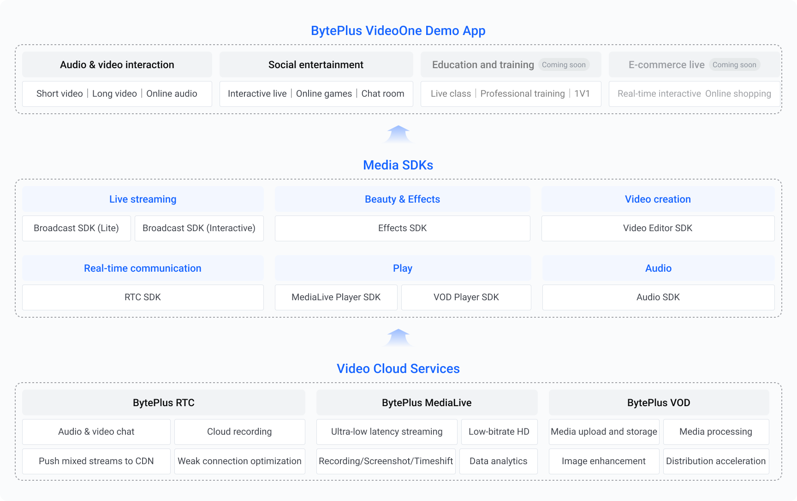

The BytePlus Video One Solution (VideoOne) is an all-in-one audio and video solution providing everything you need for a top-notch audio and video experience. It integrates a full range of media capabilities, including:

* Live streaming and watching
* Interaction between hosts and audiences
* Live stream playback and video-on-demand
* Audience interactions with media content, such as liking and commenting.
* Beauty AR and effects

VideoOne consists of three main components, as illustrated in the diagram below:

## BytePlus VideoOne demo
This open-source demo uses multiple BytePlus Media SDKs and Video Cloud services to showcase VideoOne's comprehensive audio and video capabilities. It demonstrates the product's capabilities through both solution templates and individual features for popular use cases.
VideoOne offers a range of scenario-based solutions including short drama, conversational AI, interactive live, media up and down swiping, video playback & edit and more. These solutions effectively cover the most popular audio and video communication scenarios, providing a robust and versatile offering.
VideoOne also provides best practices for using each feature in various scenarios, helping users quickly build customized solutions that meet their specific business needs.
If you are looking for a quick and easy way to build an app with rich audio and video capabilities, use the BytePlus VideoOne demo as a starting point. This modularized demo empowers you to select and combine the features you need to create a customized app. Refer to [BytePlus VideoOne demo app](https://docs.byteplus.com/byteplus-vos/docs/byteplus-videoone-demo-app_1) for a detailed introduction to the demo app and instructions on how to run the demo.

## Media SDKs
VideoOne provides a range of media SDKs for you to select and combine, enabling you to effortlessly add features such as live streaming, video playback, video calls, and beauty effects to your application.
**MediaLive Broadcast SDK**
Allows you to stream from a client device. The Interactive edition supports co-hosting.
**Effects SDK**
Enhances your app with sticker effects and filters.
**RTC SDK**
Offers high-definition audio and video communication capabilities.
**MediaLive Player SDK and VOD Player SDK**
Allows you to play a live stream or VOD. The Interactive edition of the MediaLive Player SDK supports co-hosting.
## Video Cloud Services
Distributes your content globally with ultra-low latency and processes it according to your business requirements. VideoOne provides the following cloud services:
**BytePlus MediaLive**

* Ultra-low latency streaming, also known as Real Time Media (RTM)
* Value-added services, such as low-bitrate HD transcoding, recording, screenshot capturing, and time-shifting
* Data analytics

**BytePlus RTC**

* Audio and video communications on a large scale
* Stable and reliable real-time signaling service with low latency and high concurrency
* Advanced audio processing capabilities, notably in acoustic echo cancellation (AEC), automatic gain control (AGC), and automatic noise cancellation (ANC)

**BytePlus VOD**

* Media upload, storage, and playback
* Media services, including low-bitrate HD transcoding, watermarking, and video quality enhancement
* Quality insights

