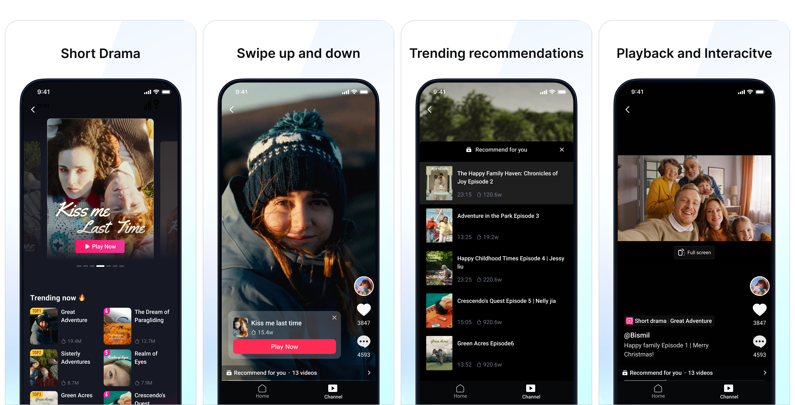
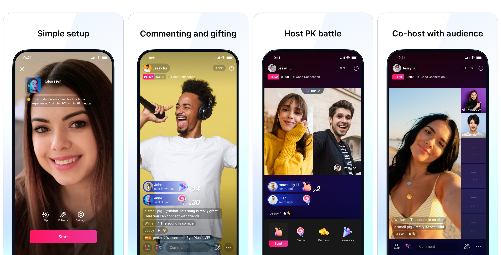

BytePlus Video One Solution (VideoOne) is a comprehensive platform for building diverse audio-visual applications, from short dramas and conversational AI to interactive live streams and more. This document provides an overview of common business scenarios you can build with VideoOne and links to detailed technical guides for implementation.
## Short drama

Build binge-watchable, vertical video applications for serialized, short-form content. This use case is designed for the increasingly popular short drama format, providing a mobile-first, immersive viewing experience that drives high user engagement and retention.

**Key enabled features:**

* Immersive, full-screen vertical video playback.
* Seamless, swipe-up navigation between episodes or different series.
* Episode and series management for serialized content.
* Interactive features like live comments, gifting, and paid content unlocking.

> Learn how to build this in our [Short drama](https://docs.byteplus.com/en/docs/byteplus-vos/short-drama) solution guide.

## Conversational AI

| English demo | Japanese demo |
| --- | --- |
|  |  |

Enable applications where users can have natural, real-time voice conversations with an AI agent. This solution provides the foundational technology for a wide range of interactive scenarios, from smart assistants and AI-powered customer service to language coaching and interactive gaming NPCs.

**Key enabled features:**

* Full-duplex, interruptible voice conversations for natural, human-like interaction.
* Ultra-low latency from speech to response, with delays as short as one second, ensuring a smooth conversational flow.
* Advanced AI noise suppression to ensure clear speech recognition in any environment.
* Function calling, allowing the AI to connect to external APIs to perform tasks like checking weather, searching databases, or making calculations.
* Multi-modal interaction, enabling the AI to receive and understand video input in addition to voice.

> Learn more about this solution in our [Conversational AI](https://docs.byteplus.com/en/docs/byteplus-vos/docs-conversational-ai) solution guide. If you’re interested in integrating this solution into your product or platform, please contact our technical support team.

## Interactive live streaming

Enable real-time engagement for social media applications, online talent shows, outdoor events, and more. Our end-to-end solution provides all the necessary components to quickly build a feature-rich, interactive live streaming platform.

**Key enabled features:**

* High-quality, low-latency client-side stream publishing and playback.
* Real-time audience interaction, including live comments, virtual gifts, and likes.
* Advanced co-hosting features, allowing hosts to invite audience members or other hosts ("PK battles") into the stream.

> Learn how to build this in our [Interactive live](https://docs.byteplus.com/en/docs/byteplus-vos/docs-implementing-interactive-live) solution guide.

## Video playback & edit

Build robust video-centric platforms for short-form video feeds, long-form content streaming, and in-app video creation. This solution is powered by the comprehensive storage, processing, and delivery capabilities of BytePlus Video on Demand (VOD).

**Key enabled features:**

* End-to-end media management, including secure uploading, storage, and processing.
* High-quality video playback with a detailed analytics dashboard.
* In-app video production tools for shooting, editing, and applying effects.

> Learn how to build this in our [Video playback & edit](https://docs.byteplus.com/en/docs/byteplus-vos/docs-video-playback-edit) solution guide.

## Swipeable media feed (aka Media up and down swiping)

Create a dynamic and engaging content discovery experience by combining live streams and on-demand videos into a single, continuous feed. This pattern is designed to maximize user retention by offering a diverse range of content through a familiar, swipe-based interface.

**Key enabled features:**

* A unified feed that seamlessly blends live streams and on-demand videos.
* Intuitive, swipe-up and swipe-down navigation for content discovery.
* Intelligent pre-loading for smooth transitions between different media types.
* Low-latency entry into live rooms directly from the feed.

> Learn how to build this in our [Media up and down swiping](https://docs.byteplus.com/en/docs/byteplus-vos/Media_up_and_down_swiping_solution) solution guide.

## Additional use cases
The flexibility of BytePlus VideoOne's foundational products (MediaLive, VOD, and RTC) allows you to build solutions for many other industries. You can also build the following applications by combining our core capabilities.
### Online education
Develop immersive and effective online learning environments for professional training, vocational education, or enrichment programs. Our solution provides the interactive tools necessary to go beyond simple video lectures.

**Key enabled features:**

* An interactive whiteboard for real-time annotations and collaboration.
* Live Q&A and polling systems to increase student engagement.
* Secure and reliable document sharing within the virtual classroom.
* Comprehensive classroom management and content security features.

### E-commerce live streaming
Integrate live video shopping directly into your e-commerce platform to drive sales and convert traffic into revenue. Our tools enable you to create a seamless "watch-and-shop" experience for your customers.

**Key enabled features:**

* In-stream product display with interactive shelves and catalogs.
* Integrated shopping cart and "add to favorites" functionality.
* Management tools for your virtual store and product inventory.
