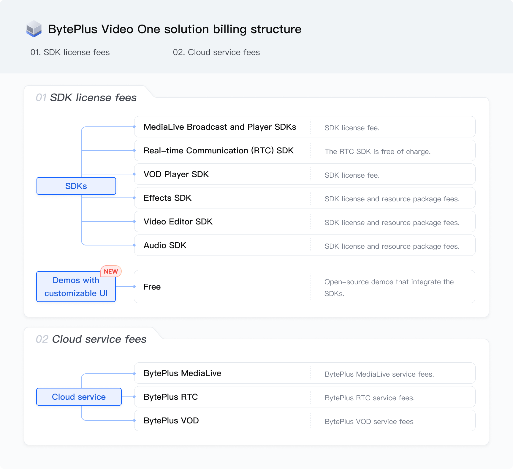

The BytePlus Video One Solution (VideoOne) offers a flexible pricing model composed of SDK license fees and cloud service fees. This guide breaks down these components to provide a clear understanding of the solution's overall cost structure.
The following diagram breaks down the fees for VideoOne. [Contact your sales representative](https://www.byteplus.com/en/contact) for more details about pricing.

