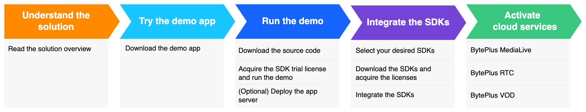

To quickly build applications with comprehensive video capabilities, use this guide as your starting point for the BytePlus Video One Solution (VideoOne). Learn the complete development path, from understanding the solution and trying the demo app to integrating core SDKs and activating the necessary cloud services.
## Overview

## VideoOne demo
We offer a BytePlus VideoOne demo app for both Android and iOS. Use the demo app to quickly familiarize yourself with the wide range of capabilities provided by VideoOne.
In addition to the demo app, you can also visit [GitHub](https://github.com/byteplus-sdk/VideoOneSolutions) to access the open-source demo project that encompasses the extensive features found in the demo app.
### Trying the demo app
Refer to [BytePlus VideoOne demo app](https://docs.byteplus.com/byteplus-vos/docs/byteplus-videoone-demo-app_1) for a detailed introduction to the app and instructions on how to install it.
### Running the demo project
The open-source demo project can serve as a starting point for you to develop a full-featured app. The project is modularized so that you can select and combine the features you need with minimum effort.
For instructions on how to run the demo project on Android and iOS, refer to [Running the demo (Android)](https://docs.byteplus.com/byteplus-vos/docs/running-the-demo-android-) and [Running the demo (iOS)](https://docs.byteplus.com/byteplus-vos/docs/running-the-demo-ios-).
The demo app includes additional features such as beauty AR, and login-with-account which are not available in the open-source demo project. If you need these features, please [contact your sales representative](https://www.byteplus.com/en/contact).

## Building your own app
If you want to replicate the scenes or single function demos in VideoOne, please refer to the **Solution implementation guides** and **Best practices**. If you want to explore more SDK functionalities beyond the open-source project, you can refer to the documentation of each respective SDK.
You may encounter dependency conflicts and compatibility issues when integrating the latest versions of the SDKs. You can avoid these issues by integrating specific versions of the SDKs listed in [Client SDK components](https://docs.byteplus.com/en/byteplus-vos/docs/version-combination?version=v1.0#a934220b). If you need assistance in obtaining documentation for these particular versions, please contact your [technical support](https://console.byteplus.com/workorder/create).

* [BytePlus MediaLive Broadcast and Player SDKs](https://docs.byteplus.com/en/byteplus-media-live/docs/introduction)
* [BytePlus RTC SDK](https://docs.byteplus.com/en/byteplus-rtc/docs/66812)
* [BytePlus VOD Player SDK](https://docs.byteplus.com/en/byteplus-vod/docs/player-sdk-overview)
* [BytePlus Effects SDK](https://docs.byteplus.com/en/effects/docs/body-motion)

## Activating cloud services
VideoOne provides the following cloud services. Choose the service best suited to your specific business needs and use cases.
**BytePlus MediaLive**

* Ultra-low latency streaming, also known as Real Time Media (RTM)
* Value-added services, such as low-bitrate HD transcoding, recording, screenshot capturing, and time-shifting
* Data analytics

For details, refer to [BytePlus MediaLive overview](https://docs.byteplus.com/en/byteplus-media-live/docs/product-overview).
**BytePlus RTC**

* Audio and video communications on a large scale
* Stable and reliable real-time signaling service with low latency and high concurrency
* Advanced audio processing capability, notably in acoustic echo cancellation (AEC), automatic gain control (AGC), and automatic noise cancellation (ANC).

For details, refer to [BytePlus RTC introduction](https://docs.byteplus.com/en/byteplus-rtc/docs/66812).
**BytePlus VOD**

* Media upload and storage
* Media services, including low-bitrate HD transcoding, watermarking, and video quality enhancement
* Quality insights

For details, refer to [What is BytePlus VOD?](https://docs.byteplus.com/en/byteplus-vod/docs/what-is-byteplus-vod)

