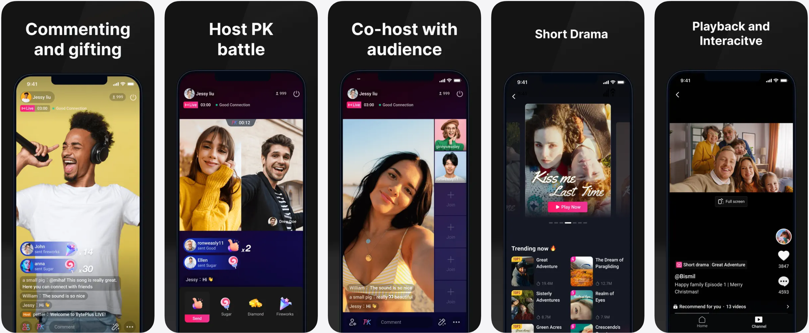
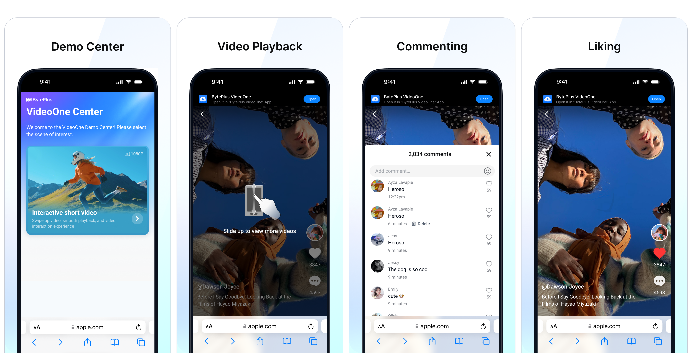

The BytePlus VideoOne demo is a functional, pre-built application that allows you to experience our key solutions and capabilities firsthand, without writing any code. It utilizes our complete suite of Media SDKs and Video Cloud services to showcase a range of industry-specific scenarios and features.
## The native demo for Android and iOS

### Scene
The **Scene** tab contains a collection of typical audio and video scenarios.

* Short Drama
* Video Playback
* Interactive Live

### Function
The **Function** tab lists core functions for each media SDK.

* Live streaming
* Video player (including ABR)
* RTC

## The web demo

### Interactive video
The VideoOne web demo offers an interactive video solution with the following features:

* Play short videos by swiping up and down
* Interactive features for viewers, such as commenting and liking

## Download the demo
You can access the demo directly on the web or install the native application on your mobile device from the official app stores. Select the appropriate tab below to find the direct link or scan the QR code.
The BytePlus VideoOne demo applications are currently available for download in selected countries and regions. If the App Store or Google Play indicates that "This app is not available in your country or region," the recommended alternative is to download the project's source code and build the demo yourself. See [Build your first app](https://docs.byteplus.com/en/docs/byteplus-vos/docs-running-the-demo).

Alternatively, you can click [here](https://play.google.com/store/apps/details?id=com.byteplus.videoone.android) to access VideoOne on Google Play.

Alternatively, you can click [here](https://apps.apple.com/th/app/byteplus-videoone/id6451967995) to access VideoOne on the App Store.

Alternatively, you can click [here](https://demo.byteplus.com/videoone/ttshow) to open the application directly in your browser.

After exploring the pre-built demo, the next step is to compile and run the project source code yourself.

**Next step**: [Build your first app](https://docs.byteplus.com/en/docs/byteplus-vos/docs-running-the-demo)

