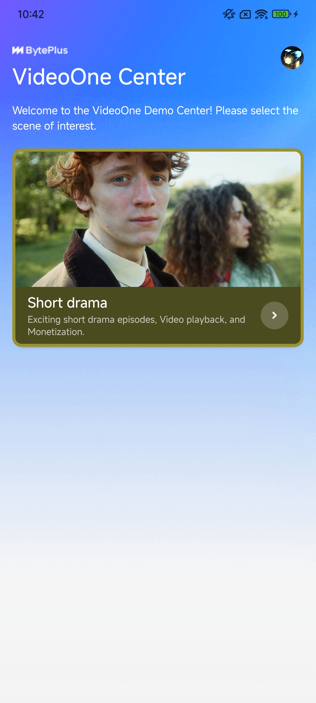
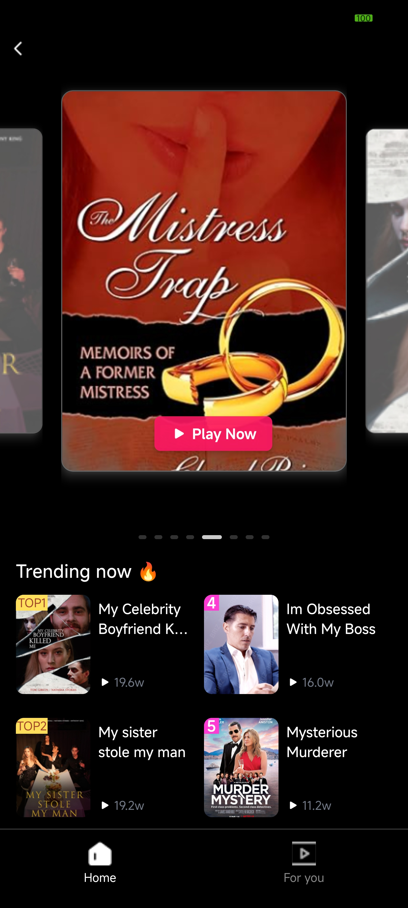
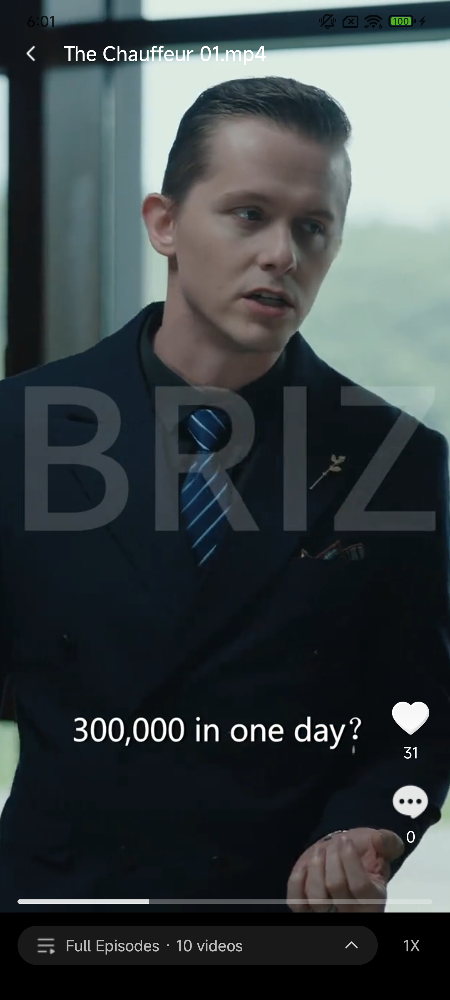

To quickly build a cross-platform video application, you can use this guide to run the VideoOne demo project. This document provides step-by-step instructions for setting up the project within the React Native framework and leveraging the React Native SDK. Upon completion, you will have a single codebase that generates both Android and iOS applications with robust video playback functionality.
## Prerequisites
Complete the following tasks before you start. We recommend maintaining a centralized record of the information gained from each task for easy reference during project setup.

| **Task** | **Task-dependent feature** | **Task instruction** | **Information gained upon completion** |
| --- | --- | --- | --- |
| 1. Register a BytePlus account. <br> 2. Create an access key for the account. | All features | * [Signing up for a BytePlus account](https://docs.byteplus.com/byteplus-platform/docs/signing-up-your-account) <br> * [Creating an access key](https://docs.byteplus.com/byteplus-platform/docs/creating-an-accesskey) | * Access Key ID (AK) <br> * Secret Access Key (SK) |
| 1. Activate the Byteplus VOD service. <br> 2. Create a VOD app and obtain a license. <br>  <br> > If you have already created a BytePlus MediaLive app, bind the existing app instead of creating a new one. | Video playback | * [Step 1: Enable the BytePlus VOD service](https://docs.byteplus.com/docs/byteplus-vod/docs-getting-started#step-1-enable-the-byteplus-vod-service) <br> * [Application management](https://docs.byteplus.com/byteplus-vod/docs/sdk-management) <br> * [License management](https://docs.byteplus.com/docs/byteplus-vod/docs-license-management) | * App ID <br> * BytePlus VOD SDK license file |

## Development environment

* **Watchman, Xcode, and CocoaPods:** Xcode requires version 14.1 or higher.
* **Android JDK and Android Studio**
* **Node.js:** Recommended version 18.0 or higher.
* **Physical Mobile Device:**
   * Android 6.0 or higher.
   * iOS 13.0 or higher.

## Procedures
### Clone the project
Follow the steps below to clone the demo project:

1. Visit GitHub and clone the [VideoOneSolutions](https://github.com/byteplus-sdk/VideoOneSolutions) repository.
2. Open a terminal, change the current directory to `Client/ReactNative`, which is the root directory of the project, and open this directory with an Integrated Development Environment (IDE).

### Install dependencies

1. Install Expo CLI globally.
   ```Shell
   npm install -g @expo/cli
   ```

2. Install the project dependencies.
   ```Shell
   npm install
   ```

3. Navigate to the ios directory and install the iOS dependencies.
   ```Shell
   cd ios && pod install
   ```


### Set up the app service
Open the `services/api.ts` file and change `SERVER_HOST` to the address of your application server.
If you need to use the demo application server provided by BytePlus, set the `SERVER_HOST` field to `videocloud.byteplusapi.com`.
:::tip Note
This address is only for testing and cannot be used in a production environment.
:::
### Set up the VOD license
Rename the license file you obtained in the prerequisite preparation section to `ttsdk.lic` and move it to the `assets` directory.
:::tip Note
This project uses the [Expo plugin](https://docs.expo.dev/config-plugins/plugins/) to copy the license file to the native resource directory. You can also refer to the guidelines in [React Native Player SDK: Integrating the SDK](https://docs.byteplus.com/en/docs/byteplus-vod/docs-rn-player-quickstart) to place the license file in the corresponding `ios` and `android` directories.
:::
### Project configuration
Please follow the steps below to ensure that the app ID matches the certificate.

1. In the `android/app/build.gradle` file, change `applicationId` to the Android package name corresponding to the certificate.
2. Open the `ios` directory with Xcode. In the **Signing & Capabilities** section, change the **Bundle Identifier** to the Bundle ID corresponding to the certificate and complete the setup of other configuration files.

### Compile and run the project
Please follow the steps below to compile and run the project.

1. Execute the below command to start the Metro Server. After the startup is complete, the terminal will display the debugging QR code.
   ```Shell
   npm run start
   ```

2. Build the debugging app:
* Android
   1. Connect your computer to an Android phone.
   2. Execute the below command and select the connected phone device from the pop-up device list.
      ```Shell
      npm run android
      ```

   3. Allow the app installation request on your phone to complete the installation.
* iOS
   4. Connect your computer to an iPhone.
   5. Execute the below command and select the connected iPhone device from the pop-up device list. The project will automatically install the app on your phone.
      ```Shell
      npm run ios
      ```


### Try out the app
After opening the app, you can explore and experience the short drama solution.

|  |  |  <br>  |
| --- | --- | --- |

## Understanding the code
### Project structure
The directory tree of the demo project is as follows:
```Plain Text
Client/ReactNative/
├── app/                    # App screens (Expo Router)
│   ├── _layout.tsx         # Root layout
│   ├── index.tsx           # Home screen
│   ├── drama_channel.tsx   # Drama channel screen
│   ├── drama_player.tsx    # Video player screen
│   └── +not-found.tsx      # 404 screen
├── components/             # Reusable components
│   ├── player/             # Video player components
│   │   ├── VideoPlayer.tsx      # Main video player
│   │   ├── EpisodePlayer.tsx    # Episode player wrapper
│   │   ├── PlaybackControls.tsx # Playback control component
│   │   └── index.ts
│   ├── modals/             # Modal components
│   ├── feed/               # Content feed components
│   ├── ui/                 # UI components
│   ├── shared/             # Shared components
│   ├── drama/              # Drama-related components
│   │   ├── DramaCarousel.tsx  # Drama carousel
│   │   ├── DramaCover.tsx     # Drama cover
│   │   ├── DramaList.tsx      # Drama list
│   │   └── index.ts
│   └── index.ts            # Component exports
├── services/               # API services
│   ├── api.ts              # Base API client
│   ├── dramaService.ts     # Drama data service
│   ├── unlockService.ts    # Content unlock service
│   └── userService.ts      # User management service
├── hooks/                  # Custom React hooks
├── utils/                  # Utility functions
├── types/                  # TypeScript type definitions
├── constants/              # App constants
├── assets/                 # Static assets
│   ├── images/             # Images and icons
│   ├── minidrama/          # Drama-specific assets
│   └── ttsdk.lic           # SDK license file
├── android/                # Android-specific files
│   ├── app/                # Android app module
│   │   ├── build.gradle    # App build configuration
│   │   └── src/            # Android source code
│   ├── build.gradle        # Project build configuration
│.  ├── ...
├── ios/                    # iOS-specific files
│   ├── videoonern/         # iOS app target
│   │   ├── AppDelegate.swift
│   │   ├── ...
│   ├── videoonern.xcodeproj/     # Xcode project
│   ├── videoonern.xcworkspace/   # Xcode workspace
│   ├── Podfile             # CocoaPods dependencies
│   ├── Podfile.lock        # CocoaPods lock file
│   └── Pods/               # CocoaPods dependencies
├── plugins/                # Expo config plugins
│   ├── withATSConfig.js    # ATS configuration plugin
│   ├── withLicense.js      # License file plugin
│   ├── withPodfileSources.js # Podfile sources plugin
│   └── xcodeUtils.js       # Xcode utilities
├── app.json                # Expo app configuration
├── tsconfig.json           # TypeScript configuration
├── package.json            # npm package configuration
├── expo-env.d.ts           # Expo TypeScript definitions
├── eslint.config.js        # ESLint configuration
├── detection_tool.py       # Detection utility
├── LICENSE                 # License file
├── README.md               # English documentation
└── README-zh_CN.md         # Chinese documentation
```

### Technical architecture
#### Core technologies

* **React Native**: Cross-platform mobile development framework
* **Expo**: Development platform and toolchain with rich APIs and components
* **TypeScript**: Type-safe JavaScript superset
* **Expo Router**: File-based routing system for simplified navigation management

#### Architecture design
The following mainly introduces the design of the VOD short drama scenario functions:

1. **Componentized architecture**: Components organized by functional modules for improved code reusability
   * `player/`: Video playback related components
   * `modals/`: Modal components
   * `feed/`: Content feed components
   * `ui/`: General UI components
   * `shared/`: Shared components
   * `drama/`: Drama-related components
2. **Service layer separation**: API services separated by business domain
   * `dramaService.ts`: Drama data management
   * `unlockService.ts`: Content unlock service
   * `userService.ts`: User management service
3. **Custom hooks**: Encapsulate reusable business logic
   * `useDramaChannel.ts`: Drama channel data management
   * `useColorScheme.ts`: Theme color management
4. **Type safety**: Comprehensive TypeScript type definitions
   * Complete interface definitions
   * Strict type checking
   * Excellent development experience

### Features
The following introduces the functions of the short play solution. For the specific usage of each function of the player, please refer to the document [React Native Player SDK](https://docs.byteplus.com/en/docs/byteplus-vod/docs-rn-player-quickstart).
#### Short drama features
##### Playback features

* **Preload video**: Support for video preloading with automatic strategies
* **Prerender video**: Support the pre-rendering strategy of the video player.
* **High-quality video streaming**: Support for multiple quality options (720p, 480p, etc.)
* **Playback controls**: Play/pause, progress bar, volume control
* **Multi-speed playback**: Support for playback speeds from 0.5x to 2.0x
* **Landscape/portrait switching**: Automatic screen orientation adaptation with different control interfaces
* **Progress management**: Support for drag-to-seek and playback position memory

##### User interaction features

* **Like system**: Support for like/unlike with real-time count updates
* **Comment functionality**: User comments and interactions
* **Haptic feedback**: Provides haptic feedback to enhance user experience

##### Monetization features

* **Ad-based unlocking**: Watch ads to unlock paid content
* **VIP subscription**: Pay to unlock all content
* **Batch unlocking**: Unlock multiple episodes at once

##### Content management

* **Drama carousel**: Home page drama recommendation carousel
* **Content lists**: Categorized drama content display
* **Recommendation system**: Intelligent recommendations based on user behavior
