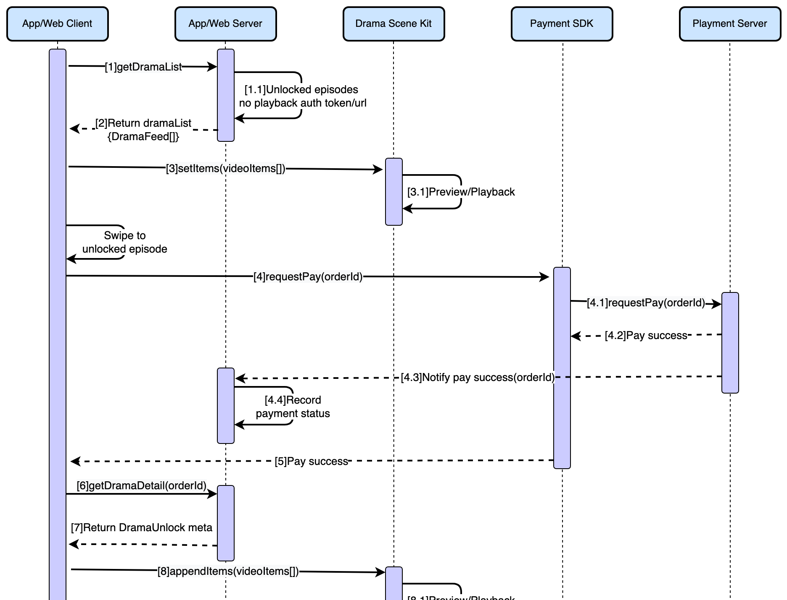

To quickly add a complete short drama video feature to your Android app, you can integrate the BytePlus VideoOne short drama demo. This guide details the entire process, from downloading the source code and configuring dependencies to customizing business logic, data models, and specific features like paid content unlocking.
# Overview of integration solutions
BytePlus VideoOne offers four integration solutions tailored for short drama videos. The table below highlights the distinctions among these four solutions.

| **Solution / Introduction** | **Integrating the short drama demo** | **Integrating the short drama video controls** | **Integrating the PlayerKit controls** | **Integrating the player SDK** |
| --- | --- | --- | --- | --- |
| Description | Built for short drama videos. This solution supports screen capture protection, episode switching, resuming playback seamlessly when switching pages, unlocking paid content and other short drama-specific features. | This solution provides a framework for short drama playback, but doesn't include other business needs. | Built on the player SDK. This solution provides the ability to play videos on the View level and hides the details on how the player is used. | This solution directly integrates the player SDK. |
| Target client | Clients who are developing new apps and are able to replace the business APIs. | Clients who are developing new apps or have existing apps and are able to replace the player architecture. | Clients who are developing new apps or have existing apps and are able to replace the player architecture. | Clients who have existing apps and want to release the short drama features quickly by reusing the existing playback code and replacing the player kernel. Clients with strong development capabilities, extensive experience with players, and ample time to develop new apps. |
| Required development | Clients only need to replace the business APIs and convert the data structures. | Clients need to implement network connectivity, the short drama player UI, playback page switching, and payment functionality themselves. | Clients need to implement network connectivity, the short drama player UI, playback page switching, and payment functionality themselves. | Clients need to implement the player features and short drama-specific features themselves. |
| Time to market | As short as one week | As short as two weeks | Two weeks to one month | Approximately one month |
| Related links | This document | [vod-mini-drama](https://github.com/byteplus-sdk/VideoOneSolutions/tree/main/Client/Android/solutions/vod-mini-drama) | [vod-playerkit](https://github.com/byteplus-sdk/VideoOneSolutions/tree/main/Client/Android/solutions/vod/vod-playerkit) | [Android Player SDK: Integrating the SDK](https://docs.byteplus.com/en/docs/byteplus-vod/docs-integration-android) |

# Running the demo
Before integrating the short drama demo, we recommend that you refer to the document [Running the demo (Android)](https://docs.byteplus.com/en/docs/byteplus-vos/docs-running-the-demo-android-) and try the short drama video features.
# Integrating the short drama demo
The source code of the short drama demo is located in the [vod-mini-drama](https://github.com/byteplus-sdk/VideoOneSolutions/tree/main/Client/Android/solutions/vod-mini-drama) folder under the [VideoOneSolutions](https://github.com/byteplus-sdk/VideoOneSolutions/tree/main) repository. Its directory structure is as follows:
```Bash
.
├── app                    # Entry point of the app 
├── build.gradle 
├── component              # Public components 
│   ├── avatars            # Avatar resources 
│   ├── loginkit           # Login 
│   └── solution-base      # Base library 
│   └── ...
└── solutions              # Solutions 
    ├── vod                # The video playback scene 
    │   ├── vod-playerkit  # VOD player kit
    │   ├── vod-scenekit   # VOD scene kit
    │   └── ...
    ├── vod-mini-drama     # The mini drama scene 
    └── ...
```

## Step 1: Download the source code
Run the following commands to download the source code to your local device:
```Bash
git clone https://github.com/byteplus-sdk/VideoOneSolutions
cd Client/Android
```

## Step 2: Copy the code
Copy the following folders to the root directory of your project and keep the directory structure as [VideoOneSolutions/Client/Android](https://github.com/byteplus-sdk/VideoOneSolutions/tree/main/Client/Android):
```Bash
component/solution-base
component/avatars
component/loginkit
component/rtc-toolkit

solutions/vod/vod-common
solutions/vod/vod-demo
solutions/vod/vod-playerkit
solutions/vod/vod-scenekit
solutions/vod/vod-settingskit
solutions/vod/vod-input-media
solutions/vod-mini-drama
```

## Step 3: Configure the Maven repository
Add the following configurations to the `build.gradle` file in the root directory of the project.
```Groovy
allprojects {
    repositories {
        maven { url 'https://artifact.bytedance.com/repository/Volcengine/' }
        maven { url 'https://artifact.byteplus.com/repository/public/' }

        google()
        mavenCentral()
    }
}

apply from: 'https://ve-vos.volccdn.com/script/vevos-repo-base.gradle'
```

## Step 4: SDK integration
To integrate the SDK into your project, add the required libraries to your module's build.gradle file. Add the libraries as follows:
To get the latest version number, see [Client SDK components](https://docs.byteplus.com/en/docs/byteplus-vos/docs-version-combination)

```Groovy
dependencies {
    def ttsdkVersion = "1.43.300.3"
    // BytePlus VOD SDK dependencies
    implementation "com.bytedanceapi:ttsdk-player_premium:$ttsdkVersion"
    implementation 'com.bytedance.applog:RangersAppLog-Lite-global:6.14.3'
}
```

## Step 5: Import the short drama module

1. Add the demo module to the `settings.gradle` file:

```Groovy
include ':app'
include ':component:avatars'
include ':component:solution-base'
include ':component:loginkit'
include ':component:rtc-toolkit'
// vod
include ':solutions:vod:vod-common'
include ':solutions:vod:vod-demo'
include ':solutions:vod:vod-input-media'
// vod-playerkit
include ':solutions:vod:vod-playerkit'
include ':solutions:vod:vod-playerkit:vod-player-utils'
include ':solutions:vod:vod-playerkit:vod-player'
include ':solutions:vod:vod-playerkit:vod-player-ve'
// vod-scenekit
include ':solutions:vod:vod-scenekit'
include ':solutions:vod:vod-settingskit'

include ':solutions:vod-mini-drama'
```


2. Add a dependency on the `:solutions:vod-mini-drama` module in your app's `app/build.gradle`  file:

```Groovy
dependencies {
    implementation project(':solutions:vod-mini-drama')
}
```


3. Sync the Gradle files. If Android Studio doesn't report any errors, it means the demo module has been imported successfully.

## Step 6: Configure permissions and obfuscation rules

1. Add the obfuscation rules required by the BytePlus VOD Player to the `proguard-rules.pro` file of the project.

```Python
-keep class com.ss.ttm.** {*;} 
-keep class com.ss.ttvideoengine.** {*;} 
-keep class com.ss.mediakit.** {*;} 
-keep class com.ss.texturerender.** {*;}
-keep class com.bytedance.**{*;}
-keep class com.pandora.ttlicense2.**{*;}
-keep class com.pandora.common.applog.**{*;}
-keep class com.pandora.vod.VodSDK {*;} 
-keep class com.bytertc.volcbaselog.VolcBaseLogConfig{*;}
-keep class com.bytertc.volcbaselog.VolcBaseLogNative{*;}
```


2. Declare the permissions required by the SDK in the `AndroidManifest.xml` file.

```XML
<uses-permission android:name="android.permission.INTERNET" />
<uses-permission android:name="android.permission.WAKE_LOCK" />
<uses-permission android:name="android.permission.ACCESS_NETWORK_STATE" />
<uses-permission android:name="android.permission.READ_EXTERNAL_STORAGE" />
<uses-permission android:name="android.permission.WRITE_EXTERNAL_STORAGE" />
<uses-permission android:name="android.permission.ACCESS_WIFI_STATE" />
```

For more information, refer to [Integrating the SDK](https://docs.byteplus.com/en/docs/byteplus-vod/docs-integration-android).

## Step 7: Initialize the short drama demo
Call the `init` method of the VodSDK to initialize the demo.
```Java
public class App extends Application {
    @Override
    public void onCreate() {
        super.onCreate();
        VodSDK.init(this,
            "your app id",
            "your app name",
            "your app channel",
            "your app version",
            "singapore",
            "assets:///your_license_name.lic",
        );
    }
}
```

## Step 8: Integrate the short drama pages
You can refer to the code below to directly use the [DramaMainActivity](https://github.com/byteplus-sdk/VideoOneSolutions/blob/main/Client/Android/solutions/vod-mini-drama/src/main/java/com/byteplus/vod/minidrama/scene/main/DramaMainActivity.java) that has been configured in the` `[vod-mini-drama](https://github.com/byteplus-sdk/VideoOneSolutions/tree/main/Client/Android/solutions/vod-mini-drama) module:
```Java
context.startActivity(new Intent(context, DramaMainActivity.class));
```

# Tailoring to your business requirements
To quickly align the short drama demo with your business requirements, follow the steps below:

1. Customize the data layer to efficiently incorporate essential short drama video features. This involves:
   1. Replacing the business APIs: Implement the APIs outlined in the [vod/minidrama/remote/api/DramaApi](https://github.com/byteplus-sdk/VideoOneSolutions/blob/main/Client/Android/solutions/vod-mini-drama/src/main/java/com/byteplus/vod/minidrama/remote/api/DramaApi.java) package.
   2. Converting the data structure: Adapt the data structure received from your app server to match the structure defined in the short drama demo, enabling utilization of existing business workflows in the demo.
2. Customize short drama-specific functionalities like unlocking paid content.

## Source code structure of the short drama demo
```Bash
├ VodSDK.java                            // BytePlus VOD Player initialization class
├ minidrama
    ├ remote
    │   ├ api
    │   │   └ DramaApi.java              // Drama HTTP API
    │   └ model                          // Drama data models
    ├ event                              // EventBus-related drama events
    └ scene
        ├ comment                        // Comment dialogs
        ├ data                           // Drama data items
        ├ detail                         // Drama detail pages
        │   ├ pay                        // Drama ad & payment pages
        │   └ selector                   // Drama selector dialogs
        ├ main                           // Drama main page 
        ├ recommend                      // "For You" page
        ├ theater                        // Theater page
        └ widgets                        // Common widgets
```

## Adapting the data layer
### Replace the business APIs

1. Update the "Home" page API: Refer to the sample code below to call the API that gets short drama recommendations for the "Home" page.

For detailed implementation, refer to [DramaTheaterFragment.java](https://github.com/byteplus-sdk/VideoOneSolutions/blob/main/Client/Android/solutions/vod-mini-drama/src/main/java/com/byteplus/vod/minidrama/scene/theater/DramaTheaterFragment.java).

```Java
public class DramaTheaterFragment extends Fragment {
    private GetDramas mRemoteApi;

    @Override
    public void onCreate(@Nullable Bundle savedInstanceState) {
        super.onCreate(savedInstanceState);
        mRemoteApi = new GetDramas();
        // ...
    }

    @Override
    public void onViewCreated(@NonNull View view, @Nullable Bundle savedInstanceState) {
        super.onViewCreated(view, savedInstanceState);
        // ...
        refresh();
    }
    
    private void refresh() {
        // ...
        mRemoteApi.getDramaChannel(new HttpCallback<>() {
            @Override
            public void onSuccess(DramaTheaterEntity result) {
                L.d(this, "refresh", "success");
                // ...
            }
            @Override
            public void onError(Throwable e) {
                L.d(this, "refresh", e, "error");
                // ...
            }
        });
    }
}
```


2. Update the "Info" page API: Refer to the sample code below to call the API that gets short drama information for the "Info" page.

For detailed implementation, refer to [DramaDetailVideoFragment.java](https://github.com/byteplus-sdk/VideoOneSolutions/blob/main/Client/Android/solutions/vod-mini-drama/src/main/java/com/byteplus/vod/minidrama/scene/detail/DramaDetailVideoFragment.java).

```Java
public class DramaDetailVideoFragment extends BaseFragment {
    private GetDramas mRemoteApi;

    @Override
    public void onCreate(@Nullable Bundle savedInstanceState) {
        super.onCreate(savedInstanceState);
        mRemoteApi = new GetDramas();
        // ...
    }

    @Override
    public void onViewCreated(@NonNull View view, @Nullable Bundle savedInstanceState) {
        super.onViewCreated(view, savedInstanceState);
        // ...
        load(dramaItem);
    }

    private void load(@NonNull DramaItem dramaItem) {
        // ...
        mRemoteApi.getDramaList(dramaItem.getDramaId(), new HttpCallback<>() {
            @Override
            public void onSuccess(List<DramaFeed> items) {
                L.d(this, "load", "success", DramaItem.dump(dramaItem), items);
                // ...
            }
            @Override
            public void onError(Throwable e) {
                L.e(this, "load", e, "error", DramaItem.dump(dramaItem));
                // ...
            }
        });
    }
}
```


3. Update the "For you" page API: Refer to the sample code below to call the API that gets short drama lists for the "For you" page.

For detailed implementation, refer to [DramaRecommendVideoFragment.java](https://github.com/byteplus-sdk/VideoOneSolutions/blob/main/Client/Android/solutions/vod-mini-drama/src/main/java/com/byteplus/vod/minidrama/scene/recommend/DramaRecommendVideoFragment.java).

```Java
public class DramaRecommendVideoFragment extends Fragment {
    private GetDramas mRemoteApi;

    @Override
    public void onCreate(@Nullable Bundle savedInstanceState) {
        super.onCreate(savedInstanceState);
        mRemoteApi = new GetDramas();
    }

    @Override
    public void onViewCreated(@NonNull View view, @Nullable Bundle savedInstanceState) {
        super.onViewCreated(view, savedInstanceState);
        // ...
        refresh();
    }

    private void refresh() {
        // ...
        mRemoteApi.getDramaFeed(0, mBook.pageSize(), new HttpCallback<>() {
            @Override
            public void onSuccess(List<DramaRecommend> items) {
               // ...
            }
            @Override
            public void onError(Throwable e) {
               // ...
            }
        });
    }
}
```

### Converting the data structure
The short drama demo layer has defined data structures including [DramaInfo](https://github.com/byteplus-sdk/VideoOneSolutions/blob/main/Client/Android/solutions/vod-mini-drama/src/main/java/com/byteplus/vod/minidrama/remote/model/drama/DramaInfo.java) (short drama information), [DramaFeed](https://github.com/byteplus-sdk/VideoOneSolutions/blob/main/Client/Android/solutions/vod-mini-drama/src/main/java/com/byteplus/vod/minidrama/remote/model/drama/DramaFeed.java) (short drama episode information), [DramaUnlockMeta](https://github.com/byteplus-sdk/VideoOneSolutions/blob/main/Client/Android/solutions/vod-mini-drama/src/main/java/com/byteplus/vod/minidrama/remote/model/drama/DramaUnlockMeta.java) (episode unlocking information), and [CommentDetail](https://github.com/byteplus-sdk/VideoOneSolutions/blob/main/Client/Android/solutions/vod/vod-common/src/main/java/com/byteplus/vodcommon/data/remote/api2/model/CommentDetail.java) (comments). 
You must convert the data structures received from your app server into these data structures. The table below provides a breakdown of the details of these data structures.

| **Class** | **Parameter** | **Type** | **Required** | **Description** |
| --- | --- | --- | --- | --- |
| [DramaInfo](https://github.com/byteplus-sdk/VideoOneSolutions/blob/main/Client/Android/solutions/vod-mini-drama/src/main/java/com/byteplus/vod/minidrama/remote/model/drama/DramaInfo.java) <br> （Short drama info） | dramaId | String | Required | Drama ID |
|  | dramaTitle | String | Required | Short drama name |
|  | dramaCoverUrl | String | Required | Short drama cover URL |
|  | dramaPlayTimes | int | Required | Playback count |
|  | orientation | int | Required | Video orientation <br> 0 : PORTRAIT <br> 1 : LANDSCAPE |
|  | totalEpisodeNumber | int | Required | Total number of episodes |
|  | newRelease | boolean | Optional | Whether to display a "New" label (false by default). <br> true : Display <br> false : Hide |
| [DramaFeed](https://github.com/byteplus-sdk/VideoOneSolutions/blob/main/Client/Android/solutions/vod-mini-drama/src/main/java/com/byteplus/vod/minidrama/remote/model/drama/DramaFeed.java) <br> （Episode info） | vid | String | Required | Video ID |
|  | title | String | Optional | Video title |
|  | duration | double | Required | Video duration (in seconds) |
|  | coverUrl | String | Required | Video cover URL |
|  | playAuthToken | String | Optional | This is the PlayAuthToken for the video's data source, which can be issued by the AppServer through the BytePlus VOD Server SDK. |
|  | subtitleAuthToken | String | Optional | The subtitle token for the video's data source which can be issued by the AppServer through the BytePlus VOD Server SDK. |
|  | playTimes | int | Optional | Playback count |
|  | subtitle | String | Optional | Subheading of the video |
|  | createTime | Date | Optional | Time of uploading in *RFC3339* format |
|  | userName | String | Optional | Uploader name |
|  | userId | String | Optional | Uploader's userId |
|  | likeCount | int | Optional | Number of likes |
|  | commentCount | int | Optional | Number of comments |
|  | height | int | Required | Video height |
|  | width | int | Required | Video width |
|  | dramaIndex | int | Required | Video position in the episode list |
|  | dramaId | String | Required | Short drama ID |
|  | needVip | boolean | Required | Whether payment is required to unlock (false by default). |
|  | displayType | DisplayType | Required <br>  | Display type of the short drama card on the "For you" page <br> 0: TEXT, without cover image <br> 1: COVER, with cover image |
| [DramaUnlockMeta](https://github.com/byteplus-sdk/VideoOneSolutions/blob/main/Client/Android/solutions/vod-mini-drama/src/main/java/com/byteplus/vod/minidrama/remote/model/drama/DramaUnlockMeta.java) <br> （Episode unlocking info） | dramaId | String | Required | Short drama ID |
|  | vid | String | Required | Video ID |
|  | dramaIndex | int | Optional | Video position in the episode list |
|  | playAuthToken | String | Required | The PlayAuthToken of the video's data source which can be issued by the AppServer through the BytePlus VOD Server SDK. |
The short drama demo's video controls use the [VideoItem](https://github.com/byteplus-sdk/VideoOneSolutions/blob/main/Client/Android/solutions/vod/vod-scenekit/src/main/java/com/byteplus/vod/scenekit/data/model/VideoItem.java) data structure. Therefore, you must convert [DramaFeed](https://github.com/byteplus-sdk/VideoOneSolutions/blob/main/Client/Android/solutions/vod-mini-drama/src/main/java/com/byteplus/vod/minidrama/remote/model/drama/DramaFeed.java) objects to [VideoItem](https://github.com/byteplus-sdk/VideoOneSolutions/blob/main/Client/Android/solutions/vod/vod-scenekit/src/main/java/com/byteplus/vod/scenekit/data/model/VideoItem.java) objects for compatibility.
```Java
// Convert DramaFeed to VideoItem
VideoItem videoItem = DramaFeed.toVideoItem();
```

Components built on the video controls use [VideoItem](https://github.com/byteplus-sdk/VideoOneSolutions/blob/main/Client/Android/solutions/vod/vod-scenekit/src/main/java/com/byteplus/vod/scenekit/data/model/VideoItem.java) objects. To implement your business logic, you must retrieve the original [DramaFeed](https://github.com/byteplus-sdk/VideoOneSolutions/blob/main/Client/Android/solutions/vod-mini-drama/src/main/java/com/byteplus/vod/minidrama/remote/model/drama/DramaFeed.java) data from a [VideoItem](https://github.com/byteplus-sdk/VideoOneSolutions/blob/main/Client/Android/solutions/vod/vod-scenekit/src/main/java/com/byteplus/vod/scenekit/data/model/VideoItem.java) object. This allows you to access the necessary short drama information.
```Java
// Get DramaFeed from VideoItem
DramaFeed dramaFeed = DramaFeed.of(videoItem);
```

## Customizing short drama-specific features
### Anti-screen recording
You can refer to the sample code below to call the system API through the Activity `onCreate` method to enable anti-screen recording. In the short drama demo, anti-screen recording has been enabled for [DramaDetailVideoActivity](https://github.com/byteplus-sdk/VideoOneSolutions/blob/main/Client/Android/solutions/vod-mini-drama/src/main/java/com/byteplus/vod/minidrama/scene/detail/DramaDetailVideoActivity.java) and [DramaMainActivity](https://github.com/byteplus-sdk/VideoOneSolutions/blob/main/Client/Android/solutions/vod-mini-drama/src/main/java/com/byteplus/vod/minidrama/scene/main/DramaMainActivity.java). For more information, refer to [Preventing screen recording](https://docs.byteplus.com/en/docs/byteplus-vos/docs-anti-screen-recording#window-anti-screen-recording-anti-screenshot).
```Java
@Override
protected void onCreate(Bundle savedInstanceState) {
    super.onCreate(savedInstanceState);
    Window window = getWindow();
    window.addFlags(WindowManager.LayoutParams.FLAG_SECURE);
}
```

### Unlocking paid content
The process for unlocking and playing paid content in the short drama demo is shown in the image below.



The short drama demo does not include a third-party SDK; it provides a mock implementation to illustrate the process.
Insert the third-party SDK and replace the imitation payment process on the [DramaEpisodeUnlockByPaymentFragment](https://github.com/byteplus-sdk/VideoOneSolutions/blob/main/Client/Android/solutions/vod-mini-drama/src/main/java/com/byteplus/vod/minidrama/scene/detail/pay/DramaEpisodeUnlockByPaymentFragment.java) page.
```Java
public class DramaEpisodeUnlockByPaymentFragment extends BottomSheetDialogFragment {

    @Override
    public void onViewCreated(@NonNull View view, @Nullable Bundle savedInstanceState) {
        // ...
        binding.action.setOnClickListener(v -> {
            SKU value = Objects.requireNonNull(viewModel.sku.getValue());
           // After a successful payment, request unlockEpisodes to get playback auth tokens
            List<String> episodes = //...
            unlockStateModel.unlockEpisodes(dramaItem.getDramaId(), episodes);
        });
    }
}
```


