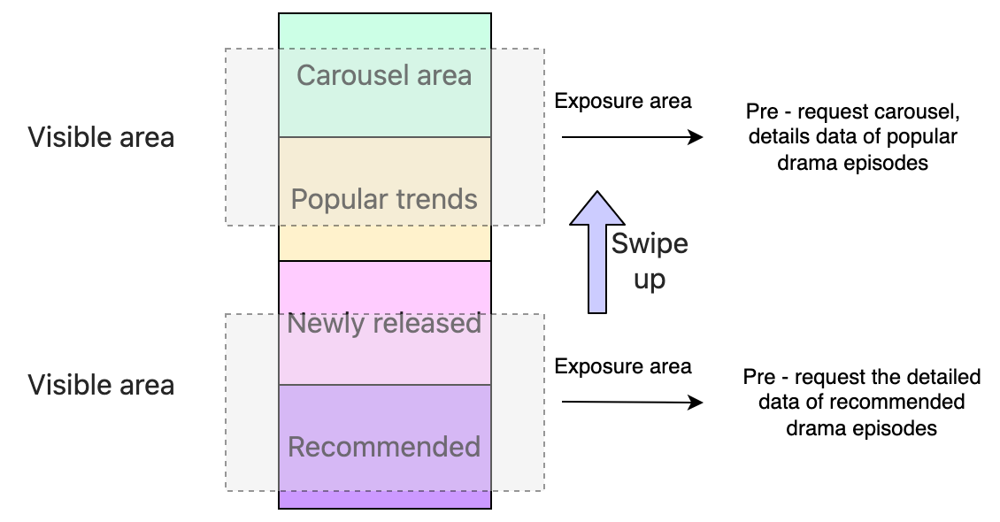
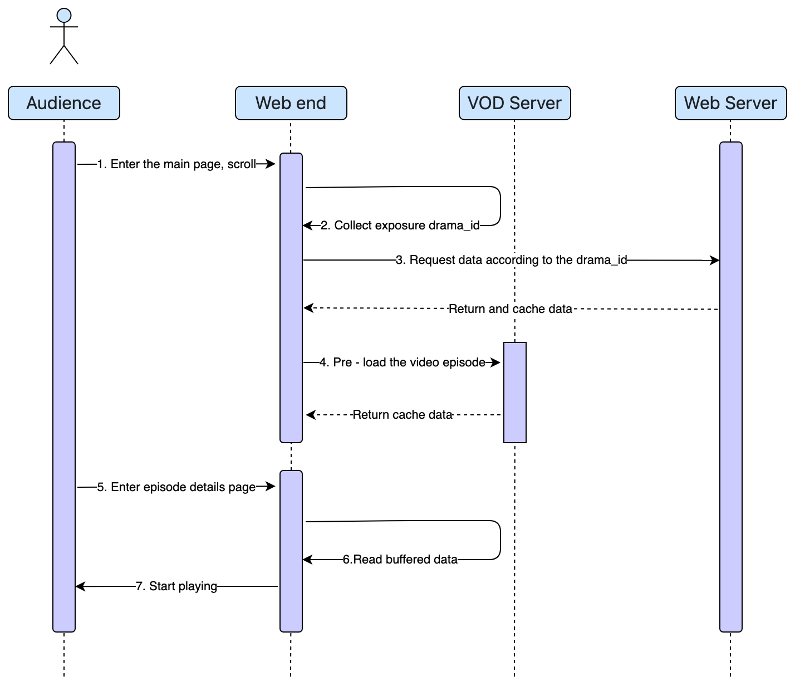
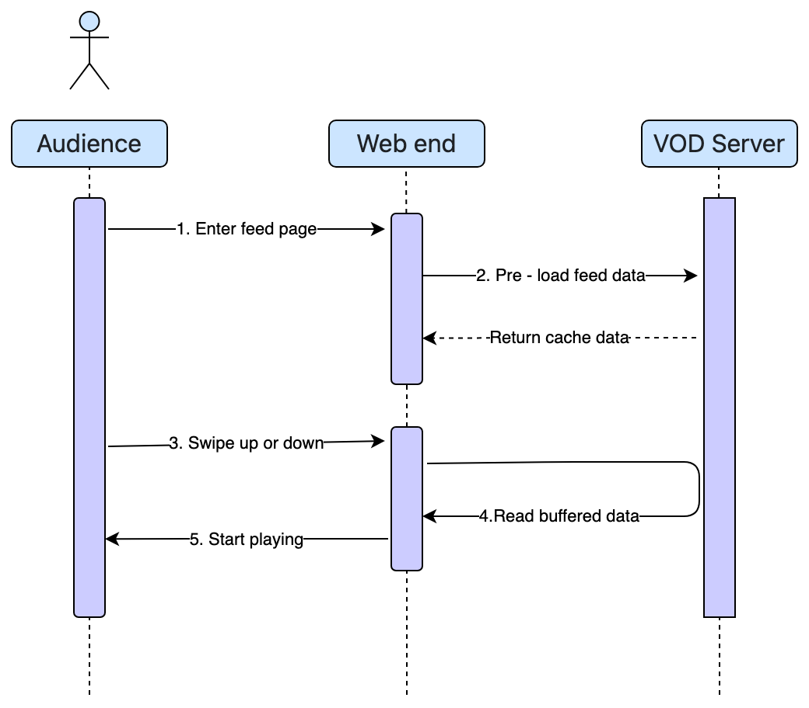
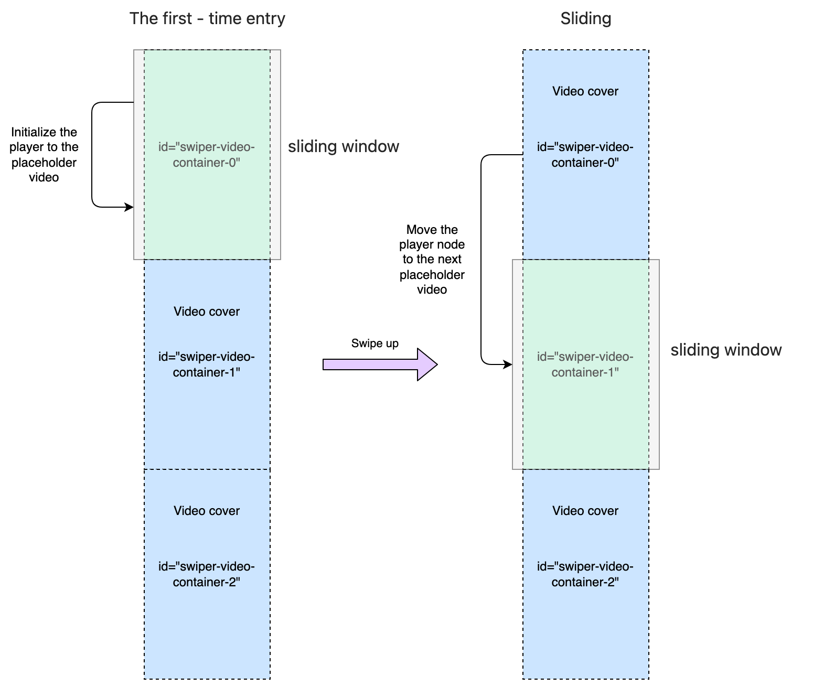

To quickly build a short drama video feature for your web application, you can use the BytePlus VideoOne demo. This guide provides step-by-step instructions to download the source code, install dependencies, and run the project. It also explains how to adapt the data structures and APIs to fit your business needs.
# Solution Overview

| **Feature Description** | **Environment Requirements** | **Development Tasks** | **Time to market** |
| --- | --- | --- | --- |
| Built with components designed for short drama videos, this solution supports features like episode switching, seamless playback resumption between pages, and unlocking paid content. | * Node version: 20 or above. <br> * Device requirement: Only mobile Android and iOS devices are supported. Foldable phones are not supported. | Replace the business APIs and convert data structures for the app | As little as one week |

# Integrating the short drama demo
## Step 1: Download the source code
Run the following commands to download the source code to your local device:
```Bash
git clone https://github.com/byteplus-sdk/videoone-example
cd videoone-example
```

## Step 2: Install the dependencies
Go to the root directory of the project and run `pnpm install --registry=https://registry.npmmirror.com` to install the dependencies ([pnpm](https://pnpm.io/installation) is recommended).
## Step 3: Run the project

1. Run the `pnpm run dev` command to start the project. The default port is 8000.
2. Open `localhost:8000/videoone/dramaGround`  in the browser to preview the short drama.

## Step 4: Build and release
Execute `pnpm run build` to get the output package. During deployment, pay special attention to the `base` and `build` of the `vite.config.ts` configuration:

1. The package will be created in the `output` directory. You can change the `outDir` under `build` to use another directory.
2. Public path for packaged resources:
   1.  If the packaged resources will be directly hosted on the server, you can keep it the same as the development environment. 
   2. If the static resources will be uploaded to and hosted on CDN, you will need to obtain the corresponding acceleration domain name and replace the `*` with it.
   ```JavaScript
   export default defineConfig({
     base: isProd ? '*' : '/',
     server: {
       port: 8000,
     },
     build: {
       outDir: 'output',
     },
   });
   ```


# Adapt to Business Needs
## Source code structure of the short drama demo
```Bash
videoone-example
├─ README.md
├─ index.html # Render template
├─ package.json
├─ pnpm-lock.yaml
├─ src
│  ├─ @types
│  ├─ App.tsx
│  ├─ assets # Static resources such as fonts, SVGs, images, Lottie animations, etc.
│  ├─ components
│  │  ├─ videoSwiper # Short drama feed sliding component
│  │  └─ ...
│  ├─ interface # Interface type definition
│  ├─ main.tsx
│  ├─ pages
│  │  ├─ drama # Short drama
│  │  │  ├─ Channel # Short drama channel page
│  │  │  ├─ ChannelDetail # Short drama channel detail page
│  │  │  ├─ Ground # Short drama ground page
│  │  └─ ttshow # Interactive video module (optional)
│  ├─ player.ts
│  ├─ plugins # Player plugins
│  ├─ redux # State management
│  ├─ service # Interface configuration
│  │  └─ path.ts
│  ├─ utils # Common configurations or methods
│  │  ├─ flexible.ts # rem adaptation (see vite.config.ts)
│  │  ├─ index.ts
│  │  ├─ preload.ts # feed pre - loaded data processing
│  │  ├─ translation.ts
│  │  └─ util.ts # Common methods
│  └─ vite-env.d.ts
└─ vite.config.ts
```

## Adapt the data layer
### Data structure overview
To implement short drama videos, the short drama demo has defined the following structures: `drama_meta` (short drama info), `video_meta` (video info) and `comment_meta` (comments). You will need to convert the data structures returned by your app server to the above data structures. The table below lists the details of the data structures:

| **Class** | **Parameter** | **Type** | **Required** | **Description** |
| --- | --- | --- | --- | --- |
| `drama_meta` <br> (short drama info) | dramaId | String | Required | Drama ID |
|  | dramaTitle | String | Required | Short drama name |
|  | dramaCoverUrl | String | Required | Short drama cover URL |
|  | dramaPlayTimes | int | Required | Playback count |
|  | dramaVideoOrientation | int | Required | Video orientation <br> 0 : PORTRAIT <br> 1 : LANDSCAPE |
|  | dramaLength | int | Required | Total number of episodes |
|  | newRelease | boolean | Optional | Whether to display a "New" label (false by default). <br> true : Display <br> false : Hide |
| `video_meta` <br> (episode video information) | vid | String | Required | Video ID |
|  | name | String | Optional | Video title |
|  | duration | double | Required | Video duration (in seconds) |
|  | coverUrl | String | Required | Video cover URL |
|  | playAuthToken | String | Optional | The PlayAuthToken for the video, issued by your AppServer using the BytePlus VOD Server SDK. |
|  | subtitleAuthToken | String | Optional | The subtitle token for the video, issued by your AppServer using the BytePlus VOD Server SDK. |
|  | playTimes | int | Optional | Playback count |
|  | subtitle | String | Optional | Subheading of the video |
|  | like | int | Optional | Number of likes |
|  | comment | int | Optional | Number of comments |
|  | height | int | Required | Video height |
|  | width | int | Required | Video width |
|  | order | int | Required | Video position in the episode list |
|  | dramaId | String | Required | Short drama ID |
|  | vip | boolean | Required | Whether payment is required to unlock (false by default). |
|  | displayType | DisplayType | Required <br>  | Display type of the short drama card on the "For you" page. <br> 0 : TEXT, without cover image <br> 1 : COVER, with cover image |
| `comment_meta` <br> (comments) | content | String | Optional | Comment content |
|  | name | String | Optional | User name |
|  | uid | int | Optional | User ID |
|  | like | int | Optional | Number of likes |
|  | createTime | String | Optional | Creation time |
|  |  liked | boolean | Optional | Indicates whether the user has liked the comment. |

### Replace the APIs
Replace the corresponding APIs in the file `src/service/path.ts`.
```JavaScript
export const API_PATH = {
  // Short drama
  GetDramaChannel: '/drama/v1/getDramaChannel', // Get data for channel page, including carousel, recommendations, etc.
  GetDramaFeed: '/drama/v1/getDramaFeed', // Get recommended data, supporting paginated queries.
  GetDramaList: '/drama/v1/getDramaList', // Get drama list data.
  GetDramaVideoComments: '/drama/v1/getVideoComments', // Get mock comments.
  GetDramaDetail: '/drama/v1/getDramaDetail', // Get detailed data of short drama episodes.
};
```

# Implementation Details (for reference only)
If you are interested in the implementation details, you can refer to the section below, which provides details on preloading resources and switching URLs in a single instance.
## Preloading resources
### Pre-requesting and caching data
The "Home" page contains a selection of short drama series. There may be as many as 100 requests running at the same time, but HTTP 1.0 browsers can only support up to 6 concurrent requests. It is impossible to process so many requests simultaneously, and they will affect the processing of other high-priority requests. Therefore, it makes more sense to determine a user's scroll position by checking which elements are visible and then incrementally pre-fetch data for the relevant short drama series.





You can use the `IntersectionObserver` method to determine whether a series element is exposed. If yes, you can then call `handlePreload` to run a pre-request and cache the data using the `useCache` parameter in `axios-hooks`.
```JavaScript
import useAxios from 'axios-hooks';

const refPreloadSet = useRef(new Set()) as React.MutableRefObject<Set<string>>;
const [, executePreload] = useAxios(
    {
      url: API_PATH.GetDramaList,
      method: 'POST',
    },
    { useCache: true, autoCancel: false, manual: true },
);

const handlePreload = (drama_id: string) => {
  // Avoid repeated requests for the same drama episode.
  if (!refPreloadSet.current.has(drama_id)) {
    executePreload({
      data: {
        drama_id: drama_id,
        play_info_type: 1,
        user_id: window.sessionStorage.getItem('user_id'),
      },
    });
    refPreloadSet.current.add(drama_id);
  }
};

useEffect(() => {
  refIo.current = new IntersectionObserver(entries => {
    entries.forEach(entry => {
      if (entry.intersectionRatio > 0 && entry.target.getAttribute('drama-id')) {
        handlePreload(entry.target.getAttribute('drama-id')!);
      }
    });
  });
  const dramaLIst = document.querySelectorAll('.drama');
  dramaLIst.forEach(el => {
    refIo.current?.observe(el);
  });
}, [data?.response]);

useEffect(() => {
  return () => {
    refIo.current?.disconnect();
  };
}, []);
```

### Preloading video buffer data
Preloading is a feature of the `Veplayer`, which only supports the MP4 format and the DirectURL mode. Therefore, the browser must support MSE, which means it has to be a PC or Android browser and not an iOS browser.
**Preloading the first episode of a series**
When users are browsing the `Home` page, the `drama_id` of the elements exposed will be obtained and added to the preloading queue. When they enter the `Details` page of a series, the buffer data will be directly used to reduce the time to first frame.




This can be implemented using the sample code below:
```JavaScript
useEffect(() => {
  // Enable pre-loading on PC and Android
  if (!(os.isPc || os.isAndroid)) {
    return;
  }
  if (dramaDetailData?.response) {
    const singlelist = [
      { ...dramaDetailData?.response[0], videoModel: parseModel(dramaDetailData?.response[0].video_model)! },
    ];
    if (!preloadOnceRef.current) {
      preloadOnceRef.current = true;
      VePlayer.setPreloadScene(0); // Update to manual mode. Note: In manual mode, load all preloadable resources at once.
      VePlayer.preloader?.clearPreloadList(); // Clear the preload list before switching the mode.
      VePlayer.setPreloadList(formatPreloadStreamList(singlelist) as IPreloadStream[]);
    } else {
      VePlayer.addPreloadList(formatPreloadStreamList(singlelist) as IPreloadStream[]);
    }
  }
}, [dramaDetailData?.response]);
```

**Preloading feeds**
Feed preloading begins when a user enters the "Recommendations" page or the details page of a series. As the user swipes to switch episodes, the app calls `playNext` to change the URL. The Veplayer then identifies the current video's `vid` and adds the previous (`prevCount`) and next (`nextCount`) episodes to the preloading queue. These preloading tasks are executed once the current video starts playing and its buffer is sufficient.



This can be implemented using the sample code below:
```JavaScript
useEffect(() => {
  // Preloading is only supported on PC and Android.
  if (!(os.isPc || os.isAndroid)) {
    return;
  }
  // Scenarios for enabling pre - loading: 
  // 1. On the recommendation page and in an active state;
  // 2. Entering the short drama details page.
  if ((isChannel && isChannelActive) || !isChannel) {
    VePlayer.setPreloadScene(1, {
      prevCount: 1,
      nextCount: 2,
    });
    // Setting of the pre - load pending list
    VePlayer.preloader?.clearPreloadList();
    VePlayer.setPreloadList(formatPreloadStreamList(videoDataList, definition) as IPreloadStream[]);
  }
}, [isChannel, isChannelActive, videoDataList.filter(item => !item.vip).length, definition]); // Only unlocked videos are preloaded.
```

## Keeping a single player instance
Destroying and recreating players requires the registration and destruction of a large number of events. The internal process is complex and time-consuming. Switching URLs in a single player instance can skip this process and minimize the time to first frame. This solution uses the DOM `insertBefore` method to move the initialized player node to the next active window and calls the `playNext` method of `playerSdk` to switch between feeds.





**Notes**
When the "playNext" method is called in fullscreen mode on Android devices, the system will exit the fullscreen mode. This is because the xgplayer internally deems the movement of the player DOM as a shortcut action, which will trigger the "exitFullScreen" method. A temporary workaround is to delay moving the DOM element until the user manually exits fullscreen mode.


