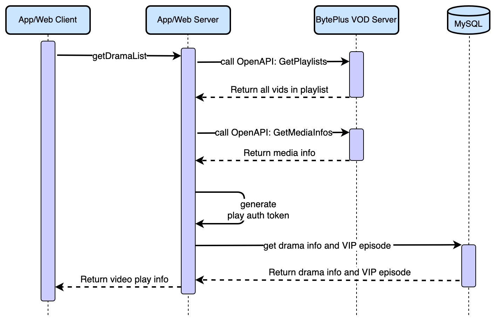
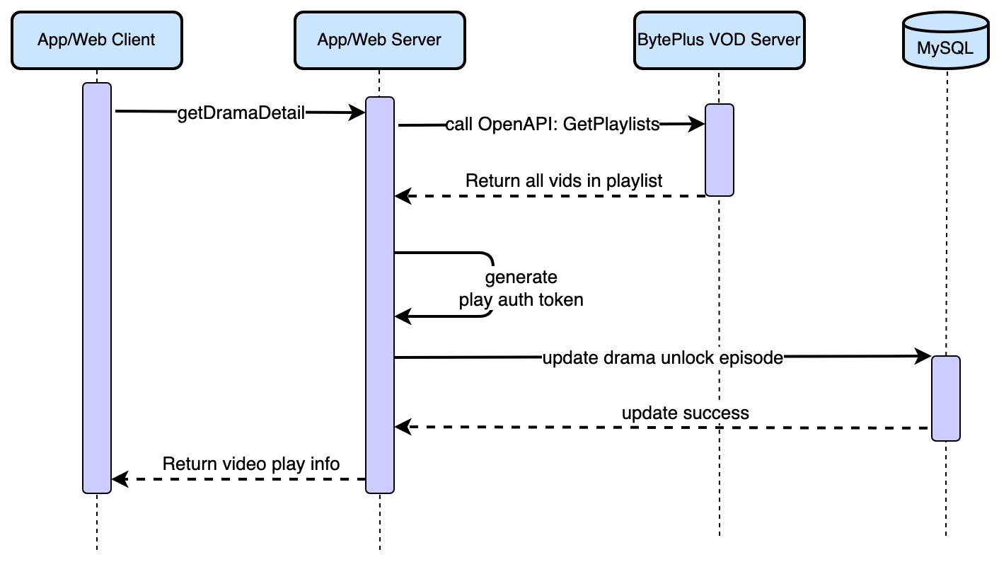

This article offers an in-depth exploration of the integration solutions for hosting short drama videos on your server with BytePlus VideoOne. It details a step-by-step process to seamlessly integrate the short drama demonstration.
## System requirements 

* [Go](https://go.dev/doc/tutorial/getting-started) 1.18 or higher.
* [MySQL](https://dev.mysql.com/doc/mysql-getting-started/en/) 5.7 or higher.
* [Redis](https://redis.io/docs/latest/operate/oss_and_stack/install/install-redis/) 6.2 or higher.

# Prerequisites 

* A valid [BytePlus account](http://console.byteplus.com/) with [BytePlus VOD](https://console.byteplus.com/vodpaas) and [BytePlus RTC](https://console.byteplus.com/rtc/workplaceRTC) activated.
* You have [created an access key](https://docs.byteplus.com/en/docs/byteplus-platform/docs-creating-an-accesskey) for the account.
* You have cloned the [VideoOneSolutions](https://github.com/byteplus-sdk/VideoOneSolutions) repository from GitHub.
* Complete the following steps on the [SDK management](https://console.byteplus.com/vodpaas/sdk/) page within the BytePlus VOD console.

# Run the server-side code 
This section explains how to run the server-side code on your server.
## Step 1: Creating tables in MySQL
Execute the following DML SQL to create a MySQL database.
```SQL
CREATE DATABASE IF NOT EXISTS `videoone`; 
USE `videoone`; 
 
DROP TABLE IF EXISTS `user_profile`; 
CREATE TABLE `user_profile` 
( 
    `id`         bigint(20) unsigned NOT NULL AUTO_INCREMENT COMMENT 'primary key', 
    `user_id`    varchar(32)         NOT NULL DEFAULT '' COMMENT 'user id', 
    `user_name`  varchar(64)         NOT NULL DEFAULT '' COMMENT 'user name', 
    `created_at` timestamp           NOT NULL DEFAULT CURRENT_TIMESTAMP COMMENT 'create time', 
    `updated_at` timestamp           NOT NULL DEFAULT CURRENT_TIMESTAMP ON UPDATE CURRENT_TIMESTAMP COMMENT 'update time', 
    PRIMARY KEY (`id`), 
    UNIQUE KEY `idx_user_id` (`user_id`) 
) ENGINE = InnoDB DEFAULT CHARSET = utf8mb4 COMMENT ='user profile information';

CREATE TABLE `video_comments`
(
    `id`          bigint(20) unsigned NOT NULL AUTO_INCREMENT COMMENT 'id',
    `vid`         varchar(100)        NOT NULL DEFAULT '' COMMENT 'vid',
    `name`        varchar(100)        NOT NULL DEFAULT '' COMMENT 'name',
    `content`     text COMMENT 'content',
    `create_time` datetime            NOT NULL DEFAULT CURRENT_TIMESTAMP COMMENT 'create time',
    `update_time` datetime            NOT NULL DEFAULT CURRENT_TIMESTAMP ON UPDATE CURRENT_TIMESTAMP COMMENT 'update_time',
    PRIMARY KEY (`id`)
) ENGINE = InnoDB  DEFAULT CHARSET = utf8mb4 COMMENT ='comments of video';

INSERT INTO video_comments(`name`, `content`)
VALUES ('Tom', 'This is a fantastic video.'),
       ('Oliver', 'The way I would try.'),
       ('Jake', 'wow!!!'),
       ('Oscar', 'It is what I like.'),
       ('William', 'Visited this year was beautiful.'),
       ('Robert', 'very empty magic.');

CREATE TABLE `drama`
(
    `id`                bigint(20) unsigned NOT NULL AUTO_INCREMENT COMMENT 'id',
    `title`             varchar(512)        NOT NULL DEFAULT '' COMMENT 'drama title',
    `description`       varchar(100)        NOT NULL DEFAULT '' COMMENT 'description',
    `drama_id`          varchar(100)        NOT NULL DEFAULT '' COMMENT 'drama_id',
    `cover_url`         varchar(512)        NOT NULL DEFAULT '' COMMENT 'cover download url',
    `total_number`      int(11)             NOT NULL DEFAULT '0' COMMENT 'total_number',
    `free_number`       int(11)             NOT NULL DEFAULT '0' COMMENT 'free_number',
    `video_orientation` int(11)             NOT NULL DEFAULT '0' COMMENT 'orientation, 0: Portrait, 1: Horizontal',
    `create_time`       timestamp           NULL     DEFAULT CURRENT_TIMESTAMP COMMENT 'create time',
    `update_time`       timestamp           NULL     DEFAULT CURRENT_TIMESTAMP ON UPDATE CURRENT_TIMESTAMP COMMENT 'update time',
    PRIMARY KEY (`id`)
) ENGINE = InnoDB  DEFAULT CHARSET = utf8mb4 COMMENT ='drama';

CREATE TABLE `drama_unlock`
(
    `id`          bigint(20) unsigned NOT NULL AUTO_INCREMENT COMMENT 'id',
    `user_id`     varchar(512)        NOT NULL DEFAULT '' COMMENT 'user_id',
    `drama_id`    varchar(100)        NOT NULL DEFAULT '' COMMENT 'drama_id',
    `vid_list`    text COMMENT 'vid',
    `create_time` timestamp           NULL     DEFAULT CURRENT_TIMESTAMP COMMENT 'create time',
    `update_time` timestamp           NULL     DEFAULT CURRENT_TIMESTAMP ON UPDATE CURRENT_TIMESTAMP COMMENT 'update time',
    PRIMARY KEY (`id`),
    UNIQUE KEY `uniq_uid_dramaId` (`user_id`, `drama_id`)
) ENGINE = InnoDB  DEFAULT CHARSET = utf8mb4 COMMENT ='drama_unlock';
```

## Step 2: Configuring the server 
Within the project folder, navigate to the `/Server/conf` directory, open the config.yaml file, and configure the following settings.

| **Parameter** | **Data type** | **Description** | **Example** |
| --- | --- | --- | --- |
| mysql_dsn  <br>  | String  | The DSN of your MySQL server, where:  <br>  <br> * user_name is the username of your MySQL account.  <br> * password is the password of your MySQL account.  <br> * mysql_address is the IP address of your MySQL server.  <br> * port is the port number used by MySQL.  | user1:0EFF9BF*******2240CA35@tcp([127.0.0.1:3306](http://127.0.0.1:3306/))/videoone?parseTime=true&loc=Local  |
| redis_addr  | String  | The IP address and port number of your Redis server.  |   |
| redis_password  | String  | The password for your Redis service.  | 0EFF9BF*******2A35  |
| port  | String  | The port number used by this app service. In most cases, you can set it to 8080.  | 8080  |
| access_key  | String  | The **Access Key ID (AK)** of your BytePlus account.  | AKAPZ7******FK4k9  |
| secret_access_key  | String  | The **Secret Access Key (SK)** of your BytePlus account.  | 8dk39vK********k7D==  |
## Step 3: Preparing VOD media files 
Follow the steps below to prepare VOD media files. For more detailed instructions, you can refer to [Getting started with BytePlus VOD](https://docs.byteplus.com/en/byteplus-vod/docs/getting-started?version=v1.0).

1. Create a VOD space.
2. Upload some video files to the VOD space. Select "Multi-bitrate template for general online videos" as the workflow template.
3. Add a domain name.
4. Publish the video files.

## Step 4: Creating VOD playlist

1. After publishing the video files, invoke the VOD OpenAPI to create playlists. For more detailed instructions, you can refer to [CreatePlaylist](https://docs.byteplus.com/en/docs/byteplus-vod/reference-createplaylist). Sample code for creating a playlist:

```Go
import (
    "github.com/byteplus-sdk/byteplus-sdk-golang/service/vod"
    "github.com/byteplus-sdk/byteplus-sdk-golang/service/vod/models/request"
    "strings"
)

// The list of VIDs to include in the playlist.
var VidList = []string{
    "vid1",
    "vid2",
}

// The AccessKey and SecretKey for your BytePlus account.
const (
    AK = "AKxxxx"
    SK = "xxxxxx"
)

// Creates a playlist using the VOD OpenAPI and returns the playlist ID.
func CreatePlayList() string {
    vodInstance := vod.NewInstance()
    vodInstance.SetAccessKey(AK)
    vodInstance.SetSecretKey(SK)

    req := &request.VodCreatePlaylistRequest{
       Name: "test playlist",
       Vids: strings.Join(VidList, ","),
    }

    resp, _, err := vodInstance.CreatePlaylist(req)
    if err != nil {
       panic(err)
    }
    if resp.ResponseMetadata.Error != nil {
       panic(resp.ResponseMetadata.Error)
    }
    return resp.Result.Id
}
```


2. The [CreatePlaylist](https://docs.byteplus.com/en/docs/byteplus-vod/reference-createplaylist) API call returns a playlistID. Insert this ID into your MySQL database. When inserting the data, you can also add basic information about the short-form drama, such as its title, description, cover image, total number of episodes, and the number of paid episodes.

```SQL
INSERT INTO
   drama (title, description, drama_id, cover_url, total_number, free_number,video_orientation)
VALUES
   ('{title}', '{description}', '{playlist ID}', '{cover_url}', 10, 4,0),
   ('{title}', '{description}', '{playlist ID}', '{cover_url}', 8, 3,0),
```

## Step 5: Deploying the project 
Under the root directory, run the following command to compile and deploy the project:
```Shell
sh startserver.sh
```

## Step 6: Checking results and logs 
Call the ping interface using the following command:
```Shell
curl --location 'http://{your_server_address}:{port_number}/videoone_opensource/ping'
```

The following response indicates that the service is up and running:
```Plain Text
{"message":"pong"} 
```

To access the service logs, navigate to the `/Server/output/log/app` directory and find the logs in app.log. Here is an example of a log entry:
```Plain Text
time="2021-12-31T15:35:14+08:00" level=info msg="get login userID: 123" Location="user.go:49" LogID=75119c42-3a98-4533-a3f7-d2b8468c03f6
```

# Implementation
## Get all episodes of the short drama
This section explains how to get the playback information for all episodes in a short drama.
### Sequence diagram




### Step 1: Get all the Vids included in the short drama
Call OpenAPI [GetPlaylists](https://docs.byteplus.com/en/docs/byteplus-vod/reference-getplaylists) to retrieve all Vids contained in the playlist through the playlist ID.
```Go
instance := vod_openapi.GetInstance()
resp, _, err := instance.GetPlaylists(&request.VodGetPlaylistsRequest{
    Ids: dramaID,  // In VideoOne, the dramaID is used as the playlist ID.
})
```

### Step 2: Get media info from BytePlus VOD
Invoke the OpenAPI [GetMediaInfos](https://docs.byteplus.com/en/docs/byteplus-vod/reference-getmediainfos) to obtain the media information for the vid, such as duration, title, etc.
```Go
// The OpenAPI allows fetching information for up to 20 vids at a time.
func createVIDSlice(vids []string) []string {
    size := 20
    var output []string
    for i := 0; i < len(vids); i += size {
       end := i + size
       if end > len(vids) {
          end = len(vids)
       }
       segment := vids[i:end]
       output = append(output, strings.Join(segment, ","))
    }
    return output
}

// send query
vidQueryList := createVIDSlice(allVID)
var metaMap = make(map[string]*business.VodMediaInfo)
for _, vidList := range vidQueryList {
    mediaInfo, _, err := instance.GetMediaInfos(&request.VodGetMediaInfosRequest{Vids: vidList})
    for _, v := range mediaInfo.GetResult().MediaInfoList {
       metaMap[v.BasicInfo.Vid] = v
    }
}
```

### Step 3: Generate a play auth token locally
```Go
expireTime := 3600 * 24 // default expire time: 24 hours

token, err := instance.GetPlayAuthToken(&request.VodGetPlayInfoRequest{Vid: v.Vid}, expireTime)
if err != nil {
    logs.CtxError(ctx, "GetPlayInfo Failed! *Error is: %v", err)
    return nil, err
}
```

### Step 4: Identify VIP episodes
The number of free episodes for each short drama has been pre-set (the `free_number` field in the table ***drama***), and for VIP episodes, users need to unlock them first. We have recorded the information of users unlocking VIP episodes in MySQL, and based on this information, we need to determine which VIP episodes are available before returning the playlist.
```Go
// 1. Retrieve VIP episodes that the user has unlocked from MySQL
func (d *DramaRepoImpl) GetUserDramaUnlockVID(ctx context.Context, userID, dramaID string) ([]string, error) {
    var unlock drama_model.DramaUnlock
    err := db.Client.WithContext(ctx).Debug().Table(TableUnlock).
       Where("user_id =? and drama_id =?", userID, dramaID).First(&unlock).Error
    if err != nil {
       if errors.Is(err, gorm.ErrRecordNotFound) {
          return []string{}, nil
       }
       logs.CtxError(ctx, "DB Op Failed! *Error is: %v", err)
       return nil, err
    }
    return strings.Split(unlock.VIDList, ","), nil
}

// 2. Loop through the playlist to identify VIP episodes
order := 0
for _, list := range resp.Result.Playlists {
    for _, v := range list.VideoInfos {
       order++
       vip := true
       if order <= dramaInfo.FreeNumber || util.StringInSlice(v.Vid, unlockVIDs) {
          vip = false
       }
       // Omit irrelevant code
}
```


## Unlock VIP episodes
### Sequence diagram




### Step 1: Update records in MySQL
```Go
func (d *DramaRepoImpl) UpdateUserDramaUnlockVID(ctx context.Context, userID, dramaID string, VIDList []string) error {
    vids := "," + strings.Join(VIDList, ",")
    result := db.Client.WithContext(ctx).Debug().Table(TableUnlock).
       Where("user_id =? and drama_id =?", userID, dramaID).
       Update("vid_list", gorm.Expr("concat(vid_list, ?)", vids))
    if result.Error != nil {
       logs.CtxError(ctx, "DB Op Failed! *Error is: %v", result.Error)
       return result.Error
    }

    // update 0 rows, insert a new record
    if result.RowsAffected == 0 {
       err := db.Client.WithContext(ctx).Debug().Table(TableUnlock).Create(&drama_model.DramaUnlock{
          UserID:  userID,
          DramaID: dramaID,
          VIDList: strings.Join(VIDList, ","),
       }).Error
       if err != nil {
          logs.CtxError(ctx, "DB Op Failed! *Error is: %v", err)
          return err
       }
    }
    return nil
}
```


