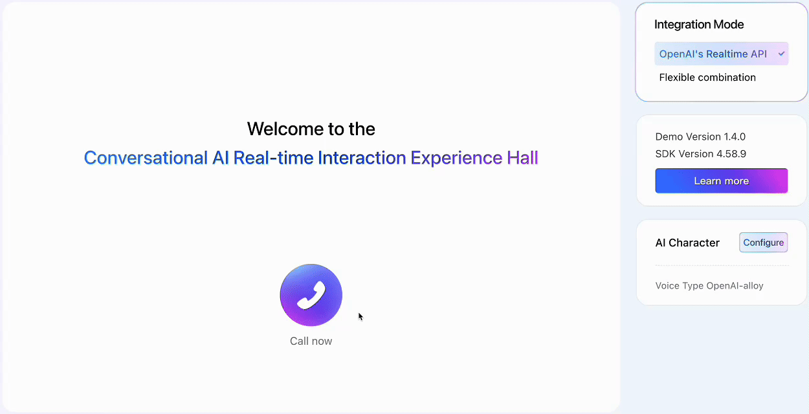
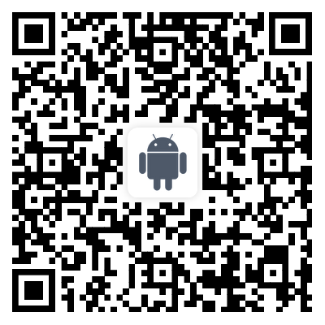

To quickly experience the Conversational AI solution without writing any code, follow this guide. You will interact with an AI character through a web-based demo, allowing you to see the technology in action firsthand.

## Prerequisites
Before you begin, ensure the following:

*  You have access to the web application with Conversational AI enabled.
*  Your microphone permissions are granted in the browser.

## Procedure
### Step 1: Initiate the call
Open the [Conversational AI demo](https://demo.byteplus.com/rtc/solution/aigc) in your web browser. Click **Call now** to enter the conversation room and start a real-time interaction with the AI character. The system will establish audio input/output streams and trigger the AI’s welcome response if configured.
### Step 2 (Optional): Interrupt the AI
During the conversation, you can interrupt the AI agent in the following ways:

*  Click **Interrupt** to manually stop the AI’s ongoing speech.
*  Alternatively, speak directly while the AI is speaking; the system supports barge-in and will detect your input, allowing you to take the turn.

### Step 3 (Optional): Configure AI character settings
To customize the AI character, click **Configure** under the **AI Character** panel. You can modify the following parameters:

* **Character settings**
   *  **Prompt**: Defines the AI character’s persona and behavior.
   *  **Welcome Speech**: Initial message played when the conversation starts.
*  **TTS Voice**: Select from available text-to-speech voices.
*  **LLM Model**: Choose the large language model.
*  **ASR Vendor**: Select the automatic speech recognition provider.

Changes take effect in the next session unless otherwise specified.
### **Step 4: End the call**
Click the hang up icon to leave the conversation room and terminate the session. All associated audio and processing tasks will stop upon disconnection.
## Next steps
 Explore more Conversational AI demo experiences across multiple platforms:

Alternatively, you can click [here](https://play.google.com/store/apps/details?id=com.byteplus.videoone.android) to access VideoOne on Google Play.

Alternatively, you can click [here](https://apps.apple.com/th/app/byteplus-videoone/id6451967995) to access VideoOne on the App Store.

Alternatively, you can click [here](https://demo.byteplus.com/rtc/solution/aigc) to open the application directly in your browser.

If you’re interested in integrating this solution into your product or platform, please contact our technical support team.

