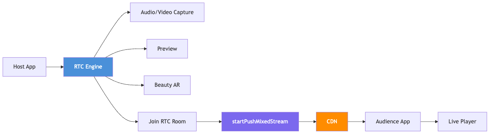
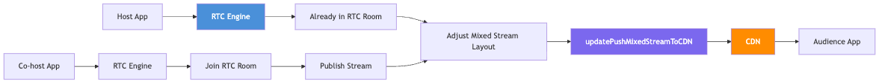
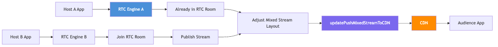

Interactive live streaming incorporates interactive features into the standard live streaming experience. This includes activities such as host PK battle and co-hosting with audience members, providing a more engaging experience than standard live streaming that only allows interaction through text chat and virtual gifts. Interactive live streaming brings the host and audience closer together, resulting in a more immersive and enjoyable experience for both parties.

## Billing
This solution incurs fees for RTC services and live streaming. RTC service fees apply throughout the entire live streaming session, as both solo hosting and co-hosting use RTC rooms. For details, refer to [BytePlus MediaLive pricing overview](https://docs.byteplus.com/en/byteplus-media-live/docs/overview-1) and [RTC service fees](https://docs.byteplus.com/en/byteplus-rtc/docs/69871).
## Highlights

* This solution is optimized for live streaming that involves occasional co-hosting.
* This solution uses a unified RTC-based architecture for both solo hosting and co-hosting, simplifying the streaming workflow and enabling seamless transitions between hosting modes.

## Architecture
This section describes the technical architecture of the solution.
### Solo hosting

In solo hosting, the RTC engine handles audio and video capture, preview, and beauty AR. The host joins an RTC room, and the RTC engine pushes the mixed stream to the CDN using `startPushMixedStream`.
### Co-hosting with audience members

When the host begins co-hosting with audience members, since the host is already in the RTC room, the RTC engine adjusts the mixed stream layout to include the co-host's stream and continues pushing the resulting stream to the CDN. During this process, the host receives the audio and video from the co-hosts, and the audience can watch the mixed stream on their apps. Once co-hosting stops, the mixed stream layout reverts to the solo hosting mode.
### Host PK battle

When the host begins a host PK battle, since the host is already in the RTC room, the RTC engine adjusts the mixed stream layout to include host B's stream and continues pushing the resulting stream to the CDN. During this process, host A receives the audio and video from host B, and the audience can watch the mixed stream on their apps. Once the host PK battle stops, the mixed stream layout reverts to the solo hosting mode.
## Implementation
For implementation details, see the following topics:

* [Implementing interactive live for Android](/1rce8t3b/8557)
* [Implementing interactive live for iOS](/1rce8t3b/8558)
* [Implementing interactive live for Web](/1rce8t3b/s41wz9lu)
* [Implementing interactive live for Server](/1rce8t3b/v1ipuiny)
