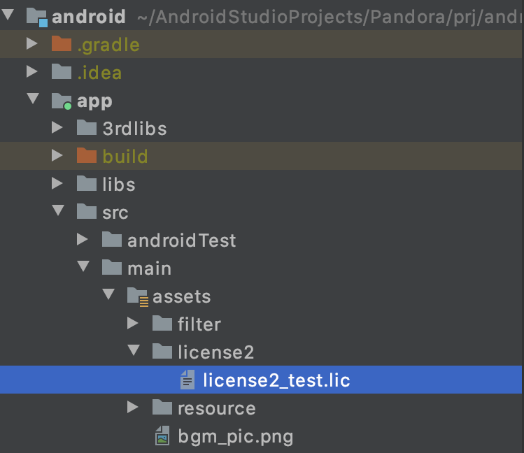
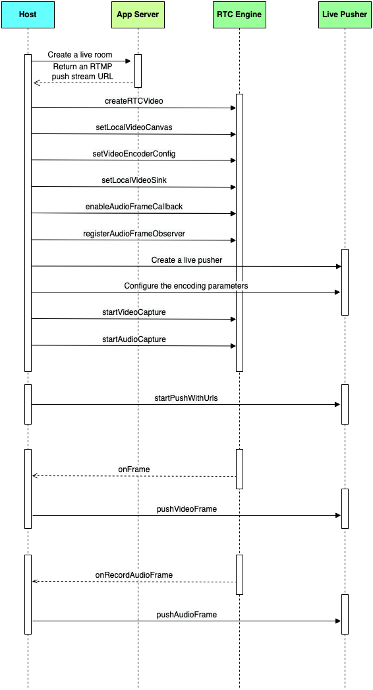
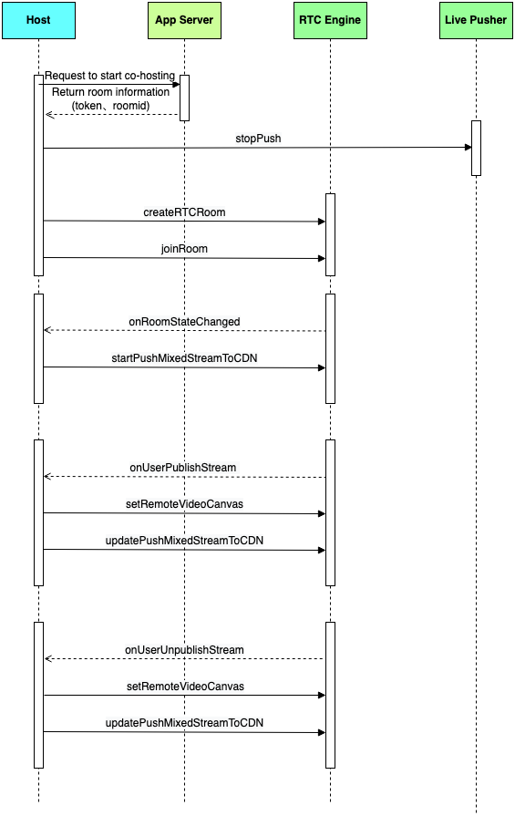
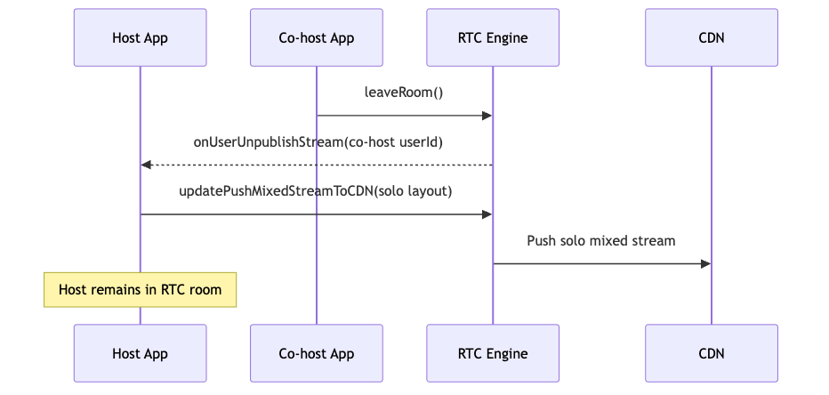
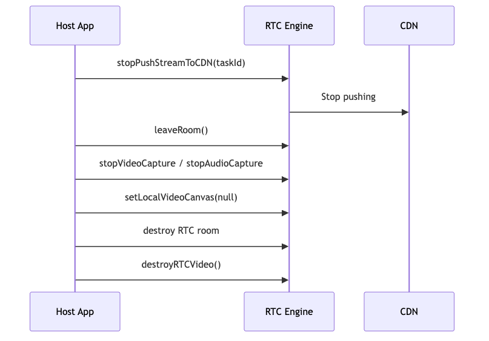
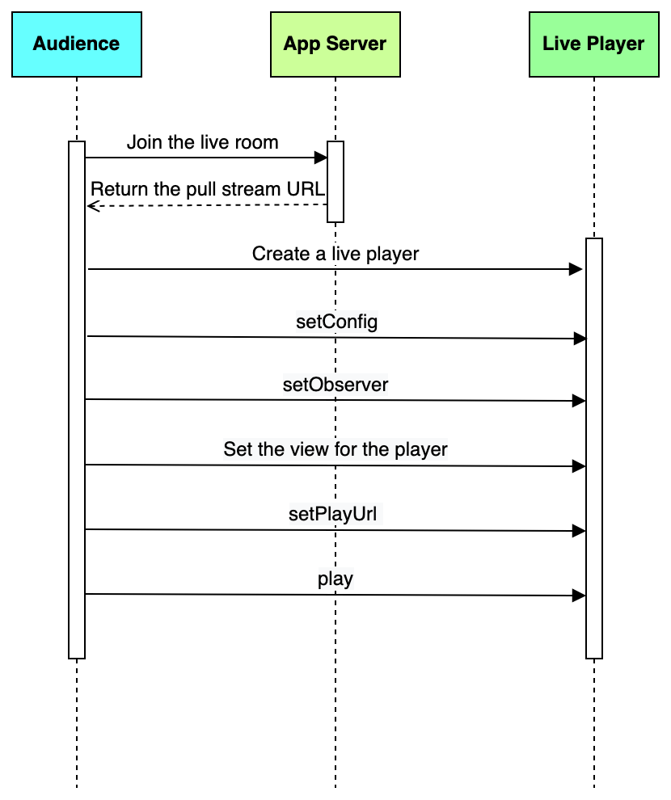
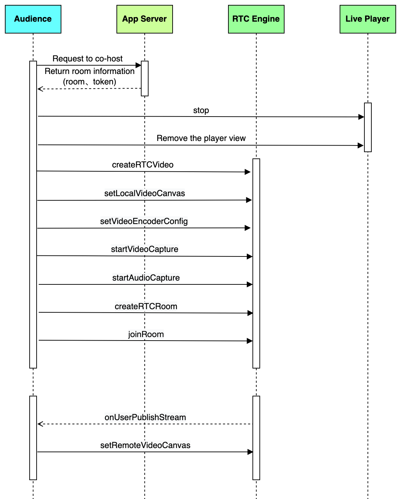
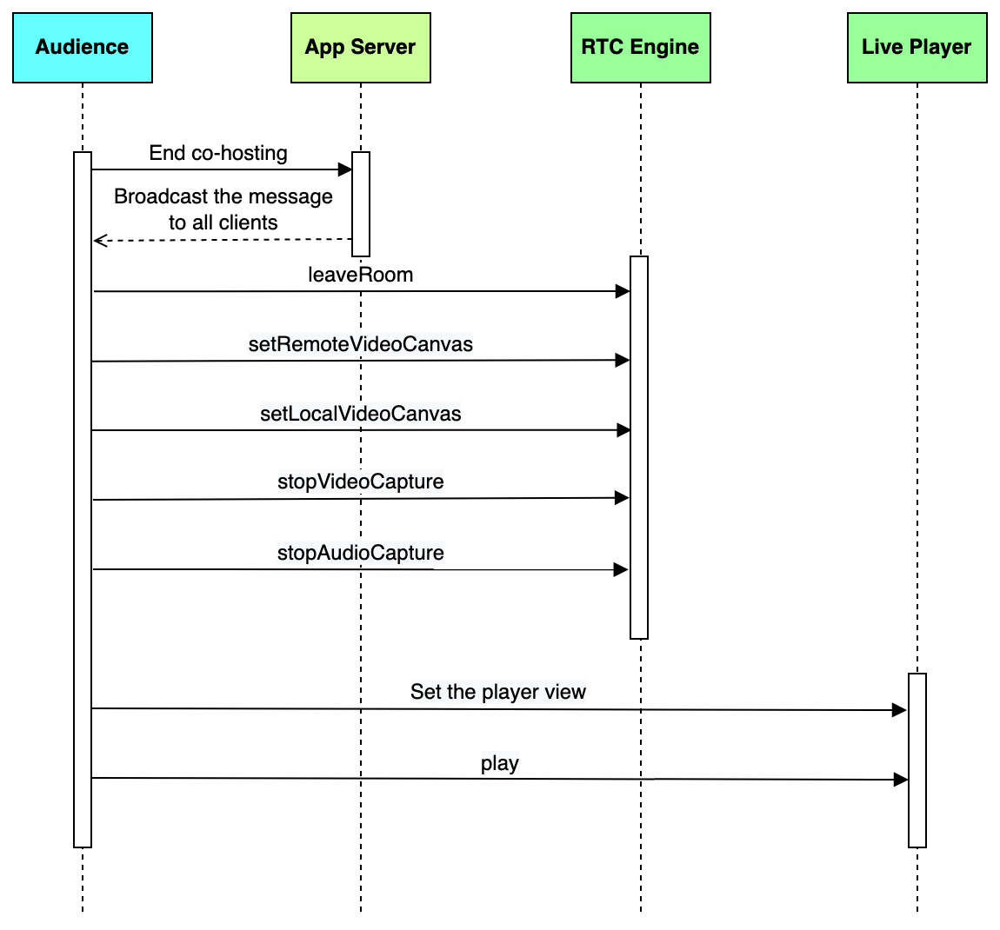
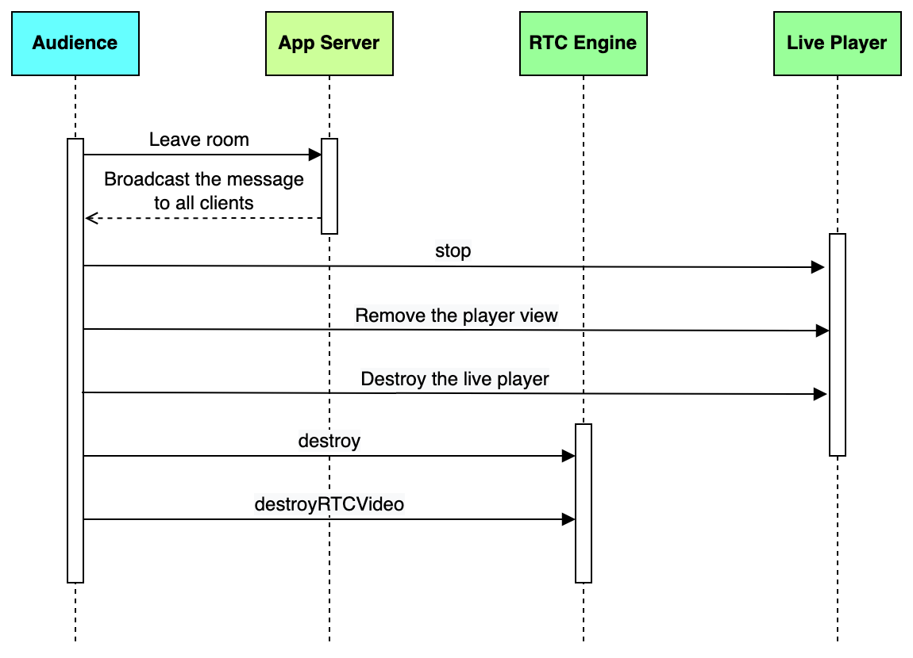

To build an interactive live streaming app on Android, you can use the BytePlus MediaLive and RTC SDKs. This guide provides step-by-step instructions and code examples for implementing core features for both hosts and audiences, such as starting a stream, enabling co-hosting, and playing a live stream.
## System requirements

* A physical mobile device running Android 5.0 or above. Running the app on emulators is not currently supported.
* CPU architecture: armv7a or arm64

## Prerequisites

* A valid [BytePlus account](http://console.byteplus.com/) with [BytePlus MediaLive](https://console.byteplus.com/live) and [BytePlus RTC](https://console.byteplus.com/rtc/workplaceRTC) activated.
* You have completed the [basic setup for live streaming](https://docs.byteplus.com/en/byteplus-media-live/docs/getting-started).
* You have obtained a BytePlus MediaLive SDK license.
   * For detailed instructions on how to acquire the license, see [Accessing your SDK license](https://docs.byteplus.com/en/docs/byteplus-media-live/docs-sdk-management#accessing-your-sdk-license).
   * To learn more about choosing the right license type for your needs, please refer to [SDK introduction](https://docs.byteplus.com/en/docs/byteplus-media-live/docs-introduction).
* You have obtained the BytePlus MediaLive SDK package. To access the interactive live feature, you must use the Interactive edition of the SDK. See [Accessing your SDK package](https://docs.byteplus.com/en/docs/byteplus-media-live/docs-sdk-management#accessing-your-sdk-package) for more information.

## Integrating the SDKs
This section introduces how to integrate BytePlus MediaLive Broadcast and Player SDKs into your Android project.
### Importing the SDKs

1. Open the `build.gradle` file in the root directory.
2. Define the Maven repositories and configure the repository URLs.
   ```Groovy
   allprojects {
       repositories {
           google()
           mavenCentral()
           maven {
               url 'https://artifact.bytedance.com/repository/Volcengine/'
           }
           maven {
               url 'https://artifact.byteplus.com/repository/public/'
           }
       }
   }
   
   apply from: 'https://ve-vos.volccdn.com/script/vevos-repo-base.gradle'
   ```

3. Open the `build.gradle` file in the app module project.
4. Configure the CPU architecture used by the App in `defaultConfig`. Both armv7a and arm64 are supported.
5. Add the SDK dependencies in the `dependencies` section.
   ```Groovy
   android {
      defaultConfig {
          ndk {
   // Set the native library architectures to support armv7a or arm64.
              abiFilters 'armeabi-v7a', 'arm64-v8a'
           }
      }
   }
   
   dependencies {
       ......
       // Add the online integration address of the SDK.
      ttsdkVersion = '1.43.300.3'
      implementation "com.bytedanceapi:ttsdk-ttlivepush_rtc:$ttsdkVersion"
      implementation "com.bytedanceapi:ttsdk-ttlivepull_rtc:$ttsdkVersion"
      implementation "com.bytedanceapi:ttsdk-ttcommon:$ttsdkVersion"
      implementation "com.bytedanceapi:ttsdk-ttlicense2:$ttsdkVersion"
       // Add third-party dependencies.
      implementation 'commons-net:commons-net:3.9.0'
      // Enable HTTPDNS resolution.
       implementation 'com.squareup.okhttp3:okhttp:4.12.0'
   }
   ```

6. Click the **Sync Project with Gradle Files** button to synchronize the SDK. The SDK will be automatically downloaded and integrated into the project. If the integration fails, check your network connection to the remote repository.

### Configuring permissions

1. Declare the permissions required by the app in the `AndroidManifest.xml` file:
   ```XML
   <uses-permission android:name="android.permission.CAMERA" />
   <uses-permission android:name="android.permission.RECORD_AUDIO" />
   <uses-permission android:name="android.permission.MODIFY_AUDIO_SETTINGS" />
   <uses-permission android:name="android.permission.INTERNET" />
   ```

2. Add code for dynamically requesting permissions:
   ```XML
   private boolean checkPermission(int request) {
           String permissions[] = new String[]{
                   Manifest.permission.CAMERA,
                   Manifest.permission.RECORD_AUDIO,
                   Manifest.permission.MODIFY_AUDIO_SETTINGS,
                   Manifest.permission.ACCESS_NETWORK_STATE
           };
           List<String> permissionList = new ArrayList<>();
           for (String permission : permissions) {
               boolean granted = ContextCompat.checkSelfPermission(this, permission) == PackageManager.PERMISSION_GRANTED;
               if (granted) continue;
               permissionList.add(permission);
           }
           if (permissionList.isEmpty()) return true;
   
           String permissionsToGrant[] = new String[permissionList.size()];
           permissionList.toArray(permissionsToGrant);
           ActivityCompat.requestPermissions(this, permissionsToGrant, request);
           return false;
   }
   ```


### Adding a license
Copy the license file you have obtained to your project directory. For example, copy the `License2_test.lic` file to the `assets` directory, as shown in the following screenshot. Take note of the directory path to the license file as you will use it when initializing the SDK.
Make sure the package name associated with the license file is the same as that of your project. Otherwise, the license authentication will fail.

### Implementing code obfuscation

1. Add the following lines to the `proguard-rules.pro` file to prevent SDK-related classes from being obfuscated.
   ```XML
   -keep class com.pandora.**{*;}
   -keep class com.ss.**{*;} 
   -keep class com.bytedance.**{*;}
   -keep class com.pandora.ttlicense2.**{*;}
   -keep class com.bytertc.**{*;} 
   ```

2. As you are integrating the Interactive edition of the Broadcast or Player SDK, you also need to configure obfuscation rules for the RTC SDK. Please refer to [Obfuscating your code for Android Apps](https://docs.byteplus.com/en/docs/byteplus-rtc/docs-78295) for details.

### Initializing the SDK
Use the following code to initialize the SDK:
```Java
// Initialize the environment.
   Env.init(new Config.Builder()
   .setApplicationContext(sApplicationContext)
   .setAppID("Your App ID")
   .setAppName("Your application name")
   .setAppVersion(BuildConfig.VERSION_NAME) // A valid version number should contain two or more separators, such as "1.3.2".
   .setAppChannel("Your app channel")
   .setLicenseUri("Your license URI")
   .setLicenseCallback(mLicenseCallback) // Set the license callbacks.
   .build());

// Enable logcat. It is recommended to enable logcat during development and disable logcat when compiling the release APK.
// LicenseManager.turnOnLogcat(true);

// License callbacks.
LicenseManager.Callback mLicenseCallback =new LicenseManager.Callback() {
        @Override
        public void onLicenseLoadSuccess(@NonNull String licenseUri, @NonNull String licenseId) {
            licenseID = licenseId; // License ID, through which you can get the license information.
        }

        @Override
        public void onLicenseLoadError(@NonNull String licenseUri, @NonNull Exception e, boolean retryAble) {
           
        }

        @Override
        public void onLicenseLoadRetry(@NonNull String licenseUri) {
           
        }

        @Override
        public void onLicenseUpdateSuccess(@NonNull String licenseUri, @NonNull String licenseId) {
          licenseID = licenseId;
        }

        @Override
        public void onLicenseUpdateError(@NonNull String licenseUri, @NonNull Exception e, boolean retryAble) {
           
        }

        @Override
        public void onLicenseUpdateRetry(@NonNull String licenseUri) {
          
        }
    };
    
// Get the license information.
License license = LicenseManager.getInstance().getLicense(licenseID); // You can get the license ID through mLicenseCallback.
if (license != null) {
    StringBuilder builder = new StringBuilder();
    builder.append("License id:" + license.getId()).append("\n")
           .append("License package:" + license.getPackageName()).append("\n")
           .append("License test:" + license.getType()).append("\n")
           .append("License version:" + license.getVersion()).append("\n");

    if (license.getModules() != null) {
        String names = "";
        for (License.Module module : license.getModules()) {
            names = "module name:" + module.getName() + ", start time:" +
            TimeUtil.format(module.getStartTime(), Times.YYYY_MM_DD_KK_MM_SS)
                    + ", expire time:" + TimeUtil.format(module.getExpireTime(), Times.YYYY_MM_DD_KK_MM_SS) + "\n";
            builder.append("License modules:" + names);
        }
    }
 }
```

The following table describes the parameters required for initialization:

| **Parameter** | **Required** | **Data Type** | **Description** | **Example** |
| --- | --- | --- | --- | --- |
| AppID | Yes | String | App ID, which is the unique identifier of your SDK application. | `123456` |
| AppName | Yes | String | Application name, which is the name of your SDK application. | `video_demo` |
| AppVersion | Yes | String | The version number of your Android app. A valid version number should contain two or more separators, such as "1.3.2". | `1.3.2` |
| AppChannel | Yes | String | The app's download channel. You can also use this parameter to distinguish between app builds for different environments, such as production, testing, and debugging. | `google_play` |
| LicenseUri | Yes | String | The local path to the license file. | `assets:///license2/license2_test.lic` |

### Uploading logs
By default, automatic SDK log uploading is enabled for debugging and analysis. To protect confidential data, you can call `Env.openAppLog(false)` to disable log uploading before initializing the SDK.
## Implementing the feature for the host
This section provides instructions on implementing the interactive live streaming feature for the host.
### Starting the live stream
The host uses both the RTC engine and the live pusher to start a stream.
**Sequence diagram**


**Sample code**

1. Create an RTC engine, set the local preview, and configure the encoding parameters.
   ```Java
   // Initialize the RTCVideo object
   mRTCVideo = RTCVideo.createRTCVideo(Env.getApplicationContext(), mAppId, mRTCVideoEventHandler, null, null);
   
   // Set the local preview
   VideoCanvas videoCanvas = new VideoCanvas();
   videoCanvas.renderView = renderView;
   videoCanvas.renderMode = VideoCanvas.RENDER_MODE_HIDDEN;
   mRTCVideo.setLocalVideoCanvas(StreamIndex.STREAM_INDEX_MAIN, videoCanvas);
   
   // Set the video encoding parameters
   VideoEncoderConfig config = new VideoEncoderConfig(
           mConfig.mVideoEncoderWidth, mConfig.mVideoEncoderHeight, mConfig.mVideoEncoderFps, mConfig.mVideoEncoderKBitrate * 1000);
   mRTCVideo.setVideoEncoderConfig(config);  
   ```

2. Subscribe to the local audio and video data captured with the RTC engine.
   ```Java
   // Subscribe to the local video data
   mRTCVideo.setLocalVideoSink(StreamIndex.STREAM_INDEX_MAIN, mVideoFrameListener, IVideoSink.PixelFormat.I420);
   
   // Subscribe to the local audio data
   mRTCVideo.enableAudioFrameCallback(AudioFrameCallbackMethod.AUDIO_FRAME_CALLBACK_RECORD,
           new AudioFormat(changeSampleRate(mConfig.mAudioCaptureSampleRate),
                   changeChannel(mConfig.mAudioCaptureChannel)));
   mRTCVideo.registerAudioFrameObserver(mAudioFrameListener);
   ```

3. Create a live pusher and configure its encoding parameters.
   ```Java
   // Create a live pusher
   VeLivePusherConfiguration config = new VeLivePusherConfiguration()
           .setContext(AppUtil.getApplicationContext())
           .setReconnectCount(10);
   mLivePusher = config.build();
   
   // Configure the encoding parameters for stream pushing
   VeLivePusherDef.VeLiveVideoEncoderConfiguration videoEncoderConfig = mLivePusher.getVideoEncoderConfiguration()
           .setResolution(resolution)
           .setFps(fps)
           .setBitrate(defaultBitrate)
           .setCodec(VeLiveVideoCodecH264)
           .setEnableAccelerate(true);
   mLivePusher.setVideoEncoderConfiguration(videoEncoderConfig);
   mLivePusher.setProperty("VeLiveKeyBitrateAdaptStrategy", "NORMAL");
   mLivePusher.startVideoCapture(VeLiveVideoCaptureExternal);
   mLivePusher.startAudioCapture(VeLiveAudioCaptureExternal);
   ```

4. Start audio and video capture with the RTC engine.
   ```Java
   // Start video capture
   mRTCVideo.startVideoCapture();
   
   // Start audio capture
   mRTCVideo.startAudioCapture();
   ```

5. Start stream pushing with the live pusher.
   ```Java
   // Start stream pushing. Set 'url' to an RTMP push stream address.
   mLiveCore.start(url);
   mLivePusher.startPushWithUrls(urls.toArray(new String[0]));
   ```

6. Send the local audio and video data captured with the RTC engine to the live pusher.
   ```Java
   // Send the local video data to the live pusher
   IVideoSink mVideoFrameListener = new IVideoSink() {
       @Override
       public void onFrame(com.ss.bytertc.engine.video.VideoFrame frame) {
           final int width = frame.getWidth();
           final int height = frame.getHeight();
           final int chromaHeight = (height + 1) / 2;
           final int chromaWidth = (width + 1) / 2;
           final VideoRotation rotation = frame.getRotation();
           int bufferSize = width * height + chromaWidth * chromaHeight * 2;
           final ByteBuffer dstBuffer = ByteBuffer.allocateDirect(bufferSize);
           YuvHelper.I420Rotate(frame.getPlaneData(0), frame.getPlaneStride(0),
                                frame.getPlaneData(1), frame.getPlaneStride(1),
                                frame.getPlaneData(2), frame.getPlaneStride(2),
                                dstBuffer,width, height,frame.getRotation().value());
   
           dstBuffer.position(0);
           final boolean needSwapWidthHeight = (rotation == VideoRotation.VIDEO_ROTATION_90 || rotation == VideoRotation.VIDEO_ROTATION_270);
           final int dstWidth = needSwapWidthHeight ? height : width;
           final int dstHeight = needSwapWidthHeight ? width : height;
   
           VeLiveVideoFrame liveVideoFrame = new VeLiveVideoFrame(
                   dstWidth,
                   dstHeight,
                   System.currentTimeMillis() * 1000,
                   dstBuffer
           );
           mLivePusher.pushExternalVideoFrame(liveVideoFrame);
           liveVideoFrame.release();
       }
   };
   
   // Send the local audio data to the live pusher
   mAudioFrameListener = new IAudioFrameObserver() {
       @Override
       public void onRecordAudioFrame(IAudioFrame audioFrame) {
           VeLiveAudioFrame frame = new VeLiveAudioFrame(
                   convertFrom(audioFrame.sample_rate()),
                   convertFrom(audioFrame.channel()),
                   System.currentTimeMillis() * 1000,
                   audioFrame.getDataBuffer());
           mLivePusher.pushExternalAudioFrame(frame);
       }
   
   };
   ```


### Enabling beauty AR (Optional)
Refer to [Effects](https://docs.byteplus.com/en/byteplus-rtc/docs/114717) for detailed instructions on how to implement beauty AR by using the RTC engine.
### Enabling co-hosting
To co-host either with audience members or a host from another live room (host PK battle), do the following:

1. Stop streaming with the live pusher.
2. Join an RTC room.
3. Start pushing mixed RTC streams to CDN.

**Sequence diagram**


**Sample code**

1. Stop streaming with the live pusher.
   ```Java
   mLivePusher.stopPush();
   ```

2. Create an RTC room, set the user information, and join the room. Refer to [Authentication with Token](https://docs.byteplus.com/en/byteplus-rtc/docs/70121) for details about how to get the token from the app server.
   ```Java
   // Create an RTC room
   mRTCRoom = mRTCVideo.createRTCRoom(roomId);
   mRTCRoom.setRTCRoomEventHandler(mIRtcRoomEventHandler);
   
   // Set the user information
   mUserId = userId;
   mRoomId = roomId;
   UserInfo userInfo = new UserInfo(userId, null);
   RTCRoomConfig roomConfig = new RTCRoomConfig(ChannelProfile.CHANNEL_PROFILE_COMMUNICATION,
           true, true, true);
           
   // Join the room. Get the token from the app server.
   mRTCRoom.joinRoom(token, userInfo, roomConfig);
   ```

3. Start pushing mixed RTC streams to CDN after successfully joining the room.
   ```Java
   // Notification of a successful join room
   private RtcRoomEventHandlerAdapter mIRtcRoomEventHandler = new RtcRoomEventHandlerAdapter() {
       @Override
       public void onRoomStateChanged(String roomId, String uid, int state, String extraInfo) {
           // Create a stream mixing configuration instance
           final MixedStreamConfig streamConfig = MixedStreamConfig.defaultMixedStreamConfig()
           .setRoomID(roomId)
           .setPushURL(pushUrl)
           .setExpectedMixingType(ByteRTCStreamMixingType.STREAM_MIXING_BY_SERVER);
           
           // Set the video encoding parameters for the mixed stream. The settings must be consistent with the encoding settings for stream pushing.
           streamConfig.getVideoConfig()
               .setWidth(myConfig.width)
               .setHeight(myConfig.height)
               .setFps(myConfig.frameRate)
               .setBitrate(myConfig.bitRate);
           
           // Set the audio encoding parameters for the mixed stream. The settings must be consistent with the encoding settings for stream pushing.
           streamConfig.getAudioConfig()
               .setSampleRate(44100)
               .setChannels(2);
           
           // Set the layout information for the host
           final MixedStreamLayoutRegionConfig region = new MixedStreamLayoutRegionConfig()
                   .setUserID(userId) // The user ID of the host
                   .setIsLocalUser(true)
                   .setRoomID(roomId)
                   .setLocationX(0)// For reference only
                   .setLocationY(0)// For reference only
                   .setWidthProportion(1)// For reference only
                   .setHeightProportion(1)// For reference only
                   .setAlpha(1)
                   .setZOrder(0)
                   .setRenderMode(MixedStreamRenderMode.MIXED_STREAM_RENDER_MODE_HIDDEN);
   
           final MixedStreamLayoutConfig layout = new MixedStreamLayoutConfig()
                   .setRegions(new MixedStreamLayoutRegionConfig[]{region});
           streamConfig.setLayout(layout);
           
           // Set the ID for the push to CDN task
           String taskId = "";
       
           // Start pushing the mixed RTC stream to CDN
           mRTCVideo.startPushMixedStreamToCDN(taskId, streamConfig, mMixedStreamObserver); 
       }
   }
   ```

4. Adjust the view and modify the mixed stream layout when a co-host starts or stops publishing their stream.
   ```Java
   private RtcRoomEventHandlerAdapter mIRtcRoomEventHandler = new RtcRoomEventHandlerAdapter() {
       @Override
       public void onUserPublishStream(String uid, MediaStreamType type) {
           if (type == RTC_MEDIA_STREAM_TYPE_VIDEO || type == RTC_MEDIA_STREAM_TYPE_BOTH) {
               // Add the view to render the co-host's video
               TextureView renderView = new TextureView(Env.getApplicationContext());
               VideoCanvas canvas = new VideoCanvas();
               canvas.renderView = view;
               canvas.renderMode = RENDER_MODE_HIDDEN;
               final RemoteStreamKey streamKey = new RemoteStreamKey(mRTCRoomId, uid, StreamIndex.STREAM_INDEX_MAIN);
               mRTCVideo.setRemoteVideoCanvas(streamKey, canvas);
           }
           
           // Modify the layout information for the host
           final MixedStreamLayoutRegionConfig selfRegion = new MixedStreamLayoutRegionConfig()
                   .setUserID(userId)// The user ID of the host
                   .setIsLocalUser(true)
                   .setRoomID(roomId)
                   .setLocationX(0)// For reference only
                   .setLocationY(0.25)// For reference only
                   .setWidthProportion(0.5)// For reference only
                   .setHeightProportion(0.5)// For reference only
                   .setAlpha(1)
                   .setZOrder(0)
                   .setRenderMode(MixedStreamRenderMode.MIXED_STREAM_RENDER_MODE_HIDDEN);
           
           // Set the layout information for the co-host
           final MixedStreamLayoutRegionConfig hostRegion = new MixedStreamLayoutRegionConfig()
                   .setUserID(coHostUserId)// The user ID of the co-host
                   .setIsLocalUser(false)
                   .setRoomID(roomId)
                   .setLocationX(0.5)// For reference only
                   .setLocationY(0.25)// For reference only
                   .setWidthProportion(0.5)// For reference only
                   .setHeightProportion(0.5)// For reference only
                   .setAlpha(1)
                   .setZOrder(0)
                   .setRenderMode(MixedStreamRenderMode.MIXED_STREAM_RENDER_MODE_HIDDEN);
                   
           // Set the overall layout of the mixed stream
           final MixedStreamLayoutConfig layout = new MixedStreamLayoutConfig()
                   .setRegions(new MixedStreamLayoutRegionConfig[]{selfRegion, hostRegion});
           streamConfig.setLayout(layout);
           
            // Set the ID for the push to CDN task
           String taskId = "";
           
           // Update the push to CDN task
           mRTCVideo.updatePushMixedStreamToCDN(taskId, mixedConfig);
               
       }
   
       @Override
       public void onUserUnpublishStream(String uid, MediaStreamType type, StreamRemoveReason reason) {
           if (type == RTC_MEDIA_STREAM_TYPE_VIDEO || type == RTC_MEDIA_STREAM_TYPE_BOTH) {
               // Remove the view that renders the co-host's video
               VideoCanvas canvas = new VideoCanvas();
               canvas.renderView = null;
               canvas.renderMode = RENDER_MODE_HIDDEN;
               final RemoteStreamKey streamKey = new RemoteStreamKey(mRTCRoomId, uid, StreamIndex.STREAM_INDEX_MAIN);
               mRTCVideo.setRemoteVideoCanvas(streamKey, canvas);
           }
           
           // Modify the layout information of the host
           final MixedStreamLayoutRegionConfig region = new MixedStreamLayoutRegionConfig()
                   .setUserID(userId)// The user ID of the host
                   .setIsLocalUser(true)
                   .setRoomID(roomId)
                   .setLocationX(0)// For reference only
                   .setLocationY(0.25)// For reference only
                   .setWidthProportion(0.5)// For reference only
                   .setHeightProportion(0.5)// For reference only
                   .setAlpha(1)
                   .setZOrder(0)
                   .setRenderMode(MixedStreamRenderMode.MIXED_STREAM_RENDER_MODE_HIDDEN);
                   
           // Set the overall layout of the mixed stream
           final MixedStreamLayoutConfig layout = new MixedStreamLayoutConfig()
                   .setRegions(new MixedStreamLayoutRegionConfig[]{region});
           streamConfig.setLayout(layout);
           
           // Set the ID for the push to CDN task
           String taskId = "";
           
           // Update the push to CDN task
           mRTCVideo.updatePushMixedStreamToCDN(taskId, mixedConfig);
       }
   };
   ```


### Ending co-hosting
To stop co-hosting, do the following:

1. Stop pushing mixed RTC streams to CDN and leave the RTC room.
2. Start streaming with the live pusher.

**Sequence diagram**

**Sample code**

1. Stop pushing mixed RTC streams to CDN, leave the RTC room, and remove the view that renders the co-host's video.
   ```Java
   // Stop pushing mixed RTC streams to CDN
   mRTCVideo.stopPushStreamToCDN(taskId);
   
   // Leave the RTC room
   mRTCRoom.leaveRoom();
   
   // Remove the view that renders the co-host's video
   VideoCanvas canvas = new VideoCanvas();
   canvas.renderView = null;
   canvas.renderMode = RENDER_MODE_HIDDEN;
   final RemoteStreamKey streamKey = new RemoteStreamKey(mRTCRoomId, uid, StreamIndex.STREAM_INDEX_MAIN);
   mRTCVideo.setRemoteVideoCanvas(streamKey, canvas);
   ```

2. Start streaming with the live pusher.
   ```Java
   mLivePusher.startPushWithUrls(urls.toArray(new String[0]));
   ```


### Ending the live stream
To end the live stream, stop the stream, release the live pusher, and destroy the RTC engine.
**Sequence diagram**

**Sample code**

1. Stop pushing the live stream and destroy the live pusher.
   ```Java
   // Stop pushing the live stream
   mLivePusher.stopPush();
   
   // Destroy the live pusher
   mLivePusher.release();
   mLivePusher = null;
   ```

2. Stop audio and video capture with the RTC engine and remove the local preview.
   ```Java
   // Stop video capture
   mRTCVideo.stopVideoCapture();
   
   // Stop audio capture
   mRTCVideo.stopAudioCapture();
   
   // Remove the local preview
   VideoCanvas videoCanvas = new VideoCanvas();
   videoCanvas.renderView = NULL;
   videoCanvas.renderMode = VideoCanvas.RENDER_MODE_HIDDEN;
   mRTCVideo.setLocalVideoCanvas(StreamIndex.STREAM_INDEX_MAIN, videoCanvas);
   ```

3. Destroy the RTC room and RTC engine.
   ```Java
   // Destroy the RTC room
   mRTCRoom.destroy();
   mRTCRoom = null;
   
   // Destroy the RTC engine
   RTCVideo.destroyRTCVideo();
   mRTCVideo = null;
   ```


## Implementing the feature for the audience
This section provides instructions on implementing the interactive live streaming feature for the audience.
### Playing the live stream
Use the live player to pull and play the live stream.
**Sequence diagram**

**Sample code**

1. Create a live player and configure it.
   ```Java
   // Create a player
   VeLivePlayer mLivePlayer = new VideoLiveManager(Env.getApplicationContext());
   
   // Set the player observer
   mLivePlayer.setObserver(mLivePlayerObserver);
   
   // Configure the player
   VeLivePlayerConfiguration config = new VeLivePlayerConfiguration();
   config.enableStatisticsCallback = true;
   config.enableLiveDNS = true;
   mLivePlayer.setConfig(config);
   ```

2. Set the view for the player, set the pull stream address, and start playing.
   ```Java
   // Set the view for the player
   mLivePlayer.setSurfaceHolder(holder);
   
   // Set the pull stream address
   mLivePlayer.setPlayUrl(mPullUrl);
   
   // Start playing
   mLivePlayer.play();
   ```


### Becoming a co-host
To become a co-host, stop playing the live stream with the live player, and start co-hosting using the RTC engine.
**Sequence diagram**

**Sample code**

1. Stop playing the live stream and remove the view for the live player.
   ```Java
   // Stop playing the live stream
   mLivePlayer.stop();
   
   // Remove the view for the live player
   mLocalVideoContainer.removeView(mPlayerView);
   ```

2. Create an RTC engine and set the local preview and video encoding parameters.
   ```Java
   // Initialize the RTCVideo object
   mRTCVideo = RTCVideo.createRTCVideo(Env.getApplicationContext(), mAppId, mRTCVideoEventHandler, null, null);
   
   // Set the local preview
   VideoCanvas videoCanvas = new VideoCanvas();
   videoCanvas.renderView = renderView;
   videoCanvas.renderMode = VideoCanvas.RENDER_MODE_HIDDEN;
   mRTCVideo.setLocalVideoCanvas(StreamIndex.STREAM_INDEX_MAIN, videoCanvas);
   
   // Set the video encoding parameters
   VideoEncoderConfig config = new VideoEncoderConfig(
           mConfig.mVideoEncoderWidth, mConfig.mVideoEncoderHeight, mConfig.mVideoEncoderFps, mConfig.mVideoEncoderKBitrate * 1000);
   mRTCVideo.setVideoEncoderConfig(config);
   ```

3. Start audio and video capture with the RTC engine.
   ```Java
   // Start video capture
   mRTCVideo.startVideoCapture();
   
   // Start audio capture
   mRTCVideo.startAudioCapture();
   ```

4. Create an RTC room, set the user information, and join the RTC room. Refer to [Authentication with Token](https://docs.byteplus.com/en/byteplus-rtc/docs/70121) for details about how to get the token from the app server.
   ```Java
   // Create an RTC room
   mRTCRoom = mRTCVideo.createRTCRoom(roomId);
   mRTCRoom.setRTCRoomEventHandler(mIRtcRoomEventHandler);
   
    // Set the user information
   UserInfo userInfo = new UserInfo(userId, null);
   RTCRoomConfig roomConfig = new RTCRoomConfig(ChannelProfile.CHANNEL_PROFILE_COMMUNICATION,
           true, true, true);
       
   // Join the room. Get the token from the app server.
   mRTCRoom.joinRoom(token, userInfo, roomConfig);
   ```

5. Add or remove the views for other co-hosts when receiving notifications about their stream-publishing status.
   ```Java
   private RtcRoomEventHandlerAdapter mIRtcRoomEventHandler = new RtcRoomEventHandlerAdapter() {
       @Override
       public void onUserPublishStream(String uid, MediaStreamType type) {
           if (type == RTC_MEDIA_STREAM_TYPE_VIDEO || type == RTC_MEDIA_STREAM_TYPE_BOTH) {
               // Add the view to render the co-host's video
               TextureView renderView = new TextureView(Env.getApplicationContext());
               VideoCanvas canvas = new VideoCanvas();
               canvas.renderView = view;
               canvas.renderMode = RENDER_MODE_HIDDEN;
               final RemoteStreamKey streamKey = new RemoteStreamKey(mRTCRoomId, uid, StreamIndex.STREAM_INDEX_MAIN);
               mRTCVideo.setRemoteVideoCanvas(streamKey, canvas);
           }          
       }
   
       @Override
       public void onUserUnpublishStream(String uid, MediaStreamType type, StreamRemoveReason reason) {
           if (type == RTC_MEDIA_STREAM_TYPE_VIDEO || type == RTC_MEDIA_STREAM_TYPE_BOTH) {
               // Remove the view for the co-host
               VideoCanvas canvas = new VideoCanvas();
               canvas.renderView = null;
               canvas.renderMode = RENDER_MODE_HIDDEN;
               final RemoteStreamKey streamKey = new RemoteStreamKey(mRTCRoomId, uid, StreamIndex.STREAM_INDEX_MAIN);
               mRTCVideo.setRemoteVideoCanvas(streamKey, canvas);
           }
       }
   };
   ```


### Enabling beauty AR (Optional)
Refer to [Effects](https://docs.byteplus.com/en/byteplus-rtc/docs/114717) for detailed instructions on how to implement beauty AR by using the RTC engine.
### Ending co-hosting
To return to being a regular audience member, stop co-hosting with the RTC engine and resume playing the live stream with the live player.
**Sequence diagram**

**Sample code**

1. Leave the RTC room, stop audio and video capture with the RTC engine, and remove the local and remote views.
   ```Java
   // Leave the RTC room
   mRTCRoom.leaveRoom();
   
   // Stop video capture
   mRTCVideo.stopVideoCapture();
   
   // Stop audio capture
   mRTCVideo.stopAudioCapture();
   
   // Remove the local preview
   VideoCanvas canvas = new VideoCanvas(null, RENDER_MODE_HIDDEN, mRoomId, mUserId, false);
   mRTCVideo.setLocalVideoCanvas(mUserId, StreamIndex.STREAM_INDEX_MAIN, canvas);
   
   // Remove the remote views
   VideoCanvas canvas = new VideoCanvas();
   canvas.renderView = null;
   canvas.renderMode = RENDER_MODE_HIDDEN;
   final RemoteStreamKey streamKey = new RemoteStreamKey(mRTCRoomId, uid, StreamIndex.STREAM_INDEX_MAIN);
   mRTCVideo.setRemoteVideoCanvas(streamKey, canvas);
   ```

2. Set the view for the player and start playing the live stream.
   ```Java
   // Set the view for the player
   mLivePlayer.setSurfaceHolder(holder);
   // Start playing the live stream
   mLivePlayer.play();
   ```


### Leaving the live room
To leave the live room, do the following:

1. Stop playing the live stream and destroy the live player.
2. Destroy the RTC room and RTC engine.

**Sequence diagram**

**Sample code**

1. Stop playing the live stream, remove the view for the player, and destroy the live player.
   ```Java
   // Stop playing the live stream
   mLivePlayer.stop();
   
   // Destroy the live player
   mLivePlayer.destroy();
   mLivePlayer = null;
   ```

2. Destroy the RTC room and RTC engine.
   ```Java
   // Destroy the RTC room
   mRTCRoom.destroy();
   mRTCRoom = null;
   
   // Destroy the RTC engine
   RTCVideo.destroyRTCVideo();
   mRTCVideo = null;
   ```

