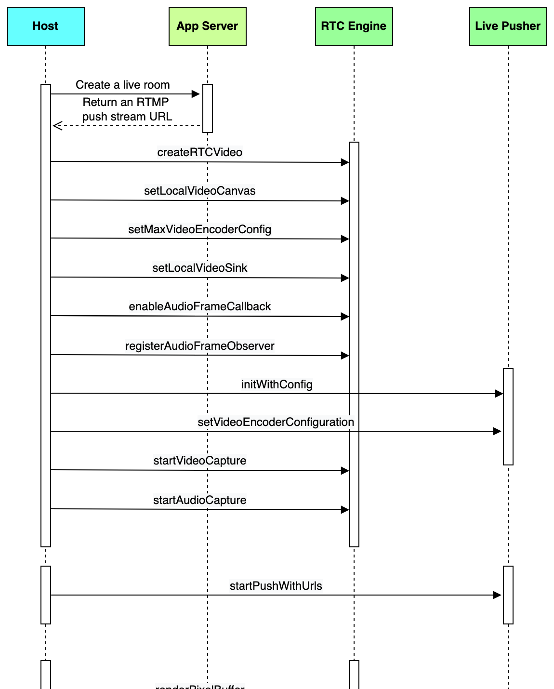
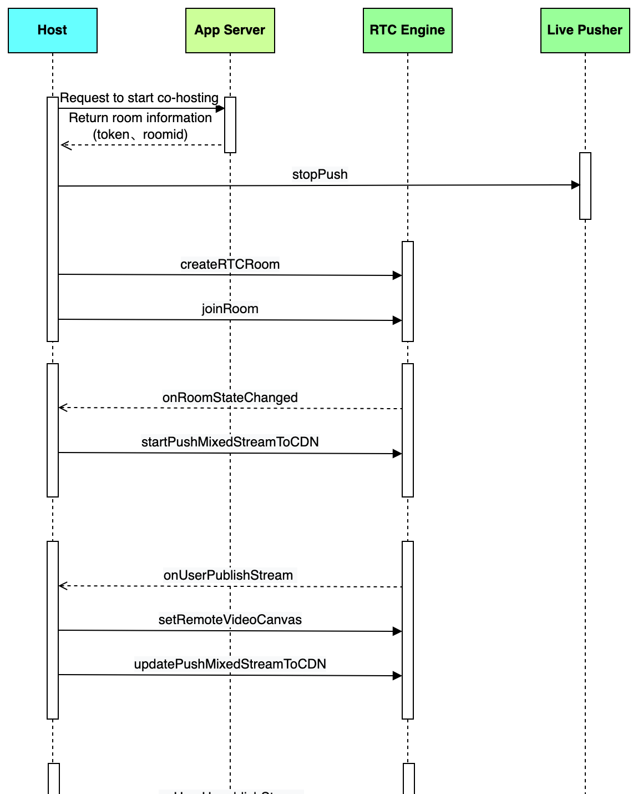
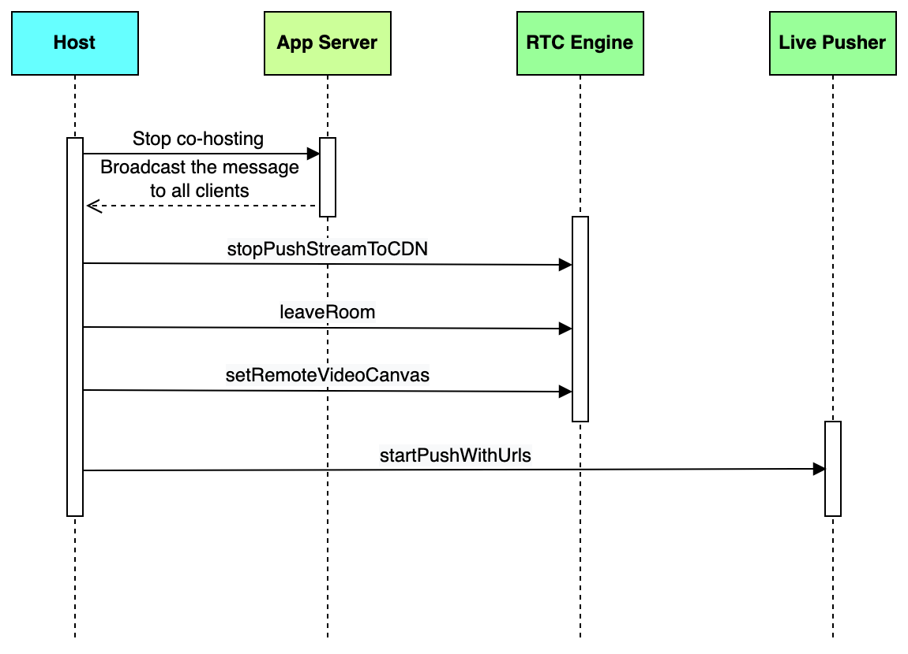
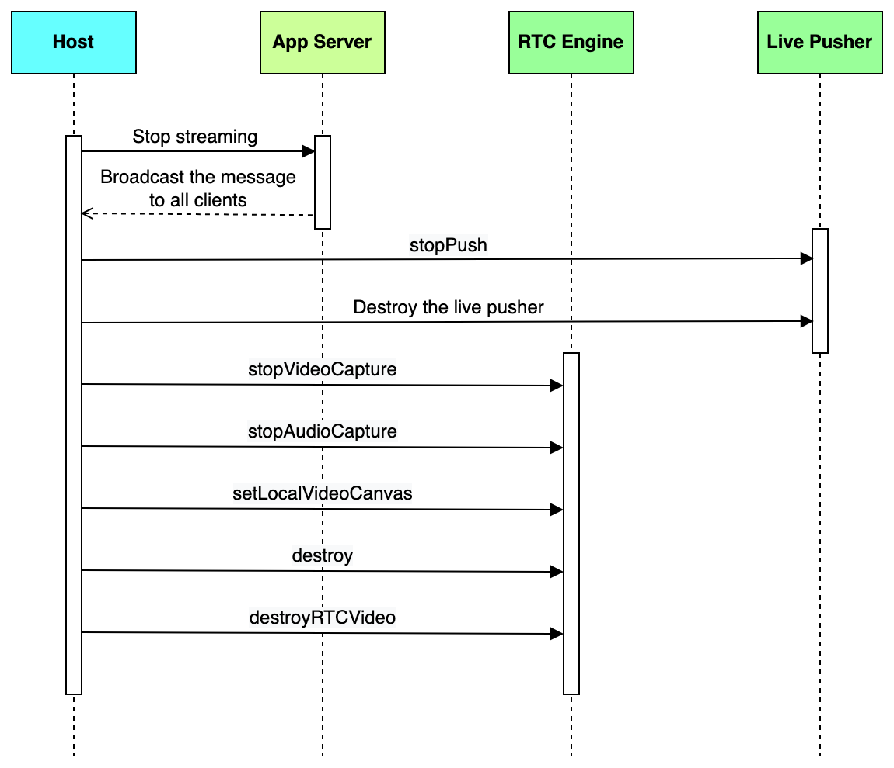
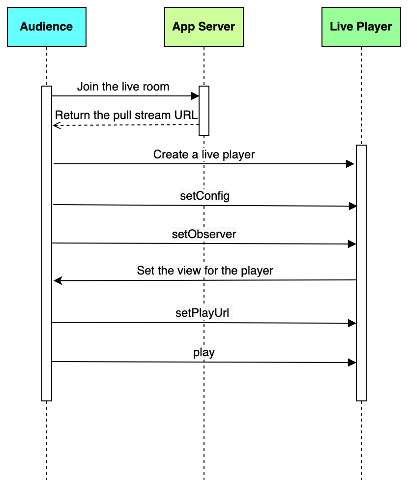
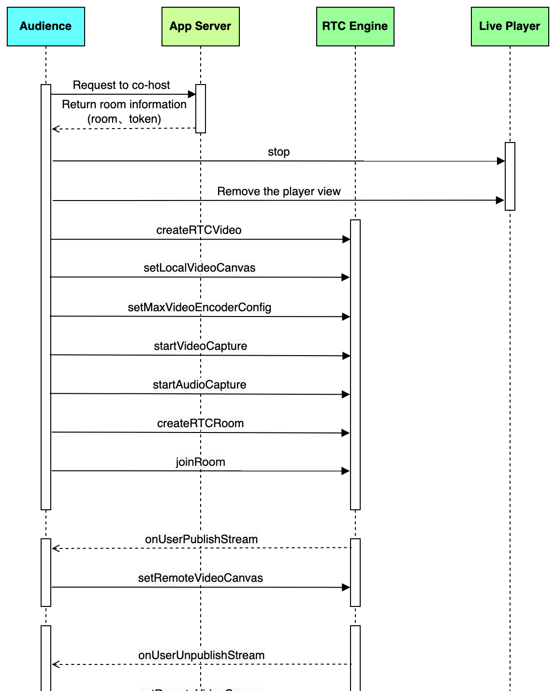
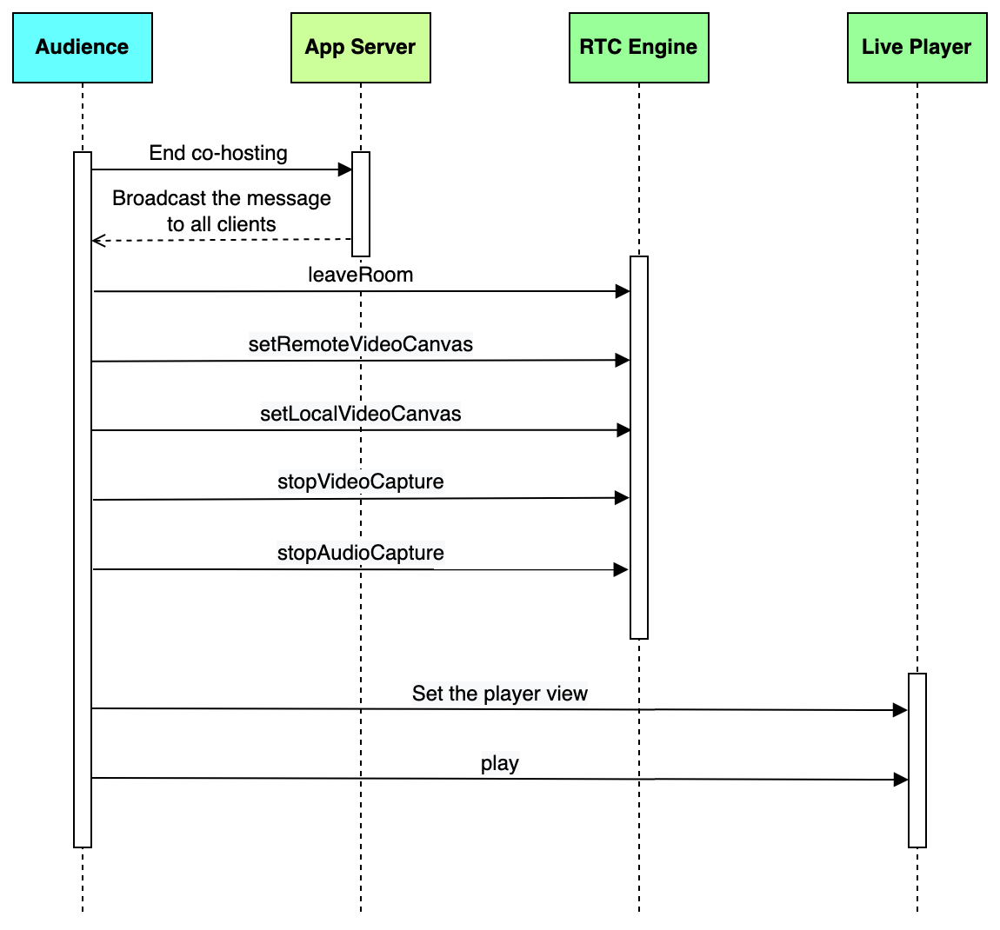
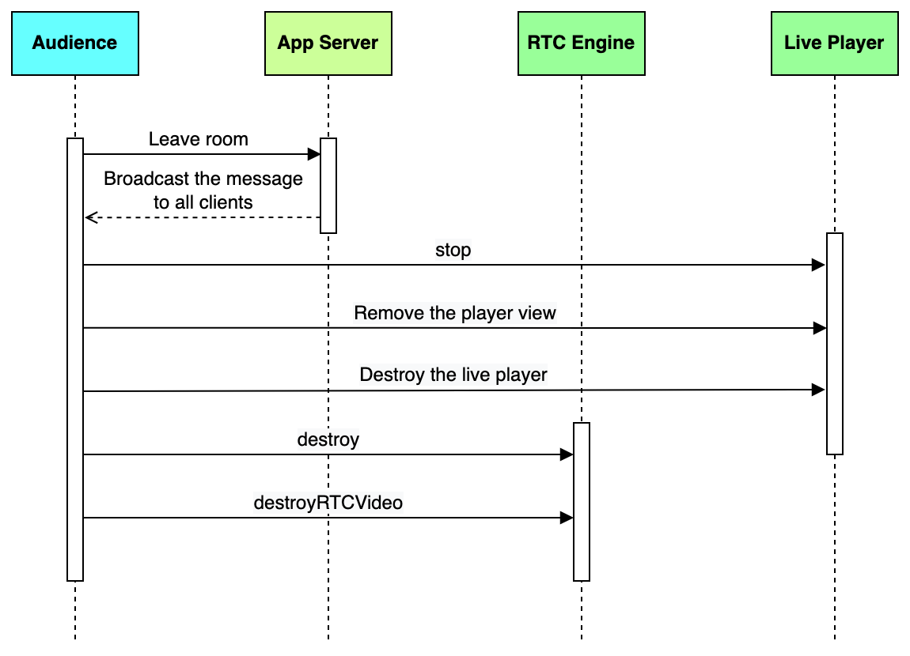

To implement a complete interactive live streaming feature in your iOS app, this guide provides comprehensive instructions and code samples. You will learn how to use the BytePlus MediaLive and RTC SDKs to build the entire workflow for both hosts and audiences, covering key functionalities such as starting a stream, enabling co-hosting, playing live video, and managing the session lifecycle.
## System requirements

* A physical iPhone or iPad running iOS 11 or higher
* Xcode 14.1 or higher

## Prerequisites

* A valid [BytePlus account](http://console.byteplus.com/) with [BytePlus MediaLive](https://console.byteplus.com/live) and [BytePlus RTC](https://console.byteplus.com/rtc/workplaceRTC) activated.
* You have completed the [basic setup for live streaming](https://docs.byteplus.com/en/byteplus-media-live/docs/getting-started).
* You have obtained a BytePlus MediaLive SDK license.
   * For detailed instructions on how to acquire the license, see [Accessing your SDK license](https://docs.byteplus.com/en/docs/byteplus-media-live/docs-sdk-management#accessing-your-sdk-license).
   * To learn more about choosing the right license type for your needs, please refer to [SDK introduction](https://docs.byteplus.com/en/docs/byteplus-media-live/docs-introduction).
* You have obtained the BytePlus MediaLive SDK package. To access the interactive live streaming feature, you must use the Interactive edition of the SDK. See [Accessing your SDK package](https://docs.byteplus.com/en/docs/byteplus-media-live/docs-sdk-management#accessing-your-sdk-package) for more information.

## Integrating the SDKs
This section introduces how to integrate BytePlus MediaLive Broadcast and Player SDKs into your iOS project.
### Installing the SDKs

1. Install Ruby on your Mac and run the following command in Terminal to install CocoaPods.
   ```Plain
   sudo gem install cocoapods
   ```

2. Run the following command in your project directory to create a Podfile.
   ```Plain
   pod init
   ```

3. Add the following dependencies for the SDKs to your Podfile.
   ```Plain
   source 'https://cdn.cocoapods.org/'
   source 'https://github.com/byteplus-sdk/byteplus-specs.git'
   source 'https://github.com/volcengine/volcengine-specs.git'
   pod 'TTSDK', '1.43.300.2-premium', :subspecs => ['LivePull-RTS', 'LivePush-RTS', 'RTCSDK']
   ```

4. Execute the following command in Terminal to update the local libraries and install the SDK.
   ```Plain
   pod install
   ```


### Requesting permissions
To record video and audio, you need to request camera and microphone permissions. To do so, include the following keys in `info.plist`:

* NSCameraUsageDescription
* NSMicrophoneUsageDescription

You can use the following code to request permissions for the camera and microphone:
```objectivec
- (void)requestCameraAuthorization:(void (^)(BOOL granted))handler {
    AVAuthorizationStatus authStatus = [AVCaptureDevice authorizationStatusForMediaType:AVMediaTypeVideo];
    if (authStatus == AVAuthorizationStatusNotDetermined) {
        [AVCaptureDevice requestAccessForMediaType:AVMediaTypeVideo completionHandler:^(BOOL granted) {
            handler(granted);
        }];
    } else if (authStatus == AVAuthorizationStatusAuthorized) {
        handler(YES);
    } else {
        handler(NO);
    }
}
- (void)requestMicrophoneAuthorization:(void (^)(BOOL granted))handler {
    AVAuthorizationStatus authStatus = [AVCaptureDevice authorizationStatusForMediaType:AVMediaTypeAudio];
    if (authStatus == AVAuthorizationStatusNotDetermined) {
        [AVCaptureDevice requestAccessForMediaType:AVMediaTypeAudio completionHandler:^(BOOL granted) {
            handler(granted);
        }];
    } else if (authStatus == AVAuthorizationStatusAuthorized) {
        handler(YES);
    } else {
        handler(NO);
    }
}
- (void)requestAuthorization {
    [self requestCameraAuthorization:^(BOOL granted) {
        if (granted) {
            NSLog(@"camera Authorization succeeds!");
        } else {
            NSLog(@"camera Authorization fails!");
        }
    }];
    [self requestMicrophoneAuthorization:^(BOOL granted) {
        if (granted) {
            NSLog(@"microphone Authorization succeeds!");
        } else {
            NSLog(@"microphone Authorization fails!");
        }
    }];
}
```

### Adding the license file
Copy the license file to your project directory and note the path to the license file.
Make sure the bundle ID associated with the license file is the same as that of your project. Otherwise, the license authentication will fail.
### Initializing the SDK
Initialize the SDK with the following code:
```objectivec
#import <TTSDK/TTSDKManager.h>

- (BOOL)application:(UIApplication *)application didFinishLaunchingWithOptions:(NSDictionary *)launchOptions {
    // Your code.
    [self configTTSDK];
    // Your code.
    return YES;
}

- (void)configTTSDK {
    // Create TTSDKConfiguration with your App ID.
    TTSDKConfiguration *configuration = [TTSDKConfiguration defaultConfigurationWithAppID:@"Your App ID"];
    // Configure your application information.
    configuration.appName = @"Your application name";
    configuration.channel = @"Your app channel";
    configuration.bundleID = @"Your bundle ID";
    
    // Configure the path to your license file.
    configuration.licenseFilePath = [NSBundle.mainBundle pathForResource:@"Your license path" ofType:nil];
    
    // Pass TTSDKConfiguration to TTSDKManager.
    [TTSDKManager startWithConfiguration:configuration];
}
```

The following table contains a detailed description for each parameter required for initialization:

| **Parameter** | **Required** | **Data Type** | **Description** | **Example** |
| --- | --- | --- | --- | --- |
| AppID | Yes | String | App ID, which is the unique identifier of your SDK application. | `123456` |
| appName | Yes | String | Application name, which is the name of your SDK application. | `video_demo` |
| channel | No | String | The channel through which to download the app. You can also use this parameter to distinguish between app builds for different environments, such as production, testing, and debugging. | `appstore` |
| bundleID | Yes | String | The package name of your iOS app (i.e., the `bundleId` value of your project's main target). | `com.byteplus.video.ios` |
| licenseFilePath | Yes | String | The path to the license file. | `live.lic` |

### Uploading logs
By default, automatic SDK log uploading is enabled for debugging and analytics. To protect confidential data, you can manually disable it by setting `shouldInitAppLog` to `NO` in `TTSDKConfiguration`.
```objectivec
- (void)configTTSDK {
    //....    
    configuration.shouldInitAppLog = NO;
    [TTSDKManager setShouldReportToAppLog:NO];
    //....
}
```

## Implementing the feature for the host
This section provides instructions on implementing the interactive live streaming feature for the host.
### Starting the live stream
The host uses both the RTC engine and the live pusher to start a stream.
**Sequence diagram**

**Sample code**

1. Create an RTC engine, set the local preview, and configure the encoding parameters.
   ```objectivec
   // Initialize the ByteRTCVideo object
   self.rtcVideo = [ByteRTCVideo createRTCVideo:self.appId delegate:self parameters:@{}];
   
   // Set the local preview
   ByteRTCVideoCanvas *canvasView = [[ByteRTCVideoCanvas alloc] init];
   canvasView.view = view;
   canvasView.renderMode = ByteRTCRenderModeHidden;
   [self.rtcVideo setLocalVideoCanvas:ByteRTCStreamIndexMain withCanvas:canvasView];
   
   // Set the video encoding parameters
   ByteRTCVideoEncoderConfig *solution = [[ByteRTCVideoEncoderConfig alloc] init];
   solution.width = self.config.captureWidth;
   solution.height = self.config.captureHeight;
   solution.frameRate = self.config.captureFps;
   solution.maxBitrate = self.config.videoEncoderKBitrate;
   [self.rtcVideo setMaxVideoEncoderConfig:solution];
   ```

2. Subscribe to the local audio and video data captured with the RTC engine.
   ```objectivec
   // Subscribe to the local video data
   [self.rtcVideo setLocalVideoSink:ByteRTCStreamIndexMain
                           withSink:self
                    withPixelFormat:(ByteRTCVideoSinkPixelFormatI420)];
   
   // Subscribe to the local audio data
   ByteRTCAudioFormat *audioFormat = [[ByteRTCAudioFormat alloc] init];
   audioFormat.channel = ByteRTCAudioChannelStereo;
   audioFormat.sampleRate = ByteRTCAudioSampleRate44100;
   [self.rtcVideo enableAudioFrameCallback:(ByteRTCAudioFrameCallbackRecord) format:audioFormat];
   [self.rtcVideo registerAudioFrameObserver:self];
   ```

3. Create a live pusher and configure the encoding parameters for stream pushing.
   ```objectivec
   // Create a live pusher
   VeLiveVideoCaptureConfiguration *videoCaptureConfig = [[VeLiveVideoCaptureConfiguration alloc] init];
   VeLiveAudioCaptureConfiguration *audioCaptureConfig = [[VeLiveAudioCaptureConfiguration alloc] init];
   VeLivePusherConfiguration *config = [[VeLivePusherConfiguration alloc] init];
   config.reconnectCount = 3;
   config.reconnectIntervalSeconds = 5; // seconds
   config.videoCaptureConfig = videoCaptureConfig;
   config.audioCaptureConfig = audioCaptureConfig;
   self.liveEngine =  [[VeLivePusher alloc] initWithConfig:config];
   
   // Configure the encoding parameters for stream pushing
   VeLiveVideoResolution resolution = VeLiveVideoResolution720P;
   VeLiveVideoEncoderConfiguration *videoEncoderConfig = [[VeLiveVideoEncoderConfiguration alloc] initWithResolution:(resolution)];
   videoEncoderConfig.minBitrate = self.config.minBitrate;
   videoEncoderConfig.maxBitrate = self.confg.maxBitrate;
   videoEncoderConfig.bitrate = self.confg.bitrate;
   videoEncoderConfig.fps = (int)self.config.videoFPS;
   
   // Set video encoding parameters.
   streamConfig.URLs = @[url];
   [self.liveEngine setVideoEncoderConfiguration:videoEncoderConfig];
   ```

4. Start audio and video capture with the RTC engine.
   ```objectivec
   // Start video capture
   [self.rtcVideo startVideoCapture];
   
   // Start audio capture
   [self.rtcVideo startAudioCapture];
   ```

5. Start stream pushing with the live pusher.
   ```objectivec
   NSArray *urls = @[url];
   [self.liveEngine startPushWithUrls:urls];
   ```

6. Send the local audio and video data captured with the RTC engine to the live pusher.
   ```objectivec
   // Send the local video data to the live pusher
   - (void)renderPixelBuffer:(CVPixelBufferRef)pixelBuffer
                    rotation:(ByteRTCVideoRotation)rotation
                 contentType:(ByteRTCVideoContentType)contentType
                extendedData:(NSData *)extendedData {
       VeLiveVideoFrame *videoFrame = [[VeLiveVideoFrame alloc] init];
       CMTime pts = CMTimeMakeWithSeconds(CACurrentMediaTime(), 1000000000);
       videoFrame.pts = pts;
       videoFrame.pixelBuffer = pixelBuffer;
       VeLiveVideoRotation videoRotation = VeLiveVideoRotation0;
       switch (rotation) {
           case ByteRTCVideoRotation0:
               videoRotation = VeLiveVideoRotation0;
               break;
           case ByteRTCVideoRotation90:
               videoRotation = VeLiveVideoRotation90;
               break;
           case ByteRTCVideoRotation180:
               videoRotation = VeLiveVideoRotation180;
               break;
           case ByteRTCVideoRotation270:
               videoRotation = VeLiveVideoRotation270;
               break;
           default:
               break;
       }
       videoFrame.rotation = videoRotation;
       videoFrame.bufferType = VeLiveVideoBufferTypePixelBuffer;
        [self.liveEngine pushExternalVideoFrame:videoFrame];
   }
   
   // Send the local audio data to the live pusher
   - (void)onRecordAudioFrame:(ByteRTCAudioFrame * _Nonnull)audioFrame {
       int channel = 2;
       if (audioFrame.channel == ByteRTCAudioChannelMono) {
           channel = 1;
       } else if (audioFrame.channel == ByteRTCAudioChannelStereo) {
           channel = 2;
       }
       
       CMTime pts = CMTimeMakeWithSeconds(CACurrentMediaTime(), 1000000000);
       VeLiveAudioFrame *frame = [[VeLiveAudioFrame alloc] init];
       frame.bufferType = VeLiveAudioBufferTypeNSData;
       frame.data = audioFrame.buffer;
       frame.pts = pts;
       frame.channels = (VeLiveAudioChannel)channel;
       frame.sampleRate = VeLiveAudioSampleRate44100;
   
       [self.liveEngine pushExternalAudioFrame:frame];
   }
   ```


### Enabling beauty AR (Optional)
Refer to [Effects](https://docs.byteplus.com/en/byteplus-rtc/docs/114717) for detailed instructions on how to implement beauty AR by using the RTC engine.
### Enabling co-hosting
To co-host with audience members or a host from another live room, do the following:

1. Stop streaming with the live pusher.
2. Join an RTC room.
3. Enable pushing mixed RTC streams to CDN.

**Sequence diagram**

**Sample code**

1. Stop streaming with the live pusher.
   ```objectivec
   [self.liveEngine stopPush];
   ```

2. Create an RTC room, set the user information, and join the room. Refer to [Authentication with Token](https://docs.byteplus.com/en/byteplus-rtc/docs/70121) for details about how to obtain the token from your app server.
   ```objectivec
   // Create an RTC room
   self.rtcRoom = [self.rtcVideo createRTCRoom:self.roomId];
   self.rtcRoom.delegate = self;
   
    // Set the user information
   ByteRTCUserInfo *userInfo = [[ByteRTCUserInfo alloc] init];
   userInfo.userId = self.userId;
   
   ByteRTCRoomConfig *config = [ByteRTCRoomConfig new];
   config.isAutoPublish = YES;
   config.isAutoSubscribeAudio = YES;
   config.isAutoSubscribeVideo = YES;
   
   // Join the room. Get the token from the app server.
   [self.rtcRoom joinRoom:token userInfo:userInfo roomConfig:config];
   ```

3. Start pushing mixed RTC streams to CDN after you successfully join the room.
   ```objectivec
   // Callback for a successful room join
   - (void)rtcRoom:(ByteRTCRoom *_Nonnull)rtcRoom
      onRoomStateChanged:(NSString *_Nonnull)roomId
               withUid:(nonnull NSString *)uid
             state:(NSInteger)state
         extraInfo:(NSString *_Nonnull)extraInfo {
         
         // Create a stream mixing configuration instance
         self.mixedStreamConfig = [ByteRTCMixedStreamConfig defaultMixedStreamConfig];
         self.mixedStreamConfig.roomId = self.roomId;
         self.mixedStreamConfig.userId = self.userId;
           
         // Set the video encoding parameters for the mixed stream. The settings must be consistent with the encoding settings for stream pushing.
         ByteRTCMixedStreamVideoConfig *videoConfig = [ByteRTCMixedStreamVideoConfig new];
         videoConfig.videoCodec = kCMVideoCodecType_H264;
         videoConfig.width = self.config.videoEncoderWith;
         videoConfig.height = self.config.videoEncoderHeight;
         videoConfig.fps = self.config.videoEncoderFps;
         videoConfig.gop = self.config.gop;
         self.mixedStreamConfig.videoConfig = videoConfig;
           
         // Set the audio encoding parameters for the mixed stream. The settings must be consistent with the encoding settings for stream pushing.
         ByteRTCMixedStreamAudioConfig *audioConfig = [ByteRTCMixedStreamAudioConfig new];
         audioConfig.audioCodec = ByteRTCMixedStreamAudioCodecTypeAAC;
         audioConfig.sampleRate = self.config.audioEncoderSampleRate;;
         audioConfig.channels = self.config.audioEncoderChannel;;
         audioConfig.bitrate = self.config.audioEncoderKBitrate;;
         self.mixedStreamConfig.audioConfig = audioConfig;
         
         // Set the URL to the RTMP push stream address
         self.mixedStreamConfig.pushURL = self.streamUrl;
         
         // Configure to mix streams on the server side
         self.mixedStreamConfig.expectedMixingType = ByteRTCMixedStreamByServer;
           
         // Initialize the layout
         ByteRTCMixedStreamLayoutConfig *layoutConfig = [[ByteRTCMixedStreamLayoutConfig alloc] init];
         
         // Set the background color ("#0D0B53" for reference only)
         layoutConfig.backgroundColor = @"#0D0B53";// For reference only
         
         NSMutableArray *regions = [[NSMutableArray alloc]initWithCapacity:6];
         
         // Set the layout information for the host
         ByteRTCMixedStreamLayoutRegionConfig *region = [[ByteRTCMixedStreamLayoutRegionConfig alloc] init];
         region.userID = self.userId;// The user ID of the host
         region.roomID = self.roomId;
         region.isLocalUser = YES;
         region.renderMode = ByteRTCMixedStreamRenderModeHidden;
         region.locationX = 0.0;// For reference only
         region.locationY = 0.0;// For reference only
         region.widthProportion = 0.5;// For reference only
         region.heightProportion = 0.5;// For reference only
         region.zOrder = 0;// For reference only
         region.alpha = 1.0;// For reference only
         [regions addObject:region];
         layoutConfig.regions = regions;
         
         // Set the overall layout of the mixed stream
         self.mixedStreamConfig.layoutConfig = layoutConfig;
           
         // Set the ID for the push to CDN task
         self.rtcTaskId = @"";
   
        // Set the SEI for the mixed stream
         NSString *json = @"your sei message";
         layoutConfig.userConfigExtraInfo = json;
         
         // Start pushing the mixed RTC stream to CDN
         [self.rtcVideo startPushMixedStreamToCDN:self.rtcTaskId mixedConfig:self.mixedStreamConfig];
   
   }
   ```

4. Adjust the view and modify the layout of the mixed stream after receiving notifications about co-hosts' stream-publishing status.
   ```objectivec
   - (void)rtcRoom:(ByteRTCRoom *)rtcRoom onUserPublishStream:(NSString *)userId type:(ByteRTCMediaStreamType)type {
   
        if (streamType == ByteRTCMediaStreamTypeVideo || streamType == ByteRTCMediaStreamTypeBoth) {
             // Add the view to render the co-host's video
            ByteRTCVideoCanvas *canvasView = [[ByteRTCVideoCanvas alloc] init];
            canvasView.view = view;
            canvasView.renderMode = ByteRTCRenderModeHidden;
            ByteRTCRemoteStreamKey *streamKey = [[ByteRTCRemoteStreamKey alloc] init];
            streamKey.userId = uid;
            streamKey.roomId = self.roomId;
            streamKey.streamIndex = ByteRTCStreamIndexMain;
            [self.rtcVideo setRemoteVideoCanvas:streamKey withCanvas:canvas];
        }
       
        NSMutableArray *regions = [[NSMutableArray alloc]initWithCapacity:6];
         
         // Modify the layout information for the host
         ByteRTCMixedStreamLayoutRegionConfig *region = [[ByteRTCMixedStreamLayoutRegionConfig alloc] init];
         region.userID = self.userId;// The user ID of the host
         region.roomID = self.roomId;
         region.isLocalUser = YES;
         region.renderMode = ByteRTCMixedStreamRenderModeHidden;
         region.locationX = 0.0;// For reference only
         region.locationY = 0.0;// For reference only
         region.widthProportion = 0.5;// For reference only
         region.heightProportion = 0.5;// For reference only
         region.zOrder = 0;// For reference only
         region.alpha = 1.0;// For reference only
         [regions addObject:region];
         
         // Set the layout information for the co-host
         ByteRTCMixedStreamLayoutRegionConfig *regionRemote = [[ByteRTCMixedStreamLayoutRegionConfig alloc] init];
         regionRemote.userID = userId;// The user ID of the co-host
         regionRemote.roomID = self.roomId;
         regionRemote.isLocalUser = NO;
         regionRemote.renderMode = ByteRTCMixedStreamRenderModeHidden;
         regionRemote.locationX = 0.5;// For reference only
         regionRemote.locationY = 0.5;// For reference only
         regionRemote.widthProportion = 0.5;// For reference only
         regionRemote.heightProportion = 0.5;// For reference only
         regionRemote.zOrder = 0;// For reference only
         regionRemote.alpha = 1.0;// For reference only
         [regions addObject:regionRemote];
         
         self.mixedStreamConfig.layoutConfig.regions = regions;
         self.mixedStreamConfig.layoutConfig.userConfigExtraInfo = @"your sei message";
         
         // Modify the mixed stream layout
         [self.rtcVideo updatePushMixedStreamToCDN:self.rtcTaskId mixedConfig:self.mixedStreamConfig];
       
   }
   
   - (void)manager:(VeLiveAnchorManager *)manager onUserUnPublishStream:(NSString *)uid type:(ByteRTCMediaStreamType)streamType reason:(ByteRTCStreamRemoveReason)reason {
   
        if (streamType == ByteRTCMediaStreamTypeVideo || streamType == ByteRTCMediaStreamTypeBoth) {
             // Remove the view that renders the co-host's video
            ByteRTCVideoCanvas *canvasView = [[ByteRTCVideoCanvas alloc] init];
            canvasView.view = nil;
            canvasView.renderMode = ByteRTCRenderModeHidden;
            ByteRTCRemoteStreamKey *streamKey = [[ByteRTCRemoteStreamKey alloc] init];
            streamKey.userId = uid;
            streamKey.streamIndex = ByteRTCStreamIndexMain;
            streamKey.roomId = self.roomId;
            [self.rtcEngineKit setRemoteVideoCanvas:streamKey withCanvas:canvas];
        }
         
        NSMutableArray *regions = [[NSMutableArray alloc]initWithCapacity:6];
         
         // Modify the layout information of the host
         ByteRTCMixedStreamLayoutRegionConfig *region = [[ByteRTCMixedStreamLayoutRegionConfig alloc] init];
         region.userID = self.userId;// The user ID of the host
         region.roomID = self.roomId;
         region.isLocalUser = YES;
         region.renderMode = ByteRTCMixedStreamRenderModeHidden;
         region.locationX = 0.0;// For reference only
         region.locationY = 0.0;// For reference only
         region.widthProportion = 0.5;// For reference only
         region.heightProportion = 0.5;// For reference only
         region.zOrder = 0;// For reference only
         region.alpha = 1.0;// For reference only
         [regions addObject:region];
         
         self.mixedStreamConfig.layoutConfig.regions = regions;
         self.mixedStreamConfig.layoutConfig.userConfigExtraInfo = @"your sei message";
         
         // Modify the mixed stream layout
         [self.rtcVideo updatePushMixedStreamToCDN:self.rtcTaskId mixedConfig:self.mixedStreamConfig];
       
   }
   ```


### Ending co-hosting
To stop co-hosting, do the following:

1. Stop pushing mixed RTC streams to CDN and leave the RTC room.
2. Start streaming with the live pusher.

**Sequence diagram**

**Sample code**

1. Stop pushing mixed RTC streams to CDN, leave the RTC room, and remove the view that renders the co-host's video.
   ```objectivec
   // Stop pushing the mixed RTC stream to CDN
   [self.rtcVideo stopPushStreamToCDN:self.rtcTaskId];
   
   // Leave the RTC room
   [self.rtcRoom leaveRoom];
   
   // Remove the view that renders the co-host's video
   ByteRTCVideoCanvas *canvasView = [[ByteRTCVideoCanvas alloc] init];
   canvasView.view = nil;
   canvasView.renderMode = ByteRTCRenderModeHidden;
   ByteRTCRemoteStreamKey *streamKey = [[ByteRTCRemoteStreamKey alloc] init];
   streamKey.userId = uid;
   streamKey.streamIndex = ByteRTCStreamIndexMain;
   streamKey.roomId = self.roomId;
   [self.rtcEngineKit setRemoteVideoCanvas:streamKey withCanvas:canvas];
   ```

2. Start streaming with the live pusher.
   ```objectivec
   NSArray *urls = @[url];
   [self.liveEngine startPushWithUrls:urls];
   ```


### Ending the live stream
To end the live stream, stop the stream and destroy the RTC engine and the live pusher.
**Sequence diagram**

**Sample code**

1. Stop pushing the live stream and destroy the live pusher.
   ```objectivec
   // Stop pushing the live stream
   [self.liveEngine stopPush];
   
   // Destroy the live pusher
   self.liveEngine = nil;
   ```

2. Stop audio and video capture with the RTC engine and remove the local preview.
   ```objectivec
   // Stop video capture
   [self.rtcVideo stopVideoCapture];
   
   // Stop audio capture
   [self.rtcVideo stopAudioCapture];
   
   // Remove the local preview
   ByteRTCVideoCanvas *canvasView = [[ByteRTCVideoCanvas alloc] init];
   canvasView.view = nil;
   canvasView.renderMode = ByteRTCRenderModeHidden;
   [self.rtcVideo setLocalVideoCanvas:ByteRTCStreamIndexMain withCanvas:canvasView];
   ```

3. Destroy the RTC room and RTC engine.
   ```objectivec
   // Destroy the RTC room
   [self.rtcRoom destroy];
   self.rtcRoom = nil;
   
   // Destroy the RTC engine
   [ByteRTCVideo destroyRTCVideo];
   self.rtcVideo = nil;
   ```


## Implementing the feature for the audience
### Playing the live stream
Use the live player to pull and play the live stream.
**Sequence diagram**

**Sample code**

1. Create a live player and configure it.
   ```objectivec
   // Create a live player
   TVLManager *livePlayer = [[TVLManager alloc] initWithOwnPlayer:YES];
   self.livePlayer = livePlayer;
   
   // Set the player observer
   [self.livePlayer setObserver:self];
   
   // Configure the player
   VeLivePlayerConfiguration *config = [[VeLivePlayerConfiguration alloc]init];
   config.enableStatisticsCallback = YES;
   config.enableLiveDNS = YES;
   config.enableSei = YES;
   [self.livePlayer setConfig:config];
   ```

2. Set the view for the player, set the pull stream address, and start playing.
   ```objectivec
   // Set the view for the player
   self.livePlayer.playerView.frame = UIScreen.mainScreen.bounds;
   [self.view addSubview:self.livePlayer.playerView];
   
   // Set the pull stream address
   [self.livePlayer setPlayUrl:LIVE_PULL_URL];
   
   // Start playing
   [self.livePlayer play];
   ```


### Becoming a co-host
To become a co-host, stop playing the live stream with the live player, and co-host with the RTC engine.
**Sequence diagram**

**Sample code**

1. Stop playing the live stream and remove the view for the live player.
   ```objectivec
   // Stop playing the live stream
   [self.livePlayer stop];
   
   // Remove the live player's view
   self.livePlayer.playerView.hidden = YES;
   ```

2. Create an RTC engine and set the local preview and video encoding parameters.
   ```objectivec
   // Initialize the ByteRTCVideo object
   self.rtcVideo = [ByteRTCVideo createRTCVideo:self.appId delegate:self parameters:@{}];
   
   // Set the local preview
   ByteRTCVideoCanvas *canvasView = [[ByteRTCVideoCanvas alloc] init];
   canvasView.view = view;
   canvasView.renderMode = ByteRTCRenderModeHidden;
   [self.rtcVideo setLocalVideoCanvas:ByteRTCStreamIndexMain withCanvas:canvasView];
   
   // Set the video encoding parameters
   ByteRTCVideoEncoderConfig *solution = [[ByteRTCVideoEncoderConfig alloc] init];
   solution.width = self.config.captureWidth;
   solution.height = self.config.captureHeight;
   solution.frameRate = self.config.captureFps;
   solution.maxBitrate = self.config.videoEncoderKBitrate;
   [self.rtcVideo setMaxVideoEncoderConfig:solution];
   ```

3. Start audio and video capture with the RTC engine.
   ```objectivec
   // Start video capture
   [self.rtcVideo startVideoCapture];
   
   // Start audio capture
   [self.rtcVideo startAudioCapture];
   ```

4. Create an RTC room, set the user information, and join the RTC room. Refer to [Authentication with Token](https://docs.byteplus.com/en/byteplus-rtc/docs/70121) for details about how to obtain the token from your app server.
   ```objectivec
   // Create an RTC room
   self.rtcRoom = [self.rtcVideo createRTCRoom:self.roomId];
   self.rtcRoom.delegate = self;
   
    // Set the user information
   ByteRTCUserInfo *userInfo = [[ByteRTCUserInfo alloc] init];
   userInfo.userId = self.userId;
   
   // Join the room and start co-hosting
   ByteRTCRoomConfig *config = [ByteRTCRoomConfig new];
   config.isAutoPublish = YES;
   config.isAutoSubscribeAudio = YES;
   config.isAutoSubscribeVideo = YES;
   // Get the token from the app server
   [self.rtcRoom joinRoom:token userInfo:userInfo roomConfig:config];
   ```

5. Add or remove the views for other co-hosts after receiving notifications about their stream-publishing status.
   ```objectivec
   - (void)rtcRoom:(ByteRTCRoom *)rtcRoom onUserPublishStream:(NSString *)userId type:(ByteRTCMediaStreamType)type {
   
        if (streamType == ByteRTCMediaStreamTypeVideo || streamType == ByteRTCMediaStreamTypeBoth) {
             // Add the view to render the co-host's video
            ByteRTCVideoCanvas *canvasView = [[ByteRTCVideoCanvas alloc] init];
            canvasView.view = view;
            canvasView.renderMode = ByteRTCRenderModeHidden;
            ByteRTCRemoteStreamKey *streamKey = [[ByteRTCRemoteStreamKey alloc] init];
            streamKey.userId = uid;
            streamKey.roomId = self.roomId;
            streamKey.streamIndex = ByteRTCStreamIndexMain;
            [self.rtcVideo setRemoteVideoCanvas:streamKey withCanvas:canvas];
        }    
   }
   
   - (void)manager:(VeLiveAnchorManager *)manager onUserUnPublishStream:(NSString *)uid type:(ByteRTCMediaStreamType)streamType reason:(ByteRTCStreamRemoveReason)reason {
   
        if (streamType == ByteRTCMediaStreamTypeVideo || streamType == ByteRTCMediaStreamTypeBoth) {
            // Remove the co-host's video view
            ByteRTCVideoCanvas *canvasView = [[ByteRTCVideoCanvas alloc] init];
            canvasView.view = nil;
            canvasView.renderMode = ByteRTCRenderModeHidden;
            ByteRTCRemoteStreamKey *streamKey = [[ByteRTCRemoteStreamKey alloc] init];
            streamKey.userId = uid;
            streamKey.roomId = self.roomId;
            streamKey.streamIndex = ByteRTCStreamIndexMain;
            [self.rtcVideo setRemoteVideoCanvas:streamKey withCanvas:canvas];
        }  
   }
   ```


### Enabling beauty AR (Optional)
Refer to [Effects](https://docs.byteplus.com/en/byteplus-rtc/docs/114717) for detailed instructions on how to implement beauty AR by using the RTC engine.
### Ending co-hosting
To return to being a regular audience member, stop co-hosting with the RTC engine and resume playing the live stream with the live player.
**Sequence diagram**

**Sample code**

1. Leave the RTC room, stop audio and video capture with the RTC engine, and remove the local and remote views.
   ```objectivec
   // Leave the RTC room
   [self.rtcRoom leaveRoom];
   
   // Remove the local preview
   ByteRTCVideoCanvas *canvasView = [[ByteRTCVideoCanvas alloc] init];
   canvasView.view = nil;
   canvasView.renderMode = ByteRTCRenderModeHidden;
   [self.rtcVideo setLocalVideoCanvas:ByteRTCStreamIndexMain withCanvas:canvasView];
   
   // Remove the remote views
   ByteRTCVideoCanvas *canvasView = [[ByteRTCVideoCanvas alloc] init];
   canvasView.view = nil;
   canvasView.renderMode = ByteRTCRenderModeHidden;
   ByteRTCRemoteStreamKey *streamKey = [[ByteRTCRemoteStreamKey alloc] init];
   streamKey.userId = uid;
   streamKey.roomId = self.roomId;
   streamKey.streamIndex = ByteRTCStreamIndexMain;
   [self.rtcVideo setRemoteVideoCanvas:streamKey withCanvas:canvas];
   
   // Stop video capture
   [self.rtcVideo stopVideoCapture];
   
   // Stop audio capture
   [self.rtcVideo stopAudioCapture];
   ```

2. Set the view for the player and start playing the live stream.
   ```objectivec
   // Add the view for the player
   self.livePlayer.playerView.hidden = NO;
   
   // Start playing the live stream
   [self.livePlayer play];
   ```


### Leaving the live room
To leave the live room, do the following:

1. Stop playing the live stream and destroy the live player.
2. Destroy the RTC room and RTC engine.

**Sequence diagram**

**Sample code**

1. Stop playing the live stream, remove the view for the player, and destroy the live player.
   ```objectivec
   // Stop playing the live stream
   [self.livePlayer stop];
   
   // Remove the player's view
   self.livePlayer.playerView.hidden = YES;
   
   // Destroy the live player
   [self.livePlayer destroy];
   self.livePlayer = nil
   ```

2. Destroy the RTC room and RTC engine.
   ```objectivec
   // Destroy the RTC room
   [self.rtcRoom destroy];
   self.rtcRoom = nil;
   
   // Destroy the RTC engine
   [ByteRTCVideo destroyRTCVideo];
   self.rtcVideo = nil;
   ```

