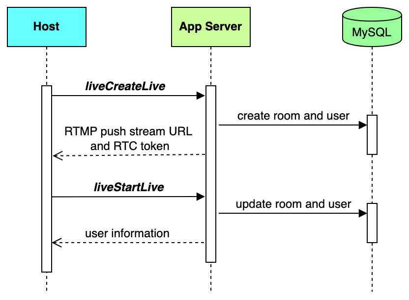
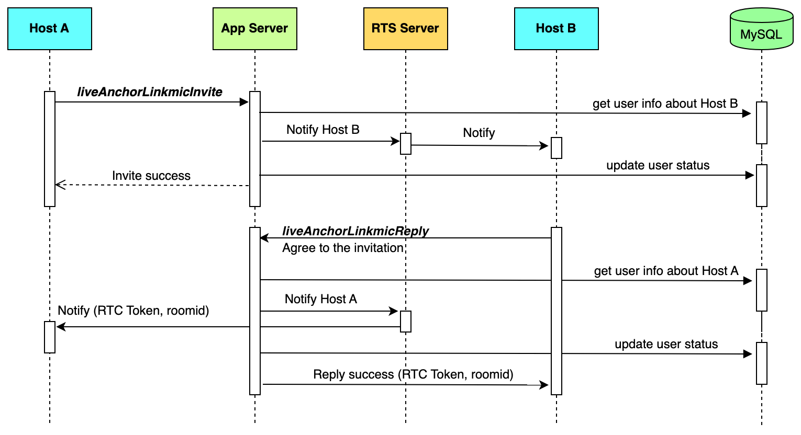
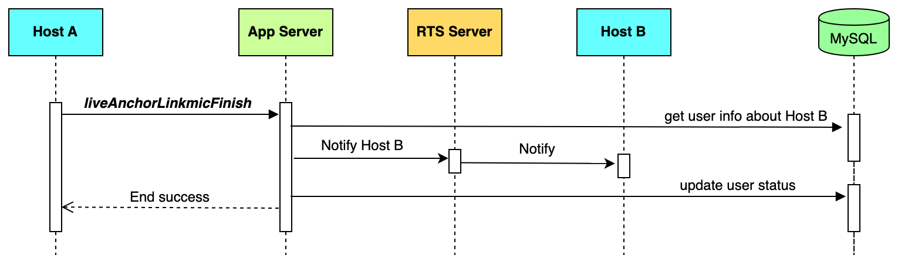
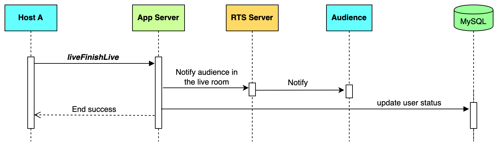
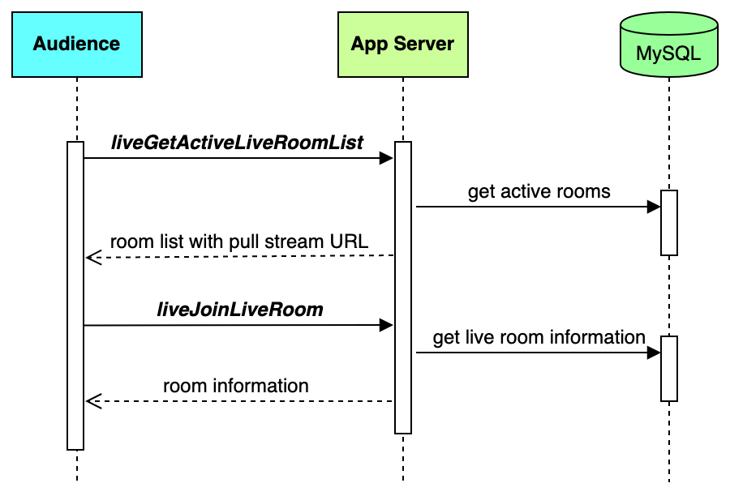
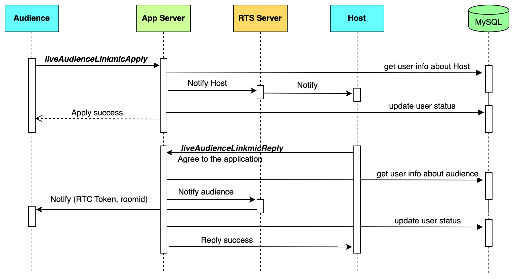
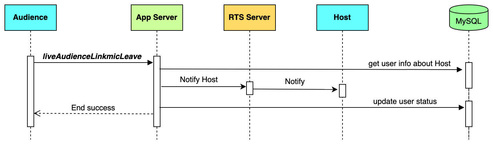
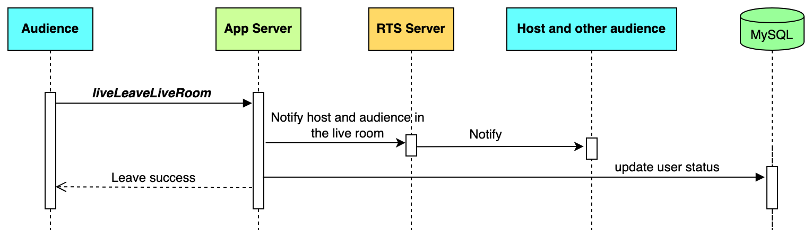

To build the server-side logic for an interactive live streaming application, this guide provides a complete implementation using Go. This document walks you through setting up the required database and server configuration, and provides code examples for core features such as starting a stream, enabling host-to-host co-hosting (PK battles), and allowing audience members to become co-hosts.
## System requirements

* [Go](https://go.dev/doc/tutorial/getting-started) 1.18 or higher
* [MySQL](https://dev.mysql.com/doc/mysql-getting-started/en/) 5.7 or higher
* [Redis](https://redis.io/docs/latest/operate/oss_and_stack/install/install-redis/) 6.2 or higher

## Prerequisites

* A valid [BytePlus account](http://console.byteplus.com/) with [BytePlus MediaLive](https://console.byteplus.com/live) and [BytePlus RTC](https://console.byteplus.com/rtc/workplaceRTC) activated.
* You have completed the [basic setup for live streaming](https://docs.byteplus.com/en/byteplus-media-live/docs/getting-started).
* You have [created an access key](https://docs.byteplus.com/en/docs/byteplus-platform/docs-creating-an-accesskey) for the account.
* You have cloned the [VideoOneSolutions](https://github.com/byteplus-sdk/VideoOneSolutions) repository from GitHub.

## Run the server-side code
This section introduces how to run the server-side code on your server.
### Creating tables in MySQL
Execute the following DML SQL to create a MySQL database.
```SQL
CREATE DATABASE IF NOT EXISTS `videoone`;
USE `videoone`;

DROP TABLE IF EXISTS `live_linker`;
CREATE TABLE `live_linker`
(
    `id`            bigint(20) unsigned NOT NULL AUTO_INCREMENT COMMENT 'Primary key',
    `app_id`        varchar(64)              DEFAULT NULL COMMENT 'app_id',
    `linker_id`     varchar(100)             DEFAULT NULL COMMENT 'linker_id',
    `from_room_id`  varchar(100)             DEFAULT NULL COMMENT 'from_room_id',
    `from_user_id`  varchar(100)             DEFAULT NULL COMMENT 'from_user_id',
    `to_room_id`    varchar(100)             DEFAULT NULL COMMENT 'to_room_id',
    `to_user_id`    varchar(100)             DEFAULT NULL COMMENT 'to_user_id',
    `biz_id`        varchar(100)             DEFAULT NULL COMMENT 'biz_id',
    `scene`         int(2)                   DEFAULT NULL COMMENT '0: Audience co-host, 1: Host-vs-host battle',
    `linker_status` int(10)                  DEFAULT NULL COMMENT 'linker_status',
    `create_time`   timestamp           NULL DEFAULT CURRENT_TIMESTAMP COMMENT 'create time',
    `linking_time`  timestamp           NULL DEFAULT CURRENT_TIMESTAMP COMMENT 'Temporary status during a co-hosting request',
    `linked_time`   timestamp           NULL DEFAULT CURRENT_TIMESTAMP COMMENT 'linked time',
    `update_time`   timestamp           NULL DEFAULT CURRENT_TIMESTAMP ON UPDATE CURRENT_TIMESTAMP COMMENT 'update time',
    `status`        int(2)                   DEFAULT NULL COMMENT 'status',
    `extra`         varchar(256)             DEFAULT NULL COMMENT 'extra information',
    PRIMARY KEY (`id`),
    UNIQUE KEY `uniq_linker_id` (`linker_id`)
) ENGINE = InnoDB DEFAULT CHARSET = utf8mb4 COMMENT ='link information';

SET sql_mode = '';
DROP TABLE IF EXISTS `live_room`;
CREATE TABLE `live_room`
(
    `id`             bigint(20) unsigned NOT NULL AUTO_INCREMENT COMMENT 'Primary key',
    `rtc_app_id`     varchar(100)                 DEFAULT NULL COMMENT 'rtc_app_id',
    `room_id`        varchar(100)                 DEFAULT NULL COMMENT 'room_id',
    `room_name`      varchar(100)                 DEFAULT NULL COMMENT 'room_name',
    `host_user_id`   varchar(100)                 DEFAULT NULL COMMENT 'host_user_id',
    `host_user_name` varchar(100)                 DEFAULT NULL COMMENT 'host_user_name',
    `stream_id`      varchar(100)                 DEFAULT NULL COMMENT 'stream_id',
    `status`         int(11)                      DEFAULT NULL COMMENT 'status',
    `create_time`    timestamp           NULL     DEFAULT CURRENT_TIMESTAMP COMMENT 'create time',
    `update_time`    timestamp           NULL     DEFAULT CURRENT_TIMESTAMP ON UPDATE CURRENT_TIMESTAMP COMMENT 'update time',
    `start_time`     timestamp           NOT NULL DEFAULT '0000-00-00 00:00:00' COMMENT 'room start time',
    `finish_time`    timestamp           NOT NULL DEFAULT '0000-00-00 00:00:00' COMMENT 'room finish time',
    `extra`          varchar(512)                 DEFAULT '' COMMENT 'extra info',
    PRIMARY KEY (`id`),
    UNIQUE KEY `uniq_app_room_id` (`rtc_app_id`, `room_id`)
) ENGINE = InnoDB DEFAULT CHARSET = utf8mb4 COMMENT ='room information';

DROP TABLE IF EXISTS `live_room_user`;
CREATE TABLE `live_room_user`
(
    `id`          bigint(20) unsigned NOT NULL AUTO_INCREMENT COMMENT 'primary key',
    `room_id`     varchar(100)             DEFAULT NULL COMMENT 'room_id',
    `user_id`     varchar(100)             DEFAULT NULL COMMENT 'user_id',
    `user_name`   varchar(100)             DEFAULT NULL COMMENT 'user_name',
    `user_role`   varchar(100)             DEFAULT NULL COMMENT 'user_role',
    `status`      int(11)                  DEFAULT NULL COMMENT 'user status',
    `mic`         int(11)                  DEFAULT NULL COMMENT 'status for mic',
    `camera`      int(11)                  DEFAULT NULL COMMENT 'status for camera',
    `extra`       varchar(256)             DEFAULT NULL COMMENT 'extra',
    `create_time` timestamp           NULL DEFAULT CURRENT_TIMESTAMP COMMENT 'create time',
    `update_time` timestamp           NULL DEFAULT CURRENT_TIMESTAMP ON UPDATE CURRENT_TIMESTAMP COMMENT 'update time',
    `app_id`      varchar(64)              DEFAULT NULL COMMENT 'app_id',
    PRIMARY KEY (`id`),
    UNIQUE KEY `uniq_room_id_user_id` (`room_id`, `user_id`)
) ENGINE = InnoDB DEFAULT CHARSET = utf8mb4 COMMENT ='user information when in room';

DROP TABLE IF EXISTS `user_profile`;
CREATE TABLE `user_profile`
(
    `id`         bigint(20) unsigned NOT NULL AUTO_INCREMENT COMMENT 'primary key',
    `user_id`    varchar(32)         NOT NULL DEFAULT '' COMMENT 'user id',
    `user_name`  varchar(64)         NOT NULL DEFAULT '' COMMENT 'user name',
    `app_id`     varchar(64)         NOT NULL COMMENT 'app_id',
    `poster_url` varchar(512)        not null DEFAULT '' COMMENT 'url',
    `created_at` timestamp           NOT NULL DEFAULT CURRENT_TIMESTAMP COMMENT 'create time',
    `updated_at` timestamp           NOT NULL DEFAULT CURRENT_TIMESTAMP ON UPDATE CURRENT_TIMESTAMP COMMENT 'update time',
    PRIMARY KEY (`id`),
    UNIQUE KEY `idx_user_id` (`user_id`)
) ENGINE = InnoDB DEFAULT CHARSET = utf8mb4 COMMENT ='user profile information';
```

### Filling in the server configuration
Within the project folder, navigate to the `/Server/conf` directory, open the `config.yaml` file, and configure the following settings.

| **Parameter** | **Data type** | **Description** | **Example** |
| --- | --- | --- | --- |
| mysql_dsn | String | The DSN of your MySQL server, where: <br>  <br> * `user_name` is the username of your MySQL account. <br> * `password` is the password of your MySQL account. <br> * `mysql_address` is the IP address of your MySQL server. <br> * `port` is the port number used by MySQL. | user1:0EFF9BF*******2240CA35@tcp(127.0.0.1:3306)/videoone?parseTime=true&loc=Local |
| redis_init | Boolean | Whether to connect to redis. | Must be **`true`** |
| redis_addr | String | The IP address and port number of your Redis server. |  |
| redis_password | String | The password for your Redis service. | 0EFF9BF*******2A35 |
| port | String | The port number used by this app service. In most cases, you can set it to `8080`. | 8080 |
| access_key | String | The **Access Key ID (AK)** of your BytePlus account. | AKAPZ7******FK4k9 |
| secret_access_key | String | The **Secret Access Key (SK)** of your BytePlus account. | 8dk39vK********k7D== |
| rtc_app_id | String | The **AppId** of your BytePlus RTC app. | 1256********37a86 |
| rtc_app_key | String | The **AppKey** of your BytePlus RTC app. | 1bfaa8e********fjc07d |
| live_app_name | String | The **AppName** in MediaLive for which you have configured a transcoding template. | videoone |
| live_pull_domain | String | http://{domain_name}, where "domain_name" represents the **domain name for stream pulling**. | `http://pull-demo.com` |
| live_push_domain | String | rtmp://{domain_name}, where "domain_name" represents the **domain name for stream pushing**. | `rtmp://push-demo.com` |
| live_stream_key | String | The **Primary key** for URL authentication. | DLH********KDF |
| live_timer_enable | Boolean | To determine whether a live room session should automatically end when the time duration specified in the `live_experience_time` parameter is reached. <br>  <br> * true: Enable automatic ending <br> * false: Disable automatic ending | true |
| live_experience_time | Integer | The duration, in minutes, after which a live room session should automatically end. This parameter takes effect only if `live_timer_enable` is set to `true`. | 20 |
### Deploying the project 
Under the root directory, run the following command to compile and deploy the project:
```Shell
sh startserver.sh
```

### Checking results and logs
Call the `ping` interface using the following command:
```Shell
curl --location 'http://{your_server_address}:{port_number}/videoone_opensource/ping'
```

The following response indicates that the service is up and running:
```Plain Text
{"message":"pong"} 
```

To access the service logs, navigate to the `/Server/output/log/app` directory and find the logs in `app.log`. Here is an example of a log entry:
```Plain Text
time="2021-12-31T15:35:14+08:00" level=info msg="get login userID: 123" Location="user.go:49" LogID=75119c42-3a98-4533-a3f7-d2b8468c03f6
```

## Implementing the feature for the host
This section provides instructions on implementing the interactive live streaming feature for the host.
### Starting the live stream
The host uses both the RTC engine and the live pusher to start a stream. Therefore, the server needs to provide the host with the RTC token and RTMP push stream URL.
**Sequence diagram**



**Sample code**

1. Generate RTMP push stream URL

```Go
// set default expire time: 12 hours from now
expireTime := strconv.FormatInt(time.Now().Add(12*time.Hour).Unix(), 10)

// generate signed URL, make sure you have edited the configuration file and filled in parameters related to LIVE 
hasher := md5.New()
hasher.Write([]byte("/" + config.Configs().LiveAppName + "/" + streamID + config.Configs().LiveStreamKey + expireTime))
secret := hex.EncodeToString(hasher.Sum(nil))

// formate URL
return config.Configs().LivePushDomain + "/" + config.Configs().LiveAppName + "/" + streamID + "?expire=" + expireTime + "&sign=" + secret
```


2. Generate RTC token

Refer to [Authentication with Token](https://docs.byteplus.com/en/docs/byteplus-rtc/docs-70121) for detailed instructions on how to generate RTC tokens.
```Go
var (
// Make sure you use the same appID, roomID, and userID when generating the token and creating the RTC call. Otherwise, joining room will fail.
    appID  = "xxxxx" 
    appKey = "xxxxx" 
    roomID = "room" // To generate a token for RTS, pass an empty value for it.
    userID = "uid"
)
t := AccessToken.New(appID, appKey, roomID, userID)
// Specify the expiration time for the token. The token will expire in 2 hours. After the token has expired, the user cannot join room with it any more.
t.ExpireTime(time.Now().Add(time.Hour * 2))
// Add privilege of subscribing.
t.AddPrivilege(AccessToken.PrivSubscribeStream, time.Time{})
// Add privilege of publishing.
t.AddPrivilege(AccessToken.PrivPublishStream, time.Time{})
// Get the token.
token,err := t.Serialize()
```

### Enabling co-hosting
To co-host with a host from another live room (in a host-vs-host battle), do the following:

1. Send invitation notification to the invited host via RTS.
2. If the host agrees, return information about the co-host's RTC room (token, roomid).
3. Update user status in the database.




**Sample code**

1. Send invitation notification to the invited host via RTS.

Refer to [SendUnicast](https://docs.byteplus.com/en/docs/byteplus-rtc/docs-1164061) for detailed instructions on how to send peer-to-peer messages from server to a client.
```Go
// build request parameters for SendUnicast
param := &sendRoomUnicastParam{
    AppID:   appID,
    RoomID:  roomID,
    From:    FromServer,
    To:      userID,
    Binary:  false,
    Message: message,
}
// send HTTP request
p, _ := json.Marshal(param)
resp, code, err := client.Json(sendRoomUnicast, nil, string(p))
// handling the HTTP response
if err != nil || code != 200 {
    if err == nil {
       err = errors.New("net error")
    }
    return err
}

r := &base.CommonResponse{}
if err = json.Unmarshal(resp, r); err != nil {
    return err
}
if r.Result == nil {
    return errors.New(r.ResponseMetadata.Error.Message)
}
return nil
```

### Ending co-hosting
To stop co-hosting, do the following:

1. Send an invitation notification to the other host via RTS.
2. Update user status in the database.




**Sample code**

1. Update user status in the database.

```Go
// defining user status constants
const LinkerStatusEnding = 7 

// update user status
updateParams := map[string]interface{}{}
updateParams["linker_status"] = LinkerStatusEnding
updateParams["linking_time"] = now
return db.Client.Table("live_linker").Where("linker_id = ?", linkerID).Updates(updateParams).Error
```

### Ending the live stream
To end the live stream, do the following:

1. Notify the audience in the live room.
2. Update user status in the database.




## Implementing the feature for the audience
This section provides instructions on implementing the interactive live streaming feature for the audience.
### Playing the live stream
Use the live player to pull and play the live stream. Therefore, the server needs to provide the pull stream URL.
**Sequence diagram**



**Sample code**

1. Generate a stream pull URL

```Go
// define transcode suffix 
const (
    postfix480  = "_ld"
    postfix540  = "_sd"
)

// generate signed URL, make sure you have edited the configuration file and filled in parameters related to LIVE 
configs := config.Configs()
res := make(map[string]string)
res["origin"] = configs.LivePullDomain + "/" + configs.LiveAppName + "/" + streamID + ".flv"
res["480"] = configs.LivePullDomain + "/" + configs.LiveAppName + "/" + streamID + postfix480 + ".flv"
res["540"] = configs.LivePullDomain + "/" + configs.LiveAppName + "/" + streamID + postfix540 + ".flv"
return res
```

### Becoming a co-host
To become a co-host, do the following:

1. Send an application notification to the host via RTS.
2. If the host agrees, return information about the RTC room (token, roomid).
3. Update user status in the database.

**Sequence diagram**



**Sample code**

1. Send invitation notification to the invited host via RTS.

Refer to [SendUnicast](https://docs.byteplus.com/en/docs/byteplus-rtc/docs-1164061) for detailed instructions on how to send peer-to-peer messages from server to a client.
```Go
// build request parameters for SendUnicast
param := &sendRoomUnicastParam{
    AppID:   appID,
    RoomID:  roomID,
    From:    FromServer,
    To:      userID,
    Binary:  false,
    Message: message,
}
// send HTTP request
p, _ := json.Marshal(param)
resp, code, err := client.Json(sendRoomUnicast, nil, string(p))
// handling the HTTP response
if err != nil || code != 200 {
    if err == nil {
       err = errors.New("net error")
    }
    logs.CtxError(ctx, "sendRoomUnicast failed,appID:%s,roomID:%s,userID:%s,error:%s", appID, roomID, userID, err)
    return errors.New(err.Error())
}

r := &base.CommonResponse{}
if err = json.Unmarshal(resp, r); err != nil {
    logs.CtxInfo(ctx, "json unmarshal common response failed,resp:%s,error:%s", string(resp), err)
    return err
}
if r.Result == nil {
    return errors.New(r.ResponseMetadata.Error.Message)
}
return nil
```

### Ending co-hosting
To stop co-hosting, do the following:

1. Send an invitation notification to the host via RTS.
2. Update user status in the database.

**Sequence diagram**



**Sample code**

1. Update user status in the database.

```Go
// defining user status constants
const LinkerStatusEnding = 7 

// update user status
updateParams := map[string]interface{}{}
updateParams["linker_status"] = LinkerStatusEnding
updateParams["linking_time"] = now
return db.Client.Table("live_linker").Where("linker_id = ?", linkerID).Updates(updateParams).Error
```

### Leaving the live room
To leave the live room, do the following:

1. Notify the host and other audience in the live room.
2. Update user status in the database.

**Sequence diagram**




