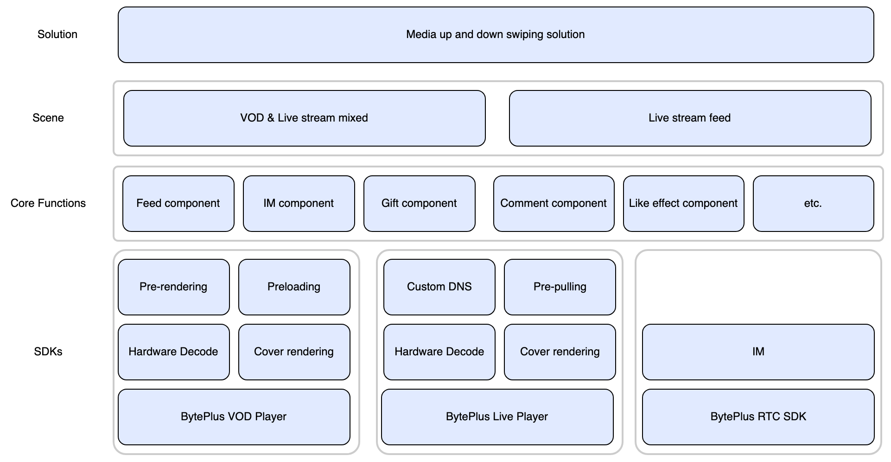

This media up and down swiping solution utilizes the playback functions of live stream and Video on Demand (VOD). It supports mixed playback of videos and live streams, as well as playlists consisting solely of videos or live streams. Media playback can be switched by an up-slide gesture. The solution also includes features such as likes, comments, and live room gifting. With this comprehensive solution, you can rapidly develop your own application.

# Highlights

* Combined with the exclusive Zero First Frame technology, the solution leverages capabilities such as pre-rendering, pre-loading, and start-play selection to achieve instant video playback, seamless transitions, and a smooth up-and-down swiping and viewing experience.
* Supports mixed layout and playback of live streams and videos. You can create a playlist containing both live stream and video content, then play it back in the application.

# Solution architecture
This section describes the technical architecture of the media swiping solution. More specifically, the underlying layer uses BytePlus VOD Player and BytePlus Live Player, and adopts strategies such as pre-loading and pre-rendering to ensure smooth playback. In addition to this, the messaging function of BytePlus RTC is also used. Using the capabilities of the underlying SDK, we have implemented some of the core functions of the media swiping solution, such as Feed Component, IM Component, and so on. With these features, we have created two classic scenarios, including **mixed feed of VOD & Live Stream** and **pure Live Stream feed**.

## Short video optimization strategy
To achieve a high-quality short video playback experience, this solution utilizes the pre-loading and pre-rendering strategies provided by the BytePlus VOD player, combined with various approaches such as advancing the playback timing and setting short video cover images. With our demo and open-source code, you can quickly achieve the same short video playback experience.
For details on the preloading and pre-rendering strategy of BytePlus VOD players, please refer to:

* [Best practices for short video scenarios [Android]](https://docs.byteplus.com/en/docs/byteplus-vod/docs-android-player-short-video-best-practices)
* [Best practices for short video scenarios [iOS]](https://docs.byteplus.com/en/docs/byteplus-vod/docs-ios-player-short-video-best-practices)

## Live stream optimization strategy
In order to achieve efficient live stream playback, the solution sample uses the BytePlus Live Player and integrates a variety of optimization strategies to achieve near-instant live stream startup. You can actually experience the above effect through our demo, and implement the same functionality with ease.
## Implementation
To learn more about implementing the solution in your own app, please refer to the following topics:

* [Implementing media up and down swiping for Android.](https://docs.byteplus.com/docs/byteplus-vos/Implementing_media_up_and_down_swiping_for_Android)
* [Implementing media up and down swiping for iOS.](https://docs.byteplus.com/docs/byteplus-vos/Implementing_media_up_and_down_swiping_for_iOS)
* [Implementing media up and down swiping for Server.](/docs/byteplus-vos/Implementing_media_up_and_down_swiping_for_Server)

