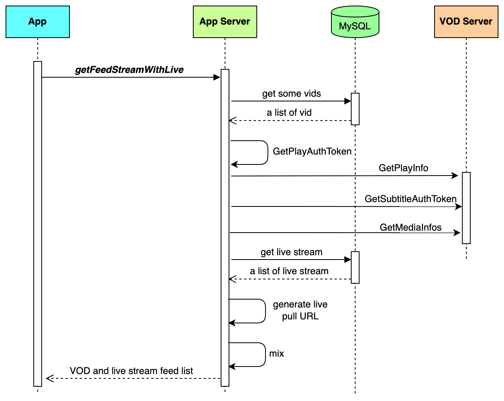
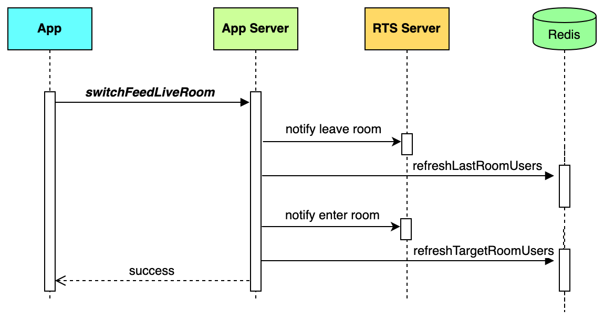

To create a swipeable media feed on your server that combines both on-demand videos and live streams, this guide provides a complete, step-by-step implementation. You will learn how to set up the necessary database and services, configure your server, prepare media assets using BytePlus VOD and MediaLive, and deploy the final application.
## System requirements 

* [Go](https://go.dev/doc/tutorial/getting-started) 1.18 or higher 
* [MySQL](https://dev.mysql.com/doc/mysql-getting-started/en/) 5.7 or higher 
* [Redis](https://redis.io/docs/latest/operate/oss_and_stack/install/install-redis/) 6.2 or higher

# Prerequisites 

* A valid [BytePlus account](http://console.byteplus.com/) with [BytePlus VOD](https://console.byteplus.com/vodpaas)、 [BytePlus MediaLive](https://console.byteplus.com/live) and [BytePlus RTC](https://console.byteplus.com/rtc/workplaceRTC) activated. 
* You have [created an access key](https://docs.byteplus.com/en/docs/byteplus-platform/docs-creating-an-accesskey) for the account. 
* Go to GitHub and clone the [VideoOneSolutions](https://github.com/byteplus-sdk/VideoOneSolutions) repository. 
* Complete the following steps on the [SDK management](https://console.byteplus.com/vodpaas/sdk/) page within the BytePlus VOD console.

# Run the server side code 
This section describes how to run the server-side code.
## Step 1: Creating tables in MySQL
Execute the following DML SQL to create a MySQL database.
```SQL
CREATE DATABASE IF NOT EXISTS `videoone`; 
USE `videoone`; 
 
DROP TABLE IF EXISTS `user_profile`; 
CREATE TABLE `user_profile` 
( 
    `id`         bigint(20) unsigned NOT NULL AUTO_INCREMENT COMMENT 'primary key', 
    `user_id`    varchar(32)         NOT NULL DEFAULT '' COMMENT 'user id', 
    `user_name`  varchar(64)         NOT NULL DEFAULT '' COMMENT 'user name', 
    `created_at` timestamp           NOT NULL DEFAULT CURRENT_TIMESTAMP COMMENT 'create time', 
    `updated_at` timestamp           NOT NULL DEFAULT CURRENT_TIMESTAMP ON UPDATE CURRENT_TIMESTAMP COMMENT 'update time', 
    PRIMARY KEY (`id`), 
    UNIQUE KEY `idx_user_id` (`user_id`) 
) ENGINE = InnoDB DEFAULT CHARSET = utf8mb4 COMMENT ='user profile information';


CREATE TABLE `live_feed`
(
    `id`          bigint(20) unsigned NOT NULL AUTO_INCREMENT COMMENT 'Primary key',
    `host_name`   varchar(128) NOT NULL DEFAULT '' COMMENT 'host name',
    `room_name`   varchar(128) NOT NULL DEFAULT '' COMMENT 'room name',
    `room_id`     varchar(64)  NOT NULL DEFAULT '' COMMENT 'room id',
    `cover_url`   varchar(512) NOT NULL DEFAULT '' COMMENT 'cover pic download url',
    `room_desc`   varchar(256) NOT NULL DEFAULT '' COMMENT 'room description',
    `stream_id`   varchar(64)  NOT NULL DEFAULT '' COMMENT 'stream id',
    `create_time` timestamp NULL DEFAULT CURRENT_TIMESTAMP COMMENT 'create time',
    `update_time` timestamp NULL DEFAULT CURRENT_TIMESTAMP ON UPDATE CURRENT_TIMESTAMP COMMENT 'update time',
    PRIMARY KEY (`id`)
) ENGINE=InnoDB DEFAULT CHARSET=utf8mb4 COMMENT='live feed';

CREATE TABLE `video_info`
(
    `id`                         bigint(20) unsigned NOT NULL AUTO_INCREMENT COMMENT 'id',
    `vid`                        varchar(100) NOT NULL DEFAULT '' COMMENT 'vid',
    `video_type`                 tinyint(4) NOT NULL DEFAULT '0' COMMENT 'Video type. 0: short, 1: medium-length, 2: long',
    `anti_screenshot_and_record` tinyint(4) NOT NULL DEFAULT '0' COMMENT 'Indicates if screen recording and screenshot prevention is supported. 0: No, 1: Yes',
    `support_smart_subtitle`     tinyint(4) NOT NULL DEFAULT '0' COMMENT 'Indicates if intelligent subtitles are supported. 0: No, 1: Yes',
    `update_time`                datetime     NOT NULL DEFAULT CURRENT_TIMESTAMP ON UPDATE CURRENT_TIMESTAMP COMMENT 'update_time',
    `create_time`                datetime     NOT NULL DEFAULT CURRENT_TIMESTAMP COMMENT 'create time',
    PRIMARY KEY (`id`),
    UNIQUE KEY `uniq_vid` (`vid`)
) ENGINE=InnoDB DEFAULT CHARSET=utf8mb4 COMMENT='video info';
```

## Step 2: Completing the server configuration 
Within the project folder, navigate to the `/Server/conf` directory, open the config.yaml file, and configure the following settings.

| **Parameter** | **Data type** | **Description** | **Example** |
| --- | --- | --- | --- |
| mysql_dsn  <br>  | String  | The DSN of your MySQL server, where:  <br>  <br> * user_name is the username of your MySQL account.  <br> * password is the password of your MySQL account.  <br> * mysql_address is the IP address of your MySQL server.  <br> * port is the port number used by MySQL.  | user1:0EFF9BF*******2240CA35@tcp(127.0.0.1:3306)/videoone?parseTime=true&loc=Local  |
| redis_addr  | String  | The IP address and port number of your Redis server.  |   |
| redis_password  | String  | The password for your Redis service.  | 0EFF9BF*******2A35  |
| port  | String  | The port number used by this app service. In most cases, you can set it to 8080.  | 8080  |
| access_key  | String  | The **Access Key ID (AK)** of your BytePlus account.  | AKAPZ7******FK4k9  |
| secret_access_key  | String  | The **Secret Access Key (SK)** of your BytePlus account.  | 8dk39vK********k7D==  |
| rtc_app_id  | String  | The **AppId** of your BytePlus RTC app.  | 1256********37a86  |
| rtc_app_key  | String  | The **AppKey** of your BytePlus RTC app.  | 1bfaa8e********fjc07d  |
| live_app_name  | String  | The **AppName** in MediaLive for which you have configured a transcoding template.  | videoone  |
| live_pull_domain  | String  | http://{domain_name}, where "domain_name" represents the **stream pull domain**.  | http://pull-demo.com |
| live_push_domain  | String  | rtmp://{domain_name}, where "domain_name" represents the **stream push domain**.  | rtmp://push-demo.com |
| live_stream_key  | String  | The **Primary key** for URL authentication.  | DLH********KDF  |
## Step 3: Preparing VOD media files

1. Follow the steps below to prepare some VOD media files. You can refer to [Getting started with BytePlus VOD](https://docs.byteplus.com/en/byteplus-vod/docs/getting-started?version=v1.0) for more detailed instructions. 
   1. Create a VOD space. 
   2. Upload some video files to the VOD space. Select **Multi-bitrate template for general online videos** as the workflow template. 
   3. Add a domain name. 
   4. Publish the video files. 
2. Enter the information about the media files you have uploaded to BytePlus VOD. 

```SQL
INSERT INTO
  video_info(vid)
VALUES
  ('{vid-1}'),
  ('{vid-2}');
```

| **Parameter** | **Data type** | **Description** | **Example** |
| --- | --- | --- | --- |
| vid  | String  | The video ID.  | v110exxdg  |
## Step 4: Preparing live streaming media

1. Here we use relay tasks provided by BytePlus MediaLive to generate live streams. You can refer to [Configuring a relay task](https://docs.byteplus.com/en/docs/byteplus-media-live/docs-relay) for more detailed instructions. 
2. Enter the information about the live streams you have created. 

```SQL
INSERT INTO
  live_feed (host_name, room_name, room_id, stream_id, room_desc, cover_url)
VALUES
  ('{host_name}', '{room_name}', '{room_id}', '{stream_id}', '{room_desc}', '{cover_url}'),
  ('{host_name}', '{room_name}', '{room_id}', '{stream_id}', '{room_desc}', '{cover_url}');
  
```

| **Parameter** | **Data type** | **Description** | **Example** |
| --- | --- | --- | --- |
| host_name | String  | The name of the host.  | v110exxdg  |
| room_name | String | The name of the live room. | Jack's Live Room |
| room_id | String | The RTC room ID bound to the live stream. | 12345 |
| stream_id | String | The stream ID of live stream. | xxxx |
| room_desc | String | The description of the live room. | This is Jack's Live Room |
| cover_url | String | The cover image URL of the live room.  | https://xxxxx |
## Step 5: Deploying the project 
Under the root directory, run the following command to compile and deploy the project: 
```Shell
sh startserver.sh
```

## Step 6: Checking result and logs 
Call the ping interface using the following command: 
```Shell
curl --location 'http://{your_server_address}:{port_number}/videoone_opensource/ping'
```

The following response indicates that the service is up and running: 
```Plain Text
{"message":"pong"} 
```

To access the service logs, navigate to the `/Server/output/log/app` directory and find the logs in app.log. Here is an example of a log entry: 
```Plain Text
time="2021-12-31T15:35:14+08:00" level=info msg="get login userID: 123" Location="user.go:49" LogID=75119c42-3a98-4533-a3f7-d2b8468c03f6
```

# Implementation
## Mixing VOD and live streaming feed list
This section introduces how to get mixed VOD and live streaming feed list.
### Sequence diagram




### Step 1: Get VIDs from MySQL and get playback information
Query MySQL to retrieve the list of VIDs. 
```Go
// Query a list of Vids from MySQL 
var videoType = 0  // 0: short video
query := db.Client.Table("video_info").Where("video_type = ?", videoType)
err := query.Order("id asc").Offset(offset).Limit(pageSize).Find(&resp).Error
return resp, err
```

For each vid, call the OpenAPI to retrieve playback information.
```Go
// build request parameter 
req := &request.VodGetPlayInfoRequest{ 
    Vid:      req.Vid, 
    FileType: req.FileType, 
    Ssl:      "1", // force get URL with HTTPS protocol 
} 
// Generate the playAuthToken locally.  
instance := vod_openapi.GetInstance() 
tokenExpires := 86400  // Default token expiration time: 24 * 60 * 60 seconds 
playAuthToken, err := instance.GetPlayAuthToken(req, tokenExpires)

// get SubtitleAuthToken 
info, _, err := instance.GetPlayInfo(req) 
 
// get SubtitleAuthToken if media has subtitle 
subtitleToken, err = instance.GetSubtitleAuthToken(&request.VodGetSubtitleInfoListRequest{ 
    Vid: vid, 
}, tokenExpires) 
 
// get media resolution 
mediaInfo, _, err := instance.GetMediaInfos(&request.VodGetMediaInfosRequest{ 
    Vids: vid 
})
```

### Step 2: Get live streams from MySQL and generate pull URL
```Go
// Query live streams from MySQL 
var resp []*live_feed_model.LiveFeed
query := db.Client.WithContext(ctx).Debug().Table("live_feed")
err := query.Offset(offset).Limit(pageSize).Find(&resp).Error
if err != nil {
    return nil, err
}

// Generate pull URLs locally
StreamPullUrlList:= live_cdn_service.GenPullUrl(streamID) 
```

### Step 3: Mix VOD and live streaming feed list
```Go
var liveList []VideoDetail
var vodList []VideoDetail
var resp []VideoDetail

// append live stream and Vod media
resp = append(resp, liveList...)
resp = append(resp, vodList...)

// shuffle and crop array
rand.Shuffle(len(result), func(i, j int) {
    result[i], result[j] = result[j], result[i]
})
if len(result) > pageSize {
    result = result[:pageSize]
}
```

## Switching live room
### Sequence diagram



### Step 1: Reduce the number of users
```Go
const (
    RoomAudienceCountPrefix = "videoone:live_feed:room_audience_count:"
)

func getRoomAudienceCountKey(roomID string) string {
    return RoomAudienceCountPrefix + ":" + roomID
}

// Increment the user count for the new room.
count, err := redis_cli.Client.IncrBy(ctx, getRoomAudienceCountKey(roomID), 1).Result()
if err != nil {
    return 0, custom_error.InternalError(err)
}
redis_cli.Client.Expire(ctx, getRoomAudienceCountKey(roomID), 24*time.Hour)
return count, nil
```

### Step 2: Notify users
```Go
appID := config.Configs().RTCAppID
informer := inform.GetInformService(appID)
data := &live_feed_model.InformUserLeave{
    UserID:        userID,
    AudienceCount: count,
    UserName:      userName,
}
informer.BroadcastRoom(ctx, oldRoomID, live_feed_model.FeedLiveOnUserLeave, data)
```


