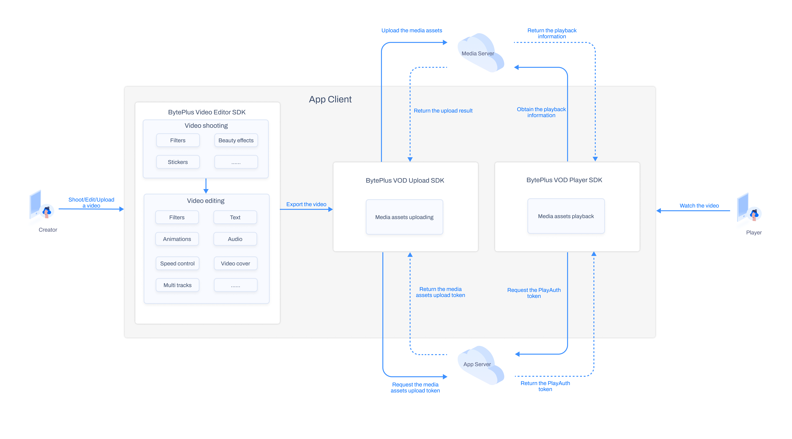

Video Playback offers a comprehensive suite of audio and video services, including features such as video effects, media uploading and management, multimedia processing, accelerated content distribution, and video playback functionality. By leveraging the infrastructure and media processing capabilities provided by BytePlus VOD, you can quickly build on-demand platforms and applications while focusing on meeting business needs and enhancing user experience.

## Billing
Using this solution incurs charges for the VOD service. For VOD pricing information, please refer to [BytePlus VOD pricing overview](https://docs.byteplus.com/en/byteplus-vod/docs/pricing). 
## Highlights
Video Playback is a one-stop solution that provides features for media uploading and video playback. You can explore the full range of video playback features and integrate them into your own application.
## Architecture
This section introduces the technical architecture of the solution. Specifically, content creators use the Video Editor SDK to shoot and edit videos. These videos are then uploaded to a media server using the Upload SDK, and viewers use the Player SDK to retrieve and play them.

### Video Playback
The BytePlus VOD Player engine handles video playback. It is a multi-platform suite of SDKs designed for seamless media stream playback. It offers a rich set of features that ensure a high-quality and stable playback experience. The Player SDK features small package size and efficient memory usage. Its efficiently architected APIs make it straightforward to integrate into applications that play short, feed, and long videos.
For more details, see [Player SDK overview](https://docs.byteplus.com/en/byteplus-vod/docs/player-sdk-overview).
### Video Editor
BytePlus Video Editor is a video processing SDK. It provides enterprise-grade solutions that help developers reduce development time and resources, allowing them to quickly add advanced short video capabilities to their applications.
The BytePlus Video Editor SDK suite offers extensive and powerful capabilities for video shooting, recording, editing, and composition. It also provides numerous effects, such as 2D/3D AR stickers (based on face, body, and background segmentation), ML-based audio/subtitle features, and high-quality beauty and filtering options.
For more details, see [BytePlus VideoEditor One Pager Overview](https://docs.byteplus.com/en/byteplus-video-editor-sdk/docs/one-pager-overview?version=v.4.0.2).
### Media upload
The BytePlus VOD Upload SDK enables you to upload your media assets (resources) to BytePlus VOD, offering a wide range of features such as upload control, acceleration, and metadata extraction. The Upload SDK can be seamlessly integrated into your Android, iOS, or Web applications, making it an ideal choice for both UGC and PGC scenarios.
For more details, see [Upload SDK overview](https://docs.byteplus.com/en/byteplus-vod/docs/upload-sdk-overview).
## Implementation
To learn more about implementing the solution in your own app, please refer to the following topics:

* [Implementing video playback for Android](/docs/byteplus-vos/docs-implementing-video-playback-edit-for-android)
* [Implementing video playback for iOS](/docs/byteplus-vos/docs-implementing-video-playback-edit-for-ios)
* [Implementing video playback for Server](/docs/byteplus-vos/Implementing_video_playback_for_Server)

