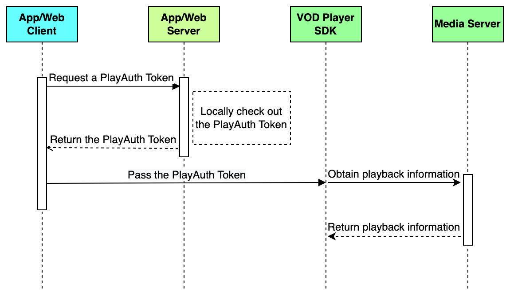
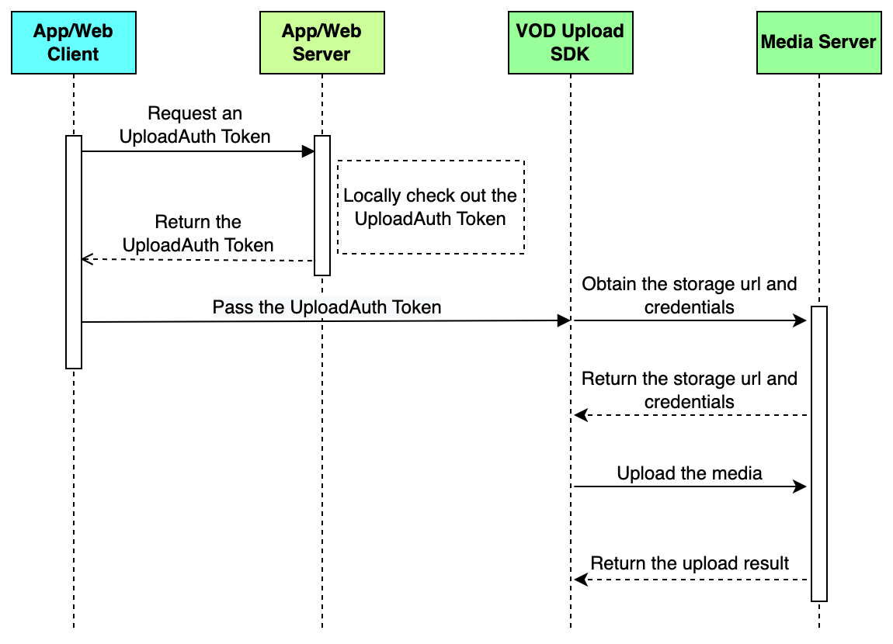

This article introduces how to implement video playback features in your iOS app.
# Development environment

* Xcode 14.0 or later.
   If you are using Xcode 15, you must complete an additional build setting configuration:
   
   1. Navigate to the **TARGETS** page, and switch to the **Build Settings** tab.
   2. Search for the **Other Linker Flags** setting.
   3. Double-click the value field for the **Other Linker Flags** setting.
   4. In the pop-up window that appears, click the **+** button and add the -ld64 linker flag.

* CocoaPods 1.10.0 or later.
* A physical mobile device running iOS 13.0 or above. Building for simulators is not currently supported.

# Prerequisites

* A valid [BytePlus account](http://console.byteplus.com/) with [BytePlus VOD](https://console.byteplus.com/vodpaas) activated.
* Complete the following steps on the [SDK management](https://console.byteplus.com/vodpaas/sdk/) page within the BytePlus VOD console:
   * Create an app and get the app ID along with the English name of the app.
   * Register for the app, then proceed to purchase and download a license for utilizing the Player SDK and Upload SDK. For the Player SDK, we recommend using the Premium Edition.

# Version requirements
To access the **video playback** and **media upload** features, you must use BytePlus VOD and BytePlus Video Editor SDKs. Please refer to the [Integration](#integration) section for the correct version number of each SDK you may use.
> For the corresponding versions of the SDKs used in each solution, please refer to the [Client SDK components](https://docs.byteplus.com/en/byteplus-vos/docs/version-combination?version=v1.0#a934220b).

# Integration
## Step 1: Modify the Podfile
Modify the Podfile in your project directory as shown below:
```Ruby
source 'https://cdn.cocoapods.org/'
source 'https://github.com/volcengine/volcengine-specs.git'
source 'https://github.com/byteplus-sdk/byteplus-specs.git'

target 'YourProjectTarget' do
  # BytePlus VOD SDK dependencies
  pod 'TTSDK', '1.43.300.2-premium', :subspecs => ['Player', 'Uploader']
end
```

## Step 2: Install the specified dependencies listed in the Podfile
To complete the SDK installation, run `pod install` in your terminal. Once the installation succeeds, you can open the generated `.xcworkspace` file to configure your project.
```Bash
pod install
```

## Step 3: Declare app permissions
Declaring the app permissions required by the SDKs in the Info.plist file of your project:
```XML
    <key>NSCameraUsageDescription</key>
    <string>Used for taking photos, recording videos, video calls, live streaming and other scenarios.</string>
  
    <key>NSMicrophoneUsageDescription</key>
    <string>Used for recording or communication scenarios such as capturing video, live streaming, and video or voice calls.</string>
    
    <key>NSPhotoLibraryAddUsageDescription</key>
    <string>This permission is required for video editing features.</string>
    
    <key>NSPhotoLibraryUsageDescription</key>
    <string>This permission is required for video editing features.</string>
     
    <key>NSAppleMusicUsageDescription</key>
    <string>This permission is required for video editing features.</string>
```

# Implementation
## Video Playback
This section introduces how to use the VOD Player SDK to play videos.
### Sequence diagram


### Step 1: Initialize the SDK
We recommend that you initialize the SDK in the `didFinishLaunchingWithOptions` method of the `appDelegate` class. See the following sample code:
```objectivec
#import <TTSDK/TTSDKManager.h>

- (BOOL)application:(UIApplication *)application didFinishLaunchingWithOptions:(NSDictionary *)launchOptions {

    // Initialize TTSDK
    [self initTTSDK];
    
    return YES;
}


- (void)initTTSDK {
    // Replace "your app id" with the AppID you applied for on the VOD console.
    NSString *appId = @"your app id"; 
    // Drag the license file obtained from the console into your project.
    // Replace "ttlicense.lic" with the actual name of your License file.
    NSString *licenseName = @"ttlicense.lic";
    TTSDKConfiguration *configuration = [TTSDKConfiguration defaultConfigurationWithAppID:appId licenseName:licenseName];
    
    // Set the maximum cache size, defaulting to 100MB, which can be customized to suit your specific business needs.
    // If the cache size exceeds the specified limit, it will be cleared according to the LRU (Least Recently Used) rule.
    TTSDKVodConfiguration *vodConfig = [[TTSDKVodConfiguration alloc] init];
    // It is recommended to set it to 300MB.
    vodConfig.cacheMaxSize = 300 * 1024 *1024; 
    configuration.vodConfiguration = vodConfig;

    [TTSDKManager startWithConfiguration:configuration]; 
}
```

When initializing the SDK, set the following parameters:

| **Name** | **Type** | **Required** | **Default Value** | **Description** |
| --- | --- | --- | --- | --- |
| appId | String | Yes | None | The app ID. You can get the app ID on the **SDK** **management** > **Applications** page in the [BytePlus VOD console](https://console.byteplus.com/vodpaas/). |
| licenseName | String | Yes | None | The path to your license. You need to put your license in the app/assets folder, and then set the LicenseUri parameter as the path to your license, such as assets/license/vod.lic. <br> For more information on the license, see [iOS Player SDK: License guide](https://docs.byteplus.com/en/docs/byteplus-vod/docs-license-guide-ios) |
| cacheMaxSize | Int | No | 300 * 1024 * 1024 (300 MB) | The maximum size in bytes of the folder for caching videos. |

### Step 2: Create a player instance
Create a player instance with the `TTVideoEngine` class, as follows:
```objectivec
// Initialize the player instance and retain it as a property.
self.engine = [[TTVideoEngine alloc] initWithOwnPlayer:YES];
```

### Step 3: Configure the category of the audio session.
Set the AudioSession category to "playback" to ensure that audio plays correctly.
```objectivec
    [[AVAudioSession sharedInstance] setCategory:AVAudioSessionCategoryPlayback error:nil];
    [[AVAudioSession sharedInstance] setActive:YES error:nil];
    // Set the audioDevice value to "audioGraph" to allow manual volume changes from the videoEngine.
    [self.videoEngine setOptionForKey:VEKKeyPlayerAudioDevice_ENUM value:@(TTVideoEngineDeviceAudioGraph)];
```

### Step 4: Set up a view for displaying the video
`TTVideoEngine` provides a view for displaying the video. The following sample code shows how to add the view as a subview:
```objectivec
// Add the player view provided by TTVideoEngine as a subview
[self.view addSubview:self.engine.playerView];
```

### Step 5: Set the video source
The SDK supports playing both local and online videos. The following section introduces how to play videos from different sources.

* #### Play a video with the video ID <span id="undefined"></span>  <span id="undefined"></span> 
   If you upload your videos to the BytePlus VOD service, you can play them using the associated video IDs. You need to set the `vid` and `playAuthToken` parameters, which can be retrieved from your app server.
   See the following sample code:
   ```objectivec
   // Replace "vid" with your actual video ID.
   NSString *vid = @"vid";
   // To play a video with the video ID, both the "playAuthToken" and "resolution" need to be set simultaneously.
   // Replace "play auth token" with your actual token.
   NSString *playAuthToken = @"play auth token";
   // Specify the video playback resolution.
   TTVideoEngineResolutionType resolution = TTVideoEngineResolutionTypeFullHD;
   TTVideoEngineVidSource *vidSource = [[TTVideoEngineVidSource alloc] initWithVid:vid playAuthToken:playAuthToken resolution:resolution];
   [self.engine setVideoEngineVideoSource:vidSource];
   [self.engine play];
   ```

   When assembling the video source, set the following parameters:

   | **Parameter** | **Type** | **Required** | **Default Value** | **Description** |
   | --- | --- | --- | --- | --- |
   | Vid | String | Yes | None | The video ID. |
   | PlayAuthToken | String | Yes | None | The playback token. |
   | Resolution | Int | No | Standard | The video resolution. See the table below. |

   Resolution

   | Enum | Video quality | Audio quality |
   | --- | --- | --- |
   | TTVideoEngineResolutionTypeSD | 360p, SD (Standard Definition) | Normal |
   | TTVideoEngineResolutionTypeHD | 480p, HD (High Definition) | High |
   | TTVideoEngineResolutionTypeFullHD | 720p, HD (High Definition) | Very high |
   | TTVideoEngineResolutionType1080P | 1080p | Original |
   | TTVideoEngineResolutionType2K | 2K | This parameter does not affect audio quality. |
   | TTVideoEngineResolutionType4K | 4K | This parameter does not affect audio quality. |
   | TTVideoEngineResolutionTypeAuto | For DASH videos, the player automatically decides the best resolution based on the viewer's network connection and adjusts the quality of the video throughout playback to minimize the risk of buffering. | This parameter does not affect audio quality. |

* #### Play a video with the HTTP URL <span id="undefined"></span>  <span id="undefined"></span> 
   If you upload your videos to the BytePlus VOD service or a third-party storage service, you can play them with the HTTP URL. You need to set the `url` parameter.
   See the following sample code:
   ```objectivec
   // Replace "your video URL" with an actual URL
   NSString *videoUrl = @"you video url";
   /// The "cacheKey" is a unique identifier for the corresponding URL. It is recommended to use the MD5 value of the URL.
   NSString *cacheKey = [videoUrl md5];
   TTVideoEngineUrlSource *urlSource = [[TTVideoEngineUrlSource alloc] initWithUrl:videoUrl cacheKey:cacheKey];
   [self.engine setVideoEngineVideoSource:urlSource];
   [self.engine play];
   ```

   When assembling the video source, set the following parameters:

   | **Parameter** | **Type** | **Required** | **Default Value** | **Description** |
   | --- | --- | --- | --- | --- |
   | Url | String | Yes | None | The HTTP URL of the video. |
   | CacheKey | String | Yes | None | The cache key, which must meet the following requirements: <br>  <br> * It should not contain any special characters and can be used as a file name. <br> * Every video has a unique cache key. <br>  <br> It is recommended to use the MD5 value of the URL as the cacheKey. |

* #### Play a local video <span id="undefined"></span>  <span id="undefined"></span> 
   If you play a local video, assign the local address to the `localVideoPath` parameter. See the following sample code:
   ```objectivec
   NSString *localVideoPath = @"file://xxx.xx";
   [self.engine setLocalURL:localVideoPath];
   [self.engine play];    
   ```


### Step 6: Control playback
The SDK provides the following methods for controlling video playback:

* Call `play` to start or resume playback.
   ```objectivec
   [self.engine play];
   ```

* Call `pause` to pause playback. Call `play` to resume.
   ```objectivec
   [self.engine pause]; 
   [self.engine play];
   ```

* Call `setCurrentPlaybackTime:complete:` to jump to a specific time. This allows you to update the playback position when users interact with the seek bar .
   ```objectivec
   [self.engine setCurrentPlaybackTime:currentTime complete:^(BOOL success) {
       // The success callback indicates whether the operation succeeds
       NSLog(@"seek complete %@", @(success));
   } renderComplete:^{
       // The renderComplete callback indicates whether the rendering operation completes
       NSLog(@"seek render complete");
   }];
   ```

* Call `StartTime` before `play` to specify the time position at which the playback starts. This method can be used for the "Skip Intro" feature.
   ```objectivec
   CGFloat startTime = 5.0f;
   [engine setOptionForKey:VEKKeyPlayerStartTime_CGFloat value:@(startTime)];
   ```

* Call `stop` to stop playback.
   ```objectivec
   [self.engine stop];
   ```


### Step 7: Release the player instance
When the video ends, or the user navigates away from the page where the video is being played, you can stop playback and release the player instance by calling `closeAysnc`. This releases the hardware decoder, memory, and network resources used by `TTVideoEngine`, which helps conserve the device's battery power.
After the player instance is released, you can no longer call methods on it. We also recommend setting the `ttVideoEngine` variable to `nil` to avoid holding a reference to the released instance.
See the following sample code:
```objectivec
// Remove the view.
[self.engine.playerView removeFromSuperview];
// Stop playback and destroy the engine instance.
[self.engine closeAysnc];
self.engine = nil;
```

The VOD Player SDK also provides a wide range of advanced features. For further details, please refer to the following topics:

* [iOS Player SDK: Basic features](https://docs.byteplus.com/en/byteplus-vod/docs/implementing-basic-features-ios)
* [iOS Player SDK: Advanced features](https://docs.byteplus.com/en/docs/byteplus-vod/docs-advanced-features-ios)

## Media upload
This section introduces how to use the VOD Upload SDK.
### Sequence diagram


### Step 1: Initialize the SDK
We recommend that you initialize the SDK in the `didFinishLaunchingWithOptions` method of the `appDelegate` class. See the following sample code:
```objectivec
#import <TTSDK/TTSDKManager.h> 
#import <TTSDK/BDFileUploaderHeader.h> 
  
- (BOOL)application:(UIApplication *)application didFinishLaunchingWithOptions:(NSDictionary *)launchOptions { 
    // Initialize TTSDK 
    [self initTTSDK]; 
     
    return YES; 
} 
  
- (void)initTTSDK { 
    // Enable debug mode for the uploader 
#if DEBUG 
    [[BDUploadUtilTool sharedInstance] enableNativeLogFunc:YES]; 
#endif 
 
    // Get the app ID from the BytePlus VOD console 
    // NSString *appId = @"you app id"; 
    TTSDKConfiguration *configuration = [TTSDKConfiguration defaultConfigurationWithAppID:<#appid#> licenseName:licenseName]; 
    [TTSDKManager startWithConfiguration:configuration]; 
}
```

### Step 2: Create an uploader instance
Create an uploader instance with the `BDVideoUploaderClient` class, as follows:
```objectivec
#import <TTSDK/BDFileUploaderHeader.h> 
 
- (void)initVideoUploader { 
    // 1. When initializing the uploader object, specify the path of the file to be uploaded 
    // NSString *filePath = @"path/to/upload/file"; 
    BDVideoUploaderClient *videoUploadClient = [[BDVideoUploaderClient alloc] initWithFilePath:<#filepath#>]; 
     
    // 2. Get the authentication parameters from your app server and pass them to the SDK  
    //NSDictionary *authParameter = @{ 
    //    BDFileUploadAccessKey: accessKeyId, 
    //    BDFileUploadSecretKey: secretKeyId, 
    //    BDFileUploadSessionToken: sessionToken, 
    //    Specify the space to which the file will be uploaded 
    //    BDFileUploadSpace: uploadSpace, 
    //}; 
    [videoUploadClient setAuthorizationParameter:<#authparameter#>]; 
     
    // 3. Customize upload configurations 
    [videoUploadClient setUploadConfig:@{ 
        // Set the slice size 
        BDFileUploadSliceSize:@(512 * 1024), 
    }]; 
     
    // 4. Set the BDVideoUploadClientDelegate 
    //  @see {BDVideoUploadClientDelegate.h} 
    videoUploadClient.delegate = self; 
     
    // 5. Set the uploader client as a global variable 
    self.videoUploadClient = videoUploadClient; 
}
```

### Step 3: Specify the file path in cloud storage
After the upload is complete, the file path in cloud storage is as follows:
`StoreUri={{BucketName}}/{{FilePrefix}}{{FileTitle}}{{FileExtension}}`

| **Parameter** | **Description** |
| --- | --- |
| BucketName | The bucket name is automatically generated. |
| FilePrefix | The file prefix must end with a forward slash (/), such as `path/to/foo/bar/`. |
| FileTitle | The file name. If not set, the SDK will automatically generate a 32-bit string as the file name. |
| FileExtension | The file suffix must start with a period (.), such as `.mp4`. |

When setting the storage path, you can specify either the full path or just the file prefix and suffix.

* Call `setFileName` to set the full path. The full path must include a file extension (e.g., `.mp4` or `.mp3`); otherwise, an error will occur.
   ```objectivec
   // FileName = FilePrefix + FileTitle + FileExtension 
   [self.videoUploadClient setFileName:<#filename#>];
   ```

* Call `setFilePrefix` to set the prefix and `setFileExtension` to set the suffix:
   ```objectivec
   // The file prefix must be ended with / 
   [self.videoUploadClient setFilePrefix:<#fileprefix#>]; 
   // The file suffix must be started with . 
   [self.videoUploadClient setFileExtension:<#fileextension#>];
   ```


### Step 4: Control the upload process
The Upload SDK provides the following methods for controlling the upload process:

* Call `start` to start uploading:
   ```objectivec
   [self.videoUploadClient start];
   ```

* Call `stop` to pause uploading:
   ```objectivec
   [self.videoUploadClient stop];
   ```

* After the upload is complete, call `close` to terminate the upload.
   ```objectivec
   [self.videoUploadClient close];
   ```


### Step 5: Set the delegate
See the following sample code:
```objectivec
#pragma mark - BDVideoUploadClientDelegate 
 
// Occurs when uploading finishes
- (void)videoUpload:(nonnull BDVideoUploaderClient*)uploadClient didFinish:(nullable BDVideoUploadInfo *)videoInfo error:(nullable NSError *)error { 
    if (!error) { 
       // Uploading succeeds
    } else { 
       // Uploading fails   
    } 
    // Release uploadClient 
    [uploadClient close]; 
} 
  
/// Indicates the uploading progress
- (void)videoUpload:(nonnull BDVideoUploaderClient*)uploadClient progressDidUpdate:(NSInteger)progress { 
    // NSLog(@"progress update:%ld", progress);
}
```

The VOD Upload SDK also provides a wide range of advanced features. For further details, please refer to the following topics:

* [BytePlus VOD Upload SDK: Uploading audios and videos](https://docs.byteplus.com/en/byteplus-vod/docs/uploading-audios-and-videos_1)
* [BytePlus VOD Upload SDK: Uploading materials](https://docs.byteplus.com/en/byteplus-vod/docs/uploading-materials_1)

