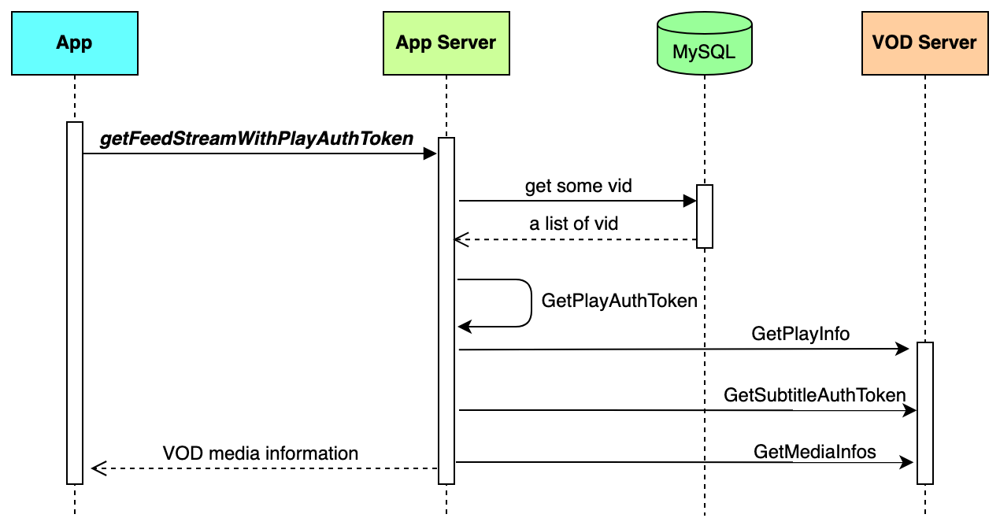
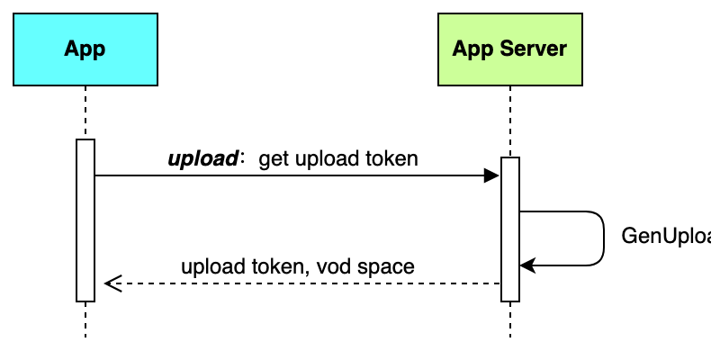

This article introduces how to implement video playback features in your server.
# System requirements

* [Go](https://go.dev/doc/tutorial/getting-started) 1.18 or higher
* [MySQL](https://dev.mysql.com/doc/mysql-getting-started/en/) 5.7 or higher
* [Redis](https://redis.io/docs/latest/operate/oss_and_stack/install/install-redis/) 6.2 or higher

# Prerequisites

* A valid [BytePlus account](http://console.byteplus.com/) with [BytePlus VOD](https://console.byteplus.com/vodpaas) activated.
* You have [created an access key](https://docs.byteplus.com/en/docs/byteplus-platform/docs-creating-an-accesskey) for the account.
* Go to GitHub and clone the [VideoOneSolutions](https://github.com/byteplus-sdk/VideoOneSolutions) repository.

# Run the server side code
This section describes how to run the server-side code.
## Step 1: Creating tables in MySQL
Execute the following DML SQL to create a MySQL database.
```SQL
CREATE DATABASE IF NOT EXISTS `videoone`;
USE `videoone`;

DROP TABLE IF EXISTS `user_profile`;
CREATE TABLE `user_profile`
(
    `id`         bigint(20) unsigned NOT NULL AUTO_INCREMENT COMMENT 'primary key',
    `user_id`    varchar(32)         NOT NULL DEFAULT '' COMMENT 'user id',
    `user_name`  varchar(64)         NOT NULL DEFAULT '' COMMENT 'user name',
    `app_id`     varchar(64)         NOT NULL COMMENT 'app_id',
    `poster_url` varchar(512)        not null DEFAULT '' COMMENT 'url',
    `created_at` timestamp           NOT NULL DEFAULT CURRENT_TIMESTAMP COMMENT 'create time',
    `updated_at` timestamp           NOT NULL DEFAULT CURRENT_TIMESTAMP ON UPDATE CURRENT_TIMESTAMP COMMENT 'update time',
    PRIMARY KEY (`id`),
    UNIQUE KEY `idx_user_id` (`user_id`)
) ENGINE = InnoDB DEFAULT CHARSET = utf8mb4 COMMENT ='user profile information';

DROP TABLE IF EXISTS `video_info`;
CREATE TABLE `video_info`
(
    `id`                         bigint(20) unsigned NOT NULL AUTO_INCREMENT COMMENT 'id',
    `vid`                        varchar(100) NOT NULL DEFAULT '' COMMENT 'vid',
    `video_type`                 tinyint(4) NOT NULL DEFAULT '0' COMMENT 'Video type. 0: short video, 1: medium-length video, 2: long video',
    `anti_screenshot_and_record` tinyint(4) NOT NULL DEFAULT '0' COMMENT 'Specifies whether to enable anti-screenshot and anti-recording features. 0: Disabled, 1: Enabled',
    `support_smart_subtitle`     tinyint(4) NOT NULL DEFAULT '0' COMMENT 'support intelligent subtitles? 0: not supported, 1: supported',
    `update_time`                datetime     NOT NULL DEFAULT CURRENT_TIMESTAMP ON UPDATE CURRENT_TIMESTAMP COMMENT 'update_time',
    `create_time`                datetime     NOT NULL DEFAULT CURRENT_TIMESTAMP COMMENT 'create time',
    PRIMARY KEY (`id`),
    UNIQUE KEY `uniq_vid` (`vid`)
) ENGINE=InnoDB DEFAULT CHARSET=utf8mb4 COMMENT='video info';

DROP TABLE IF EXISTS `video_comments`;
CREATE TABLE `video_comments`
(
    `id`          bigint(20) unsigned NOT NULL AUTO_INCREMENT COMMENT 'id',
    `vid`         varchar(100) NOT NULL DEFAULT '' COMMENT 'vid',
    `name`        varchar(100) NOT NULL DEFAULT '' COMMENT 'name',
    `content`     text COMMENT 'content',
    `create_time` datetime     NOT NULL DEFAULT CURRENT_TIMESTAMP COMMENT 'create time',
    `update_time` datetime     NOT NULL DEFAULT CURRENT_TIMESTAMP ON UPDATE CURRENT_TIMESTAMP COMMENT 'update_time',
    PRIMARY KEY (`id`)
) ENGINE=InnoDB DEFAULT CHARSET=utf8mb4 COMMENT='comments of video';

INSERT INTO video_comments(`name`, `content`)
VALUES ('Tom', 'This is a fantastic video.'),
       ('Oliver', 'The way I would try.'),
       ('Jake', 'wow!!!'),
       ('Harry', 'This feeling is indescribable. '),
       ('Jacob', 'broooo imagine.'),
       ('Charlie', 'I love this view, I need to be there.😍'),
       ('Oscar', 'It is what I like.'),
       ('William', 'Visited this year was beautiful.'),
       ('Robert', 'So magical and serene.'),
       ('Isabella', 'This is too pretty! 😍'),
       ('Emma Emma', 'My perfect getaway ❤️❤️❤️');
```

## Step 2: Filling in the server configuration
Within the project folder, navigate to the `/Server/conf` directory, open the `config.yaml` file, and configure the following settings.

| **Parameter** | **Data type** | **Description** | **Example** |
| --- | --- | --- | --- |
| mysql_dsn | String | The DSN of your MySQL server, where: <br>  <br> * `user_name` is the username of your MySQL account. <br> * `password` is the password of your MySQL account. <br> * `mysql_address` is the IP address of your MySQL server. <br> * `port` is the port number used by MySQL. | user1:0EFF9BF*******2240CA35@tcp(127.0.0.1:3306)/videoone?parseTime=true&loc=Local |
| redis_addr | String | The IP address and port number of your Redis server. |  |
| redis_password | String | The password for your Redis service. | 0EFF9BF*******2A35 |
| port | String | The port number used by this app service. In most cases, you can set it to `8080`. | 8080 |
| access_key | String | The **Access Key ID (AK)** of your BytePlus account. | AKAPZ7******FK4k9 |
| secret_access_key | String | The **Secret Access Key (SK)** of your BytePlus account. | 8dk39vK********k7D== |
| vod_space | String | The name of the BytePlus VOD space where you upload your media files. | videoone |
| vod_play_list_id | String | ID of the video playlist. <br> This parameter is only required if you need the video playlist function. You should call [CreatePlaylist](https://docs.byteplus.com/en/byteplus-vod/reference/createplaylist?version=v1.0) first to create a video playlist. You can then find the ID in the `result` parameter of the response. | pb2d0****** |

## Step 3: Preparing media files

1. Follow the steps below to prepare some media files. You can refer to [Getting started with BytePlus VOD](https://docs.byteplus.com/en/byteplus-vod/docs/getting-started?version=v1.0) for more detailed instructions.
   1. Create a VOD space.
   2. Upload some video files to the VOD space. Select **Multi-bitrate template for general online videos** as the workflow template.
   3. Add a domain name.
   4. Publish the video files.
2. Enter the information about the media files you have uploaded to BytePlus VOD.

```SQL
INSERT INTO
  video_info(vid, video_type, anti_screenshot_and_record, support_smart_subtitle)
VALUES
  ('{vid-1}', 0, 0, 0),
  ('{vid-2}', 1, 0, 1);
```

| **Parameter** | **Data type** | **Description** | **Example** |
| --- | --- | --- | --- |
| vid | String | The video ID. | v110exxdg |
| video_type | Integer | The video type. You can select the type according to the length of the video. <br>  <br>    * `0`: Short video. Videos of this category will be displayed and played on the **Home** tab within the app. <br>    * `1`: Medium video. Videos of this category will be displayed and played on the **Feed** tab within the app. <br>    * `2`: Long video. Videos of this category will be displayed and played on the **Channel** tab within the app. | 0 |
| anti_screenshot_and_record | Integer | Whether to enable anti-screen recording. <br>  <br>    * `0`: Disable <br>    * `1`: Enable | 0 |
| support_smart_subtitle | Integer | Whether to enable smart subtitling function. <br>  <br>    * `0`: Disable <br>    * `1`: Enable | 0 |

## Step 4: Deploying the project 
Under the root directory, run the following command to compile and deploy the project:
```Shell
sh startserver.sh
```

## Step 5: Checking result and logs
Call the `ping` interface using the following command:
```Shell
curl --location 'http://{your_server_address}:{port_number}/videoone_opensource/ping'
```

The following response indicates that the service is up and running:
```Plain Text
{"message":"pong"} 
```

To access the service logs, navigate to the `/Server/output/log/app` directory and find the logs in `app.log`. Here is an example of a log entry:
```Plain Text
time="2021-12-31T15:35:14+08:00" level=info msg="get login userID: 123" Location="user.go:49" LogID=75119c42-3a98-4533-a3f7-d2b8468c03f6
```

# Implementation
## Video Playback
This section introduces how to use the VOD server SDK to generate tokens required by VOD Player SDK.
### Sequence diagram



### Step 1: Get the list of video IDs from MySQL
All media information is stored in MySQL, so you need to query Vid from MySQL first.
```Go
// Query a list of Vids from MySQL 
var videoType = 0  // 0: short video
query := db.Client.Table("video_info").Where("video_type = ?", videoType)
err := query.Order("id asc").Offset(offset).Limit(pageSize).Find(&resp).Error
return resp, err
```

### Step 2: Generate PlayAuthToken
After you retrieve the Vid, use the VOD Server SDK to generate a `PlayAuthToken`.
```Go
// build request parameter
req := &request.VodGetPlayInfoRequest{
    Vid:      req.Vid,
    FileType: req.FileType,
    Ssl:      "1", // Force the URL to use the HTTPS protocol
}
// Generate the PlayAuthToken locally 
instance := vod_openapi.GetInstance()
tokenExpires := 86400  // Default token expiration time: 24 * 60 * 60 seconds
playAuthToken, err := instance.GetPlayAuthToken(req, tokenExpires)
```

### Step 3: Get other media information
After retrieving the Vid, use the VOD Server SDK to get other media information, such as subtitle auth tokens and media resolution.
```Go
instance := vod_openapi.GetInstance()

// get SubtitleAuthToken
req := &request.VodGetPlayInfoRequest{
    Vid:      vid,
    Ssl:      "1", // Force the URL to use the HTTPS protocol
}
info, _, err := instance.GetPlayInfo(req)

// get SubtitleAuthToken if media has subtitle
tokenExpires := 86400  // Default token expiration time: 24 * 60 * 60 seconds
subtitleToken, err = instance.GetSubtitleAuthToken(&request.VodGetSubtitleInfoListRequest{
    Vid: vid,
}, tokenExpires)

// get media resolution
mediaInfo, _, err := instance.GetMediaInfos(&request.VodGetMediaInfosRequest{
    Vids: vid
})
```

## Media upload
This section introduces how to use the VOD server SDK to generate upload tokens to enable media uploads via the VOD Player SDK.
### Sequence diagram



### Step 1:  Generate upload token
```Go
expireTime := time.Minute * 10  //default token expire time
instance := vod_openapi.GetInstance()
ret, _ := instance.GetUploadAuthWithExpiredTime(expireTime)
return &vod_models.STS2{
    AccessKeyID:     ret.AccessKeyID,
    SecretAccessKey: ret.SecretAccessKey,
    SessionToken:    ret.SessionToken,
    ExpiredTime:     ret.ExpiredTime,
    CurrentTime:     ret.CurrentTime,
    SpaceName:       config.Configs().VodSpace,
}, nil
```


