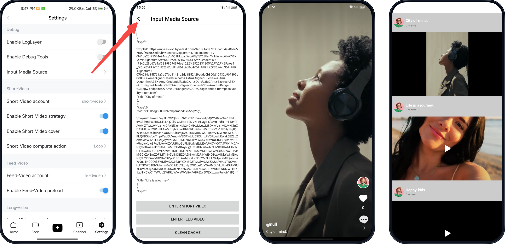

BytePlus VideoOne demo supports custom source video playback. By inputting specific video IDs or URLs, you can play specified videos in either short-form or medium-form with customization.
# Demonstration


# Instruction

1. Install and log in to the [BytePlus VideoOne Demo app](https://docs.byteplus.com/en/byteplus-vos/docs/byteplus-videoone-demo-app_1#499f90c7).
2. Enter the **Video Playback & Edit** scene by tapping the **Try it now** button, and then tapping the **Settings** button located at the bottom right corner to access the settings page.
3. Tap on the **Input Media Source** button, and enter the custom video sources in the following format:
   1. Play videos using URL only
      ```Plain Text
      // To play a single video.
      https://example.com/video1.mp4
      
      // To play multiple videos, start a new line for each video URL.
      https://example.com/video1.mp4
      https://example.com/video2.mp4
      ```

      Refer to the code in [demo_vod_play_service_test.go](https://github.com/byteplus-sdk/byteplus-sdk-golang/blob/master/example/vod/demo_vod_play_service_test.go) file to obtain the URL.

   2. Play videos using both video ID and URL. Use a JSON array of JSON objects, where each object represents a video source.
      ```JSON
      [
        {
          "type":0,
          "vid":"v110ed...m0",
          "playAuthToken":"eyJH...ifQ==",
          "title":"My Example 1"
        },
        {
          "type":1,
          "httpUrl":"https://example.com/video3.mp4",
          "title":"My Example 2"
        }
      ]
      ```

      | Field | Required | Description | Note |
      | --- | --- | --- | --- |
      | type | Yes | Video source type. <br>  <br> * 0: Play via video ID (or a combination of video ID and URL). <br> * 1: Play via URL only. | / |
      | vid | Yes when the type is 0 | Video ID. <br> You can find the video's ID (`vid`) in your VOD space in the VOD console. | / |
      | playAuthToken | Yes when the type is 0 | Video playback token. <br> Refer to the code in [demo_auth_token_test.go](https://github.com/byteplus-sdk/byteplus-sdk-golang/blob/master/example/vod/demo_auth_token_test.go) file to obtain the token. | Before obtaining the video source information, make sure to download the [BytePlus VOD Server SDK](https://docs.byteplus.com/en/byteplus-vod/docs/go-sdk?version=v1.0) as a prerequisite. |
      | httpUrl | Yes when the type is 1 | Video URL. <br> Refer to the code in [demo_vod_play_service_test.go](https://github.com/byteplus-sdk/byteplus-sdk-golang/blob/master/example/vod/demo_vod_play_service_test.go) file to obtain the URL. |  |
      | title | Yes | Custom video title. | / |

4. Tap on **ENTER SHORT VIDEO** to start playing the video(s) as a short-form video or **ENTER FEED VIDEO** as a medium-form feed video.

# Implementation
Refer to the code to integrate this feature into your app.

* Android: [SampleSourceActivity.java](https://github.com/byteplus-sdk/VideoOneSolutions/blob/main/Client/Android/solutions/vod/vod-input-media/src/main/java/com/byteplus/vod/input/media/SampleSourceActivity.java)
* iOS: [VEPlayUrlConfigViewController.m](https://github.com/byteplus-sdk/VideoOneSolutions/tree/main/Client/iOS/Component/VideoPlaybackEdit/VEVodApp/VEPlayModule/Classes/Setting/PlayVideoUrl/VEPlayUrlConfigViewController.m)


