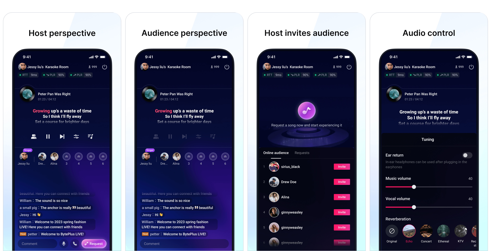
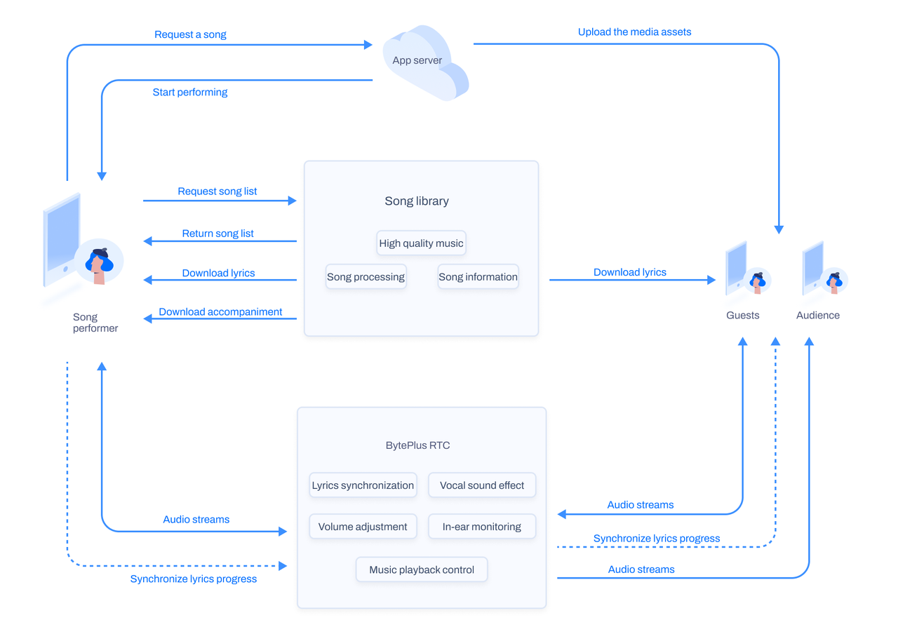

Online KTV is an interactive karaoke solution provided in VideoOne, which incorporates real-time interactive features using BytePlus RTC (Real-Time Communication) technology. It enables users to have an immersive karaoke experience online. Within an online karaoke room, users can select songs and take turns singing along with accompaniment for the audience in the room, following the song list's order. Moreover, users can engage in real-time audio interaction with each other between performances, enhancing the social and entertainment aspects of the karaoke room.

## Highlights

* **One-stop solution for full-featured interactive karaoke**
   The seamless integration of real-time interaction, song selection and singing, audio control, and other features enables developers to effortlessly create an engaging online karaoke environment.
* **Precise synchronization of lyrics and accompaniment**
   This solution enhances the lyric display experience for singers and audiences by ensuring lyrics and accompaniment are accurately synchronized, even on poor networks.
* **High-quality audio experience**
   Refined through its use in products with billions of daily active users, the BytePlus RTC technology in this solution incorporates optimized 3A (Adaptation, Adjustment, and Automation) processing algorithms that adapt to various devices, including speakers, headphones, and sound cards. This ensures high-quality vocals while effectively reducing background noise and eliminating echoes.

## Core functions

| **Function** | **Description** |
| --- | --- |
| Audio interaction | An audience member can request to become a guest. Once approved, they can activate their microphone to interact with other guests.   > An online KTV room supports up to 50 visible users simultaneously. Up to 30 of these users can activate their microphones to chat at the same time. |
| Requesting a song | Users can enter the song request center to request songs. Requested songs are displayed in the song queue. |
| Singing songs in sequence | Users perform their requested songs in the order of the song request queue. |
| Singing control | Singing controls include switching between original vocals and instrumental accompaniment, adjusting vocal reverb effects, modifying music and vocal volume, pausing/resuming accompaniment playback, and switching songs. |
| Synchronized lyrics display | All users within the karaoke room can simultaneously see the lyrics of the currently performed song, and the lyrics are accurately synchronized with the progress of the instrumental accompaniment. |
| In-ear monitor | When wearing wired headphones, a performer can enable the "in-ear monitor" feature to hear their own voice. The monitoring volume is also adjustable. |
| Seat control | The host can invite audience members to guest seats, remove users from guest seats, mute or unmute guests, and block seats. |
| Soundwave effects display | Using RTC volume callbacks, you can apply soundwave visual effects to the avatars of singers and speaking guests. |

## Architecture

## Implementation
To learn more about implementing the solution in your own app, please refer to the following topics:

* [Implementing online KTV for Android](https://docs.byteplus.com/en/byteplus-vos/docs/implementing-online-ktv-for-android?version=v1.0)
* [Implementing online KTV for iOS](https://docs.byteplus.com/en/byteplus-vos/docs/implementing-online-ktv-for-ios?version=v1.0)
* [Implementing online KTV for Server](/docs/byteplus-vos/Implementing_online_KTV_for_Server)

