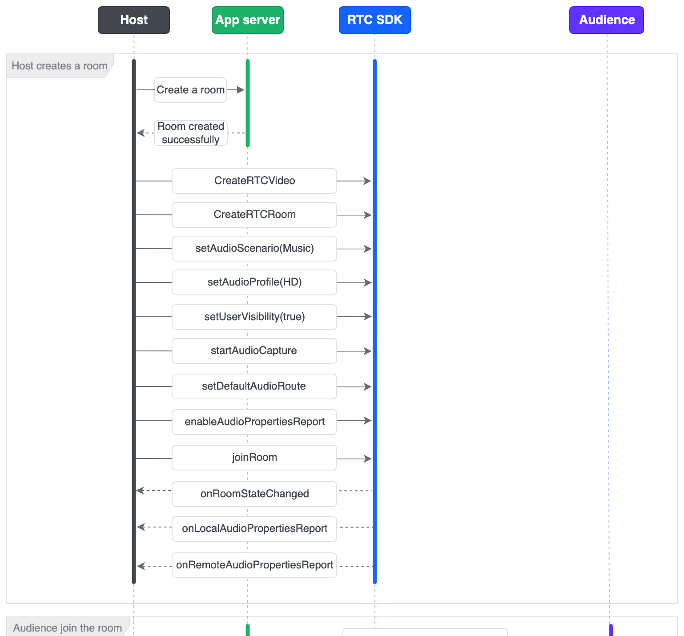
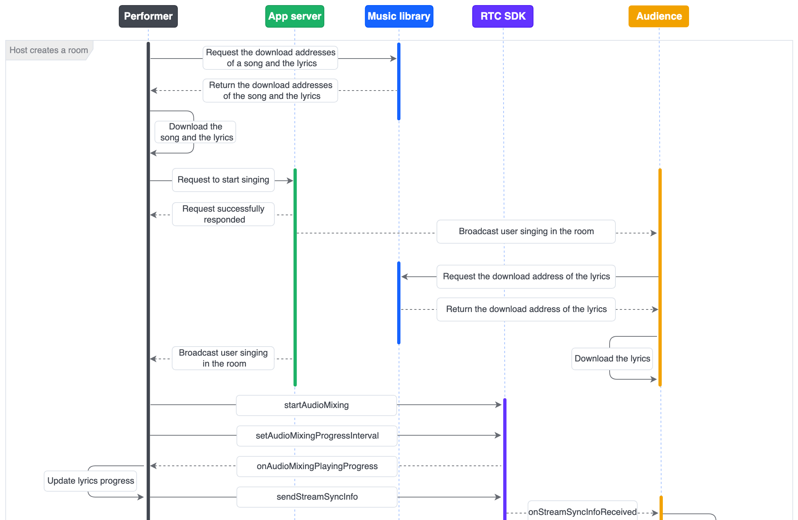

To build a feature-rich online KTV experience in your Android application, this guide provides best practices and complete code examples using the BytePlus RTC SDK. You will learn the entire implementation process, from integrating the SDK and managing rooms to synchronizing lyrics and controlling advanced audio effects like reverb and in-ear monitoring.
# System requirements

* An Android device (not an emulator) running Android 5.0 or later.
* CPU architecture: armv7a or arm64.

# Prerequisites
A valid BytePlus account with [BytePlus RTC](https://console.byteplus.com/rtc/workplaceRTC) activated. Refer to [Before Using RTC Service](https://docs.byteplus.com/en/byteplus-rtc/docs/69865) for detailed instructions.
# Integrating the SDKs
This section introduces how to integrate BytePlus RTC SDK into your Android project.
## Importing the SDKs

1. Open the build.gradle file in the root directory.
2. Define the Maven repositories and configure the repository URLs.
   ```Groovy
   allprojects { 
       repositories { 
           google() 
           mavenCentral() 
           maven { 
               url 'https://artifact.bytedance.com/repository/Volcengine/' 
           } 
           maven { 
               url 'https://artifact.byteplus.com/repository/public/' 
           } 
       } 
   } 
    
   apply from: 'https://ve-vos.volccdn.com/script/vevos-repo-base.gradle' 
   ```

3. Open the build.gradle file in the app module project.
4. In `defaultConfig`, configure the app's CPU architecture to `armv7a` or `arm64`.
5. Add the SDK dependencies.
   ```Groovy
    dependencies { 
       ...... 
       // Add the online integration address of the SDK. 
       ttsdkVersion = '1.43.300.3'
       implementation "com.bytedanceapi:ttsdk-ttlivepush_rtc:$ttsdkVersion"
   } 
   ```

6. Click the **Sync Project with Gradle Files** button to synchronize the SDK. The SDK will be automatically downloaded and integrated into the project. If the integration fails, check your network connection with the remote repository.

## Configuring permissions

1. Declare the permissions required by the app in the `AndroidManifest.xml` file:
   ```XML
   <uses-permission android:name="android.permission.RECORD_AUDIO" /> 
   <uses-permission android:name="android.permission.MODIFY_AUDIO_SETTINGS" /> 
   <uses-permission android:name="android.permission.INTERNET" />
   ```

2. Add code for dynamically requesting permissions:
   ```XML
   if (ContextCompat.checkSelfPermission(requireContext(), Manifest.permission.RECORD_AUDIO)
           == PackageManager.PERMISSION_GRANTED) {
       // Do your work with permission
   } else {
       launcher.launch(Manifest.permission.RECORD_AUDIO);
   }
   
   // In fragment or activity, request permission launcher
   final ActivityResultLauncher<String> launcher = registerForActivityResult(new ActivityResultContracts.RequestPermission(), result -> {
       if (result != Boolean.TRUE) {
           Log.d(TAG, "No permission: " + Manifest.permission.RECORD_AUDIO);
           SolutionToast.show(R.string.toast_ktv_no_mic_permission);
       }
       // Do your work with permission
   });
   ```


# Implementation
## Overall execution process

## Implementation of core functionalities
### Create and join a room
#### Sequence diagram

#### Sample code
```Java
/**
 * Join the RTC room and initialize the parameters.
 * @param token: Token used for authentication when joining a room.
 * @param roomId: ID of the room the user joins.
 * @param uid: User ID.
 * @param isHost: Whether the user is a host. Set to `true` for a host or `false` for an audience member.
 **/
public void joinRTCRoom(String token, String roomId, String userId, boolean isHost) {
    // Initialize RTCVideo object.
    mRTCVideo = RTCVideo.createRTCVideo(applicationContext, appId, mIRTCVideoEventHandler, null, null);

    // Initialize RTCRoom object.
    mRTCRoom = mRTCVideo.createRTCRoom(roomId);
    mRTCRoom.setRTCRoomEventHandler(mIRTCRoomEventHandler);

    // Set the audio scenario to "AUDIO_SCENARIO_MUSIC" for music-focused use cases.
    mRTCVideo.setAudioScenario(AudioScenarioType.AUDIO_SCENARIO_MUSIC);
    
    // Set the audio profile type to "AUDIO_PROFILE_HD" to enable high-quality stereo audio.
    mRTCVideo.setAudioProfile(AudioProfileType.AUDIO_PROFILE_HD);
        
    // Set user visibility in the room. "YES" for the host to be visible and "NO" for the audience to be invisible.
    mRTCRoom.setUserVisibility(isHost);

    // The host enables their microphone when joining the room, while audience members keep theirs disabled.
    if (isHost) {
        mRTCVideo.startAudioCapture();
    } else {
        mRTCVideo.stopAudioCapture();
    }

    // Set the default audio route to the speakerphone.
    mRTCVideo.setDefaultAudioRoute(AudioRoute.AUDIO_ROUTE_SPEAKERPHONE);

    // Enable speaker volume monitoring.
    AudioPropertiesConfig audioPropertiesConfig = new AudioPropertiesConfig(300);
    mRTCVideo.enableAudioPropertiesReport(audioPropertiesConfig);

    // Joins the room to start audio streaming. Note: A valid App ID and Token are required.
    UserInfo userInfo = new UserInfo(userId, null);
    RTCRoomConfig roomConfig = new RTCRoomConfig(ChannelProfile.CHANNEL_PROFILE_KTV,
            true, true, true);
    mRTCRoom.joinRoom(token, userInfo, roomConfig);
}
Java
```

```Java
private final IRTCVideoEventHandler mIRTCVideoEventHandler = new IRTCVideoEventHandler() {
    /**
     * Local user's volume callback.
     */
    @Override
    public void onLocalAudioPropertiesReport(LocalAudioPropertiesInfo[] audioPropertiesInfos) {
        super.onLocalAudioPropertiesReport(audioPropertiesInfos);
    }
    /**
     * Remote user's volume callback.
     */
    @Override
    public void onRemoteAudioPropertiesReport(RemoteAudioPropertiesInfo[] audioPropertiesInfos, int totalRemoteVolume) {
        super.onRemoteAudioPropertiesReport(audioPropertiesInfos, totalRemoteVolume);
    }
};
private final IRTCRoomEventHandler mIRTCRoomEventHandler = new IRTCRoomEventHandler() {
    /**
     * Received join room result.
     */
    @Override
    public void onRoomStateChanged(String roomId, String uid, int state, String extraInfo) {
    }
}
```

#### Key interface reference
##### API

| Feature | API |
| --- | --- |
| Create an RTC engine instance. | [createRTCVideo](https://docs.byteplus.com/en/byteplus-rtc/docs/70080#RTCVideo-creatertcvideo) |
| Create an RTC room instance. | [createRTCRoom](https://docs.byteplus.com/en/byteplus-rtc/docs/70080#RTCVideo-creatertcroom) |
| Sets audio scenario type. | [setAudioScenario](https://docs.byteplus.com/en/byteplus-rtc/docs/70080#RTCVideo-setaudioscenario) |
| Set audio quality type. | [setAudioProfile](https://docs.byteplus.com/en/byteplus-rtc/docs/70080#RTCVideo-setaudioprofile) |
| Set user visibility. | [setUserVisibility](https://docs.byteplus.com/en/byteplus-rtc/docs/70080#RTCRoom-setuservisibility) |
| Enable internal audio capturing. | [startAudioCapture](https://docs.byteplus.com/en/byteplus-rtc/docs/70080#RTCVideo-startaudiocapture) |
| Disable internal audio capturing. | [stopAudioCapture](https://docs.byteplus.com/en/byteplus-rtc/docs/70080#RTCVideo-stopaudiocapture) |
| Set the default audio playback device to the speaker or earpiece. | [setDefaultAudioRoute](https://docs.byteplus.com/en/byteplus-rtc/docs/70080#RTCVideo-setdefaultaudioroute) |
| Enable audio properties reporting (e.g., volume).  | [enableAudioPropertiesReport](https://docs.byteplus.com/en/byteplus-rtc/docs/70080#RTCVideo-enableaudiopropertiesreport) |
| Join the RTC room. | [joinRoom](https://docs.byteplus.com/en/byteplus-rtc/docs/70080#RTCRoom-joinroom) |
##### Callback

| Feature | Callback |
| --- | --- |
| Callback triggered when the local user successfully joins the room. | [onRoomStateChanged](https://docs.byteplus.com/en/byteplus-rtc/docs/70081#IRTCRoomEventHandler-onroomstatechanged) |
| Callback for the local user's volume. | [onLocalAudioPropertiesReport](https://docs.byteplus.com/en/byteplus-rtc/docs/70081#IRTCVideoEventHandler-onlocalaudiopropertiesreport) |
| Callback for the remote user's volume. | [onRemoteAudioPropertiesReport](https://docs.byteplus.com/en/byteplus-rtc/docs/70081#IRTCVideoEventHandler-onremoteaudiopropertiesreport) |
### Lyrics synchronization
#### Sequence diagram

#### Sample code
```Java
/**
 * Start singing. Execute after receiving the "start singing" broadcast when the lyrics/music file download is complete.
 * @param filePath: Path to the music file.
 */
public void startStartSing(String filePath) {
    // Set the music file to play simultaneously on the local and remote ends.
    IAudioMixingManager audioMixingManager = mRTCVideo.getAudioMixingManager();
    AudioMixingConfig audioMixingConfig = new AudioMixingConfig(AUDIO_MIXING_TYPE_PLAYOUT_AND_PUBLISH, 1);
    // Start playing the music file.
    audioMixingManager.startAudioMixing(AUDIO_MIXING_ID, filePath, audioMixingConfig);
    audioMixingManager.setAudioMixingProgressInterval(AUDIO_MIXING_ID, 100);
}


/**
 * Receive the music playback progress callback.
 * @param mixId: Audio mixing task ID.
 * @param progress: Music playback progress in milliseconds.
 */
@Override
public void onAudioMixingPlayingProgress(int mixId, long progress) {
    String musicId = mCurrentMusicId;
    if (musicId == null) {
        return;
    }
    syncProgressToRemote(musicId, progress);
    SongPlayProgressCallback callback = mProgressCallback;
    if (callback != null) {
        AppExecutors.mainThread().execute(() -> callback.notifyProgress(musicId, progress));
    }
}

private void syncProgressToRemote(@NonNull String musicId, long progress) {
    if (mRTCVideo != null) {
        StreamSycnInfoConfig config = new StreamSycnInfoConfig(
                StreamIndex.STREAM_INDEX_MAIN,
                3,
                StreamSycnInfoConfig.SyncInfoStreamType.SYNC_INFO_STREAM_TYPE_AUDIO);

        try {
            JSONStringer json =
                    new JSONStringer().object()
                            .key("music_id").value(musicId)
                            .key("progress").value(progress)
                            .endObject();

            mRTCVideo.sendStreamSyncInfo(json.toString().getBytes(), config);
        } catch (Exception e) {
            Log.d(TAG, "syncProgressToRemote exception: " + e.getMessage());
        }
    }
}

/**
 * Receive audio synchronization information.
 * @param streamKey: Information about the remote stream.
 * @param streamType: Type of stream to be synchronized.
 * @param data: Synchronized content.
 */
@Override
public void onStreamSyncInfoReceived(RemoteStreamKey streamKey, StreamSycnInfoConfig.SyncInfoStreamType streamType, ByteBuffer data) {
    SongPlayProgressCallback callback = mProgressCallback;
    if (callback == null) {
        return;
    }
    AppExecutors.mainThread().execute(() -> {
        CharsetDecoder decoder = StandardCharsets.UTF_8.newDecoder();
        try {
            CharBuffer buffer = decoder.decode(data);
    
            JSONObject jsonObject = new JSONObject(buffer.toString());
            long progress = jsonObject.getLong("progress");
            String musicId = jsonObject.getString("music_id");
    
            callback.notifyProgress(musicId, progress);
        } catch (Exception e) {
            Log.d(TAG, "onStreamSyncInfoReceived decode exception", e);
        }
    });
}
```

```Java
/**
 * Callback for music file playback state change.
 */
@Override
public void onAudioMixingStateChanged(int mixId, AudioMixingState state, AudioMixingError error) {
    if (AudioMixingError.AUDIO_MIXING_ERROR_OK == error) {
        SolutionEventBus.post(new AudioMixingStateEvent(state));
    }
}
```

#### Key interface reference
##### API

| Feature | API |
| --- | --- |
| Start playing the music file. | [startAudioMixing](https://docs.byteplus.com/en/byteplus-rtc/docs/70080#IAudioMixingManager-startaudiomixing) |
| Set the interval for music playback progress callback. | [setAudioMixingProgressInterval](https://docs.byteplus.com/en/byteplus-rtc/docs/70080#IAudioMixingManager-setaudiomixingprogressinterval) |
| Send audio stream synchronization information. | [sendStreamSyncInfo](https://docs.byteplus.com/en/byteplus-rtc/docs/70080#RTCVideo-sendstreamsyncinfo) |
##### Callback

| Feature | Callback |
| --- | --- |
| Callback for music playback progress. | [onAudioMixingPlayingProgress](https://docs.byteplus.com/en/byteplus-rtc/docs/70081#IRTCVideoEventHandler-onaudiomixingplayingprogress) |
| Callback for audio synchronization information. | [onStreamSyncInfoReceived](https://docs.byteplus.com/en/byteplus-rtc/docs/70081#IRTCVideoEventHandler-onstreamsyncinforeceived) |
| Callback for music file playback state changes. | [onAudioMixingStateChanged](https://docs.byteplus.com/en/byteplus-rtc/docs/70081#IRTCVideoEventHandler-onaudiomixingstatechanged) |
### Audio control
#### User interface demonstration

#### Sample code
```Java
public void selectAudioTrack(boolean isAccompany) {
    Log.d(TAG, "toggleAudioAccompanyMode");
    IAudioMixingManager audioMixingManager = mRTCVideo == null ? null : mRTCVideo.getAudioMixingManager();
    if (audioMixingManager == null) {
        return;
    }
    int trackCount = audioMixingManager.getAudioTrackCount(AUDIO_MIXING_ID);
    if (trackCount >= 2) {
        // Set whether the music is played with or without the original vocals by changing audio tracks.
        if (isAccompany) {
            audioMixingManager.selectAudioTrack(AUDIO_MIXING_ID, 2);
        } else {
            audioMixingManager.selectAudioTrack(AUDIO_MIXING_ID, 1);
        }
    } else {
        // Set whether the music is played with or without the original vocals by changing audio channels.
        if (isAccompany) {
            audioMixingManager.setAudioMixingDualMonoMode(AUDIO_MIXING_ID, AUDIO_MIXING_DUAL_MONO_MODE_R);
        } else {
            audioMixingManager.setAudioMixingDualMonoMode(AUDIO_MIXING_ID, AUDIO_MIXING_DUAL_MONO_MODE_L);
        }
    }
}

/**
 * Pause music playback.
 */
public void pauseSinging() {
    IAudioMixingManager audioMixingManager = mRTCVideo.getAudioMixingManager();
    audioMixingManager.pauseAudioMixing(AUDIO_MIXING_ID);
}

/**
 * Resume music playback.
 */
public void resumeSinging() {
    IAudioMixingManager audioMixingManager = mRTCVideo.getAudioMixingManager();
    audioMixingManager.resumeAudioMixing(AUDIO_MIXING_ID);
}

/**
 * Enable or disable the in-ear monitor function.
 * @param isEnable: "YES" for enable, "NO" for disable.
 */
public void enableEarMonitor(boolean isEnable) {
    mRTCVideo.setEarMonitorMode(isEnable ? EarMonitorMode.EAR_MONITOR_MODE_ON : EarMonitorMode.EAR_MONITOR_MODE_OFF);
}

/**
 * Adjust the volume of the in-ear monitor.
 */
public void setEarMonitorVolume(int volume) {
    mRTCVideo.setEarMonitorVolume(volume);
}

/**
 * Adjust the volume levels of locally and remotely synchronized music playback.
 */
public void setMusicVolume(int volume) {
    IAudioMixingManager audioMixingManager = mRTCVideo.getAudioMixingManager();
    audioMixingManager.setAudioMixingVolume(AUDIO_MIXING_ID, volume, AUDIO_MIXING_TYPE_PLAYOUT_AND_PUBLISH);
}

/**
 * Adjust the microphone capture volume.
 */
public void setRecordingVolume(int volume) {
    mRTCVideo.setCaptureVolume(StreamIndex.STREAM_INDEX_MAIN, volume);
}
    
/**
 * Set the reverb effect type.
 */
public void setVoiceReverbType(VoiceReverbType reverbType) {
    mRTCVideo.setVoiceReverbType(reverbType);
}
```

#### Key interface reference
##### API

| Feature | API |
| --- | --- |
| Set the channel mode for the current audio file. | [setAudioMixingDualMonoMode](https://docs.byteplus.com/en/byteplus-rtc/docs/70080#IAudioMixingManager-setaudiomixingdualmonomode) |
| Pause audio playback. | [pauseAudioMixing](https://docs.byteplus.com/en/byteplus-rtc/docs/70080#IAudioMixingManager-pauseaudiomixing) |
| Resume audio playback. | [resumeAudioMixing](https://docs.byteplus.com/en/byteplus-rtc/docs/70080#IAudioMixingManager-resumeaudiomixing) |
| Enable or disable the in-ear monitor function. | [setEarMonitorMode](https://docs.byteplus.com/en/byteplus-rtc/docs/70080#RTCVideo-setearmonitormode) |
| Adjust the volume of the in-ear monitor. | [setEarMonitorVolume](https://docs.byteplus.com/en/byteplus-rtc/docs/70080#RTCVideo-setearmonitorvolume) |
| Adjust the volume of locally and remotely synchronized music playback. | [setAudioMixingVolume](https://docs.byteplus.com/en/byteplus-rtc/docs/70080#IAudioMixingManager-setaudiomixingvolume) |
| Adjust the microphone capture volume. | [setCaptureVolume](https://docs.byteplus.com/en/byteplus-rtc/docs/70080#RTCVideo-setcapturevolume) |
| Set the reverb effect type. | [setVoiceReverbType](https://docs.byteplus.com/en/byteplus-rtc/docs/70080#RTCVideo-setvoicereverbtype) |
