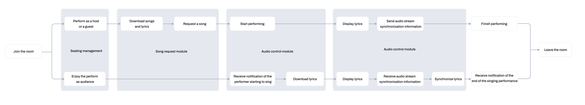
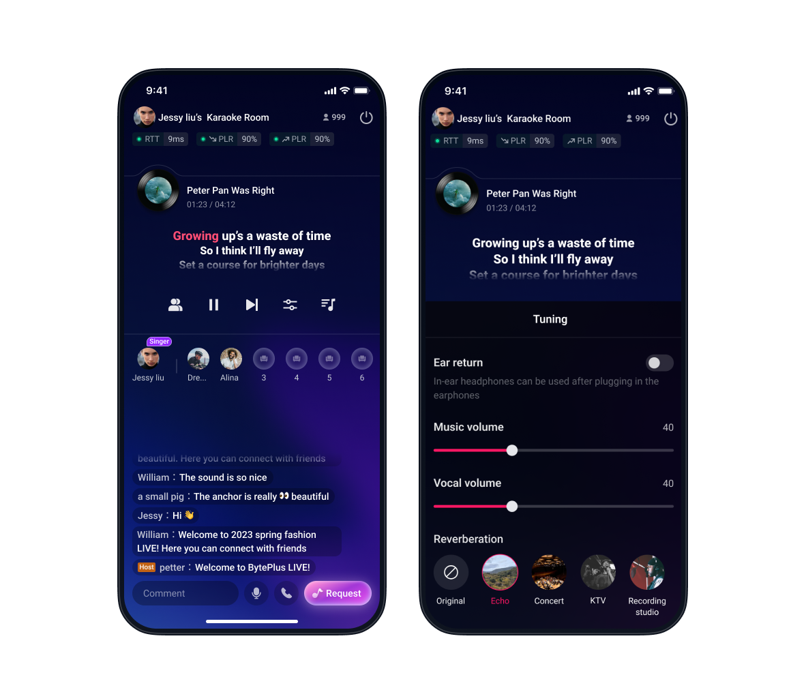

To build a feature-rich online KTV application for iOS, you can follow the steps in this guide. It provides detailed instructions, sample code, and API references for core functionalities, including creating and joining rooms, synchronizing lyrics with music playback, and implementing advanced audio controls like reverb and in-ear monitoring.
# System requirements

* A physical iPhone or iPad running iOS 11 or higher. Building on emulators is not currently supported.
* Xcode 14.1 or higher.

# Prerequisites
A valid BytePlus account with [BytePlus RTC](https://console.byteplus.com/rtc/workplaceRTC) activated. Refer to [Before Using RTC Service](https://docs.byteplus.com/en/byteplus-rtc/docs/69865) for detailed instructions.
# Integrating the SDK
This section introduces how to integrate BytePlus RTC SDK into your iOS project.
## Installing the SDKs

1. Install Ruby on your Mac and run the following command in Terminal to install CocoaPods.
   ```Ruby
   sudo gem install cocoapods
   ```

2. Execute the following command in your project directory to create a Podfile.
   ```Ruby
   pod init
   ```

3. Add the online integration addresses of the SDKs to your Podfile.
   ```Ruby
   source 'https://cdn.cocoapods.org/'
   source 'https://github.com/byteplus-sdk/byteplus-specs.git'
   source 'https://github.com/volcengine/volcengine-specs.git'
   pod 'TTSDK', '1.43.300.2-premium', :subspecs => ['RTCSDK', 'ByteAudio']
   ```

4. Execute the following command in Terminal to update the local libraries and install the SDK.
   ```Ruby
   pod install
   ```


## **Requesting permissions**
To capture audio, you will need to request permission to access the microphone. To do so, make sure to include the "NSMicrophoneUsageDescription" key in your app's `info.plist` file.
You can use the following code to request permission for microphone access:
```objectivec
- (void)requestMicrophoneAuthorization:(void (^)(BOOL granted))handler {
    AVAuthorizationStatus authStatus = [AVCaptureDevice authorizationStatusForMediaType:AVMediaTypeAudio];
    if (authStatus == AVAuthorizationStatusNotDetermined) {
        [AVCaptureDevice requestAccessForMediaType:AVMediaTypeAudio completionHandler:^(BOOL granted) {
            handler(granted);
        }];
    } else if (authStatus == AVAuthorizationStatusAuthorized) {
        handler(YES);
    } else {
        handler(NO);
    }
}

- (void)requestAuthorization {
    [self requestMicrophoneAuthorization:^(BOOL granted) {
        if (granted) {
            NSLog(@"microphone Authorization succeeds!");
        } else {
            NSLog(@"microphone Authorization fails!");
        }
    }];
}
```

# Implementation
## Overall execution process

## Implementation of core functionalities
### Create and join a room
#### Sequence diagram


#### Sample code
```objectivec
/**
 * Join the RTC room and initialize the parameters.
 * @param token: Token used for authentication when joining a room.
 * @param roomID: ID of the room the user joins.
 * @param uid: User ID.
 * @param isHost: Whether the user is a host. Set to "YES" for a host or "NO" for an audience member.
 **/
- (void)joinRTCRoomWithToken:(NSString *)token
                      roomID:(NSString *)roomID
                         uid:(NSString *)uid
                      isHost:(BOOL)isHost {
    // Initializes the ByteRTCVideo instance.
    self.rtcEngineKit = [ByteRTCVideo createRTCVideo:APPID
                                        delegate:self
                                      parameters:@{}];
    
    // Initializes the ByteRTCRoom instance.
    self.rtcRoom = [self.rtcEngineKit createRTCRoom:roomID];
    self.rtcRoom.delegate = self;
    
    // Set the audio scenario to "ByteRTCAudioScenarioMusic", which is designed for music-focused scenarios.
    [self.rtcEngineKit setAudioScenario:ByteRTCAudioScenarioMusic];
    
    // Set the audio profile type to "ByteRTCAudioProfileHD" to enable high-quality stereo audio.
    [self.rtcEngineKit setAudioProfile:ByteRTCAudioProfileHD];
    
    // Set the user's visibility in the room. Hosts should be visible ("YES"), while audience members should be invisible ("NO").
    [self.rtcRoom setUserVisibility:isHost ? YES : NO];
    
    // The host enables the microphone when joining the room, while the audience members disable it.
    if (isHost) {
        [self.rtcEngineKit startAudioCapture];
    } else {
        [self.rtcEngineKit stopAudioCapture];
    }
 
    // Set the audio route to the speakerphone.
    [self.rtcEngineKit setDefaultAudioRoute:ByteRTCAudioRouteSpeakerphone];
 
    // Enable speaker volume monitoring.
    ByteRTCAudioPropertiesConfig *audioPropertiesConfig = [[ByteRTCAudioPropertiesConfig alloc] init];
    audioPropertiesConfig.interval = 300;
    [self.rtcEngineKit enableAudioPropertiesReport:audioPropertiesConfig];
    
    // Join the room to start audio interaction as a host or audience member. Note: A valid App ID and Token are required.
    ByteRTCUserInfo *userInfo = [[ByteRTCUserInfo alloc] init];
    userInfo.userId = uid;
    ByteRTCRoomConfig *config = [[ByteRTCRoomConfig alloc] init];
    config.profile = ByteRTCRoomProfileKTV;
    config.isAutoPublish = YES;
    config.isAutoSubscribeAudio = YES;
    [self.rtcRoom joinRoom:token userInfo:userInfo roomConfig:config];
}
```

```objectivec
- (void)rtcRoom:(ByteRTCRoom *)rtcRoom onRoomStateChanged:(NSString *)roomId
                                                  withUid:(NSString *)uid
                                                    state:(NSInteger)state
                                                extraInfo:(NSString *)extraInfo {
    // Callback for the result of joining the room.
}

- (void)rtcEngine:(ByteRTCVideo *)engine onLocalAudioPropertiesReport:(NSArray<ByteRTCLocalAudioPropertiesInfo *> *)audioPropertiesInfos {
    // Callback reporting the local user's volume.
}

- (void)rtcEngine:(ByteRTCVideo *)engine onRemoteAudioPropertiesReport:(NSArray<ByteRTCRemoteAudioPropertiesInfo *> *)audioPropertiesInfos 
                                                     totalRemoteVolume:(NSInteger)totalRemoteVolume {
    // Callback reporting remote users' volumes.
}
```

#### Key interface reference
##### API

| Feature | API |
| --- | --- |
| Create an RTC engine instance. | [createRTCVideo:delegate:parameters:](https://docs.byteplus.com/en/byteplus-rtc/docs/70086#ByteRTCVideo-creatertcvideo-delegate-parameters) |
| Create an RTC room instance. | [createRTCRoom:](https://docs.byteplus.com/en/byteplus-rtc/docs/70086#ByteRTCVideo-creatertcroom) |
| Set audio scenario type. | [setAudioScenario:](https://docs.byteplus.com/en/byteplus-rtc/docs/70086#ByteRTCVideo-setaudioscenario) |
| Set audio quality type. | [setAudioProfile:](https://docs.byteplus.com/en/byteplus-rtc/docs/70086#ByteRTCVideo-setaudioprofile) |
| Set user visibility. | [setUserVisibility:](https://docs.byteplus.com/en/byteplus-rtc/docs/70086#ByteRTCRoom-setuservisibility) |
| Enable internal audio capturing. | [startAudioCapture](https://docs.byteplus.com/en/byteplus-rtc/docs/70086#ByteRTCVideo-startaudiocapture) |
| Disable internal audio capturing. | [stopAudioCapture](https://docs.byteplus.com/en/byteplus-rtc/docs/70086#ByteRTCVideo-stopaudiocapture) |
| Set the default audio route to the speaker or earpiece. | [setDefaultAudioRoute:](https://docs.byteplus.com/en/byteplus-rtc/docs/70086#ByteRTCVideo-setdefaultaudioroute) |
| Enable the audio properties report. | [enableAudioPropertiesReport:](https://docs.byteplus.com/en/byteplus-rtc/docs/70086#ByteRTCVideo-enableaudiopropertiesreport) |
| Join the RTC room. | [joinRoom:userInfo:roomConfig:](https://docs.byteplus.com/en/byteplus-rtc/docs/70086#ByteRTCRoom-joinroom-userinfo-roomconfig) |
##### Callback

| Feature | Callback |
| --- | --- |
| Callback for room state changes, such as the result of joining the room. | [rtcRoom:onRoomStateChanged:uid:state:extraInfo](https://docs.byteplus.com/en/byteplus-rtc/docs/70085#ByteRTCRoomDelegate-rtcroom-onroomstatechanged-withuid-state-extrainfo) |
| Callback for the local user's volume. | [rtcEngine:onLocalAudioPropertiesReport:](https://docs.byteplus.com/en/byteplus-rtc/docs/70085#ByteRTCVideoDelegate-rtcengine-onlocalaudiopropertiesreport) |
| Callback for the remote user's volume. | [rtcEngine:onRemoteAudioPropertiesReport:totalRemoteVolume:](https://docs.byteplus.com/en/byteplus-rtc/docs/70085#ByteRTCVideoDelegate-rtcengine-onremoteaudiopropertiesreport-totalremotevolume) |
### Lyrics synchronization
#### Sequence diagram


#### Sample code
```objectivec
/**
 * Start singing. Call this method after the music and lyrics files are downloaded and you receive the broadcast to start singing.
 * @param filePath: Path to the music file.
 */
- (void)startStartSinging:(NSString *)filePath {
    ByteRTCMediaPlayer *mediaPlayer = [self.rtcEngineKit getMediaPlayer:AudioMixingID];
    ByteRTCMediaPlayerConfig *config = [[ByteRTCMediaPlayerConfig alloc] init];
    
    // Set the music file to play simultaneously on the local and remote ends.
    config.type = ByteRTCAudioMixingTypePlayoutAndPublish;
    
    // Set the music file to play once.
    config.playCount = 1;
    
    // Start playing the music file.
    [mediaPlayer open:filePath config:config];
    
    // Set the playback progress callback interval to 100 ms.
    [mediaPlayer setEventHandler:self];
    [mediaPlayer setProgressInterval:100];
}


/**
 * Receive the music playback progress callback.
 * @param playerId: Audio mixing task ID.
 * @param progress: Music playback progress in milliseconds.
 */
- (void)onMediaPlayerPlayingProgress:(int)playerId progress:(int64_t)progress {
    // Checks if the current user is the performer.
    BOOL isSinger;
    if (isSinger) {
        NSString *millisecondStr = [NSString stringWithFormat:@"%ld", (long)(progress)];
        
        // Updates the local lyrics display based on playback progress.
        [self reloadLocalLyrics:millisecondStr];
        
        // Send audio stream synchronization information.
        NSData *data = [millisecondStr dataUsingEncoding:NSUTF8StringEncoding];
        ByteRTCStreamSycnInfoConfig *config = [[ByteRTCStreamSycnInfoConfig alloc] init];
        config.streamIndex = ByteRTCStreamIndexMain;
        config.repeatCount = 3;
        [self.rtcEngineKit sendStreamSyncInfo:data config:config];
    }
}

/**
 * Receive audio synchronization information.
 * @param remoteStreamKey: Information about the remote stream.
 * @param streamType: Type of stream to be synchronized.
 * @param data: Synchronized content.
 */
- (void)rtcEngine:(ByteRTCVideo *)engine onStreamSyncInfoReceived:(ByteRTCRemoteStreamKey *)remoteStreamKey 
                                                       streamType:(ByteRTCSyncInfoStreamType)streamType 
                                                             data:(NSData *)data {
    NSString *millisecondStr = [[NSString alloc] initWithBytes:data.bytes 
                                                        length:data.length 
                                                      encoding:NSUTF8StringEncoding];
    // Updates the lyrics display for audience members.
    [self reloadLocalLyrics:millisecondStr];
}
```

```objectivec
/**
 * Callback for music file playback state changes.
 */
- (void)onMediaPlayerStateChanged:(int)playerId 
                            state:(ByteRTCPlayerState)state 
                            error:(ByteRTCPlayerError)error
    if (state == ByteRTCPlayerStateStopped &&
        self.isManualShutdown == NO) {
        // Music playback finished.
    }
}
```

#### Key interface reference
##### API

| Feature | API |
| --- | --- |
| Start playing the music file. | [open:config:](https://docs.byteplus.com/en/docs/byteplus-rtc/docs-70086#open-config) |
| Set the event handler. | [setEventHandler:](https://docs.byteplus.com/en/docs/byteplus-rtc/docs-70086#ByteRTCAudioEffectPlayer-seteventhandler) |
| Set the interval for music playback progress callback. | [setProgressInterval:](https://docs.byteplus.com/en/docs/byteplus-rtc/docs-70086#ByteRTCMediaPlayer-setprogressinterval) |
| Send audio stream synchronization information. | [sendStreamSyncInfo:config:](https://docs.byteplus.com/en/byteplus-rtc/docs/70086#ByteRTCVideo-sendstreamsyncinfo-config) |
##### Callback

| Feature | Callback |
| --- | --- |
| Callback for music playback progress. | [onMediaPlayerPlayingProgress:progress:](https://docs.byteplus.com/en/docs/byteplus-rtc/docs-70087#ByteRTCMediaPlayerEventHandler-onmediaplayerplayingprogress-progress) |
| Callback for audio synchronization information. | [rtcEngine:onStreamSyncInfoReceived:streamType:data:](https://docs.byteplus.com/en/byteplus-rtc/docs/70085#ByteRTCVideoDelegate-rtcengine-onstreamsyncinforeceived-streamtype-data) |
| Callback for music file playback state changes. | [onMediaPlayerStateChanged:state:error:](https://docs.byteplus.com/en/docs/byteplus-rtc/docs-70087#ByteRTCMediaPlayerEventHandler-onmediaplayerstatechanged-state-error) |
### Audio control
#### User interface demonstration

#### Sample code
```objectivec
/**
 * Set whether the music is played with or without the original vocals by changing audio channels. The music file should have accompaniment on the right channel and vocals on the left channel.
 * @param isAccompaniment: Whether to remove the vocals in the played music file.
 */
- (void)switchAccompaniment:(BOOL)isAccompaniment {
    ByteRTCAudioMixingManager *audioMixingManager = [self.rtcEngineKit getAudioMixingManager];
    
    // Get the audio type.
    AudioType type;
    if (type == AudioChannel) {
        // Set whether the music is played with or without the original vocals by changing audio tracks.
        if (isAccompaniment) {
            [audioMixingManager selectAudioTrack:self.audioMixingID audioTrackIndex:1];
        } else {
            [audioMixingManager selectAudioTrack:self.audioMixingID audioTrackIndex:2];
        }
    } else if (type == AudioTrack) {
        // Set whether the music is played with or without the original vocals by changing audio channels.
        if (isAccompaniment) {
            [audioMixingManager setAudioMixingDualMonoMode:self.audioMixingID
                                                      mode:ByteRTCAudioMixingDualMonoModeR];
        } else {
            [audioMixingManager setAudioMixingDualMonoMode:self.audioMixingID
                                                      mode:ByteRTCAudioMixingDualMonoModeL];
        }
    }
}

/**
 * Pause music playback.
 */
- (void)pauseSinging {
    ByteRTCMediaPlayer *mediaPlayer = [self.rtcEngineKit getMediaPlayer:AudioMixingID];
    [mediaPlayer pause];
}
 
/**
 * Resume music playback.
 */
- (void)resumeSinging {
    ByteRTCMediaPlayer *mediaPlayer = [self.rtcEngineKit getMediaPlayer:AudioMixingID];
    [mediaPlayer resume];
}

/**
 * Enable or disable the in-ear monitor function.
 * @param isEnable: Set to "YES" to enable or "NO" to disable.
 */
- (void)enableEarMonitor:(BOOL)isEnable {
    [self.rtcEngineKit setEarMonitorMode:isEnable ? ByteRTCEarMonitorModeOn : ByteRTCEarMonitorModeOff];
}

/**
 * Adjust the volume of the in-ear monitor.
 */
- (void)setEarMonitorVolume:(NSInteger)volume {
    [self.rtcEngineKit setEarMonitorVolume:volume];
}

/**
 * Adjust the music volume for both local playback and the remote stream.
 */
- (void)setMusicVolume:(NSInteger)volume {
    ByteRTCMediaPlayer *mediaPlayer = [self.rtcEngineKit getMediaPlayer:AudioMixingID];
    [mediaPlayer setVolume:(int)volume type:ByteRTCAudioMixingTypePlayoutAndPublish];
}

/**
 * Adjust the microphone capture volume.
 */
- (void)setRecordingVolume:(NSInteger)volume {
    [self.rtcEngineKit setCaptureVolume:ByteRTCStreamIndexMain volume:(int)volume];
}

/**
 * Set the reverb effect type.
 */
- (void)setVoiceReverbType:(ByteRTCVoiceReverbType)reverbType {
    [self.rtcEngineKit setVoiceReverbType:reverbType];
}
```

#### Key interface reference
##### API

| Feature | API |
| --- | --- |
| Set the channel mode for the current audio file. | [setAudioMixingDualMonoMode:mode:](https://docs.byteplus.com/en/byteplus-rtc/docs/70086#ByteRTCAudioMixingManager-setaudiomixingdualmonomode-mode) |
| Pause audio playback. | [pause](https://docs.byteplus.com/en/docs/byteplus-rtc/docs-70086#ByteRTCMediaPlayer-pause) |
| Resume audio playback. | [resume](https://docs.byteplus.com/en/docs/byteplus-rtc/docs-70086#ByteRTCMediaPlayer-resume) |
| Enable or disable the in-ear monitor function. | [setEarMonitorMode:](https://docs.byteplus.com/en/byteplus-rtc/docs/70086#ByteRTCVideo-setearmonitormode) |
| Adjust the volume of the in-ear monitor. | [setEarMonitorVolume:](https://docs.byteplus.com/en/byteplus-rtc/docs/70086#ByteRTCVideo-setearmonitorvolume) |
| Adjust the volume of locally and remotely synchronized music playback. | [setVolume:type:](https://docs.byteplus.com/en/docs/byteplus-rtc/docs-70086#ByteRTCMediaPlayer-setvolume-type) |
| Adjust the microphone capture volume. | [setCaptureVolume:volume:](https://docs.byteplus.com/en/byteplus-rtc/docs/70086#ByteRTCVideo-setcapturevolume-volume) |
| Set the reverb effect type. | [setVoiceReverbType:](https://docs.byteplus.com/en/byteplus-rtc/docs/70086#ByteRTCVideo-setvoicereverbtype) |
