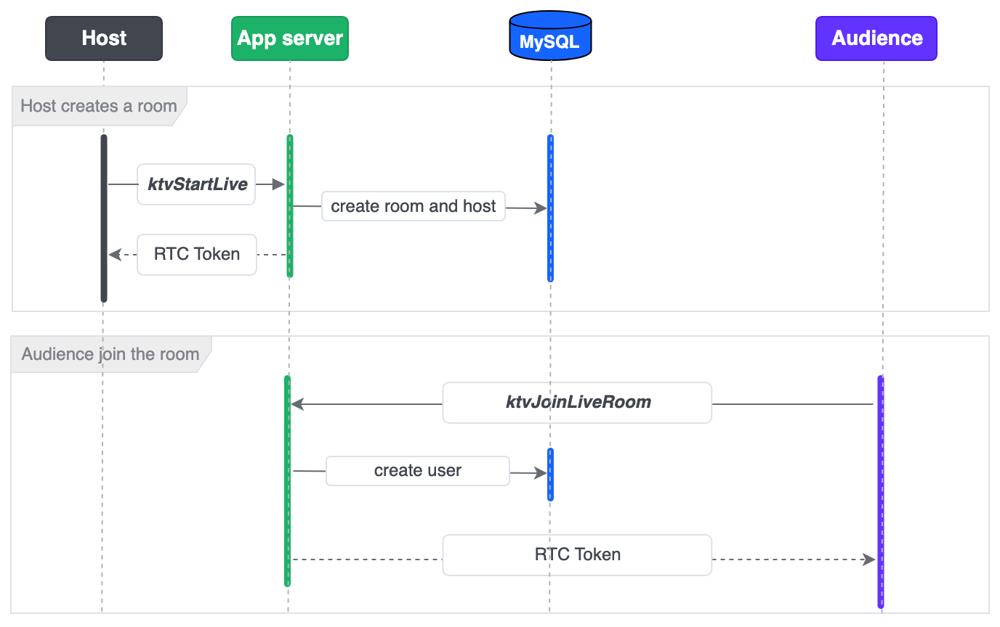
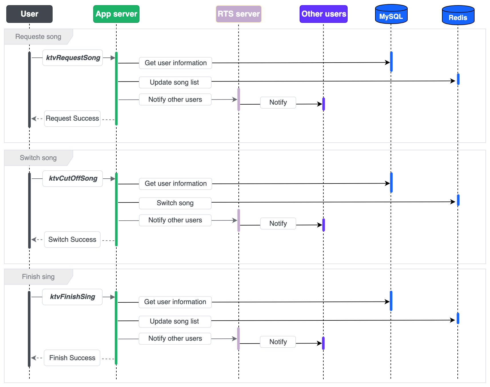
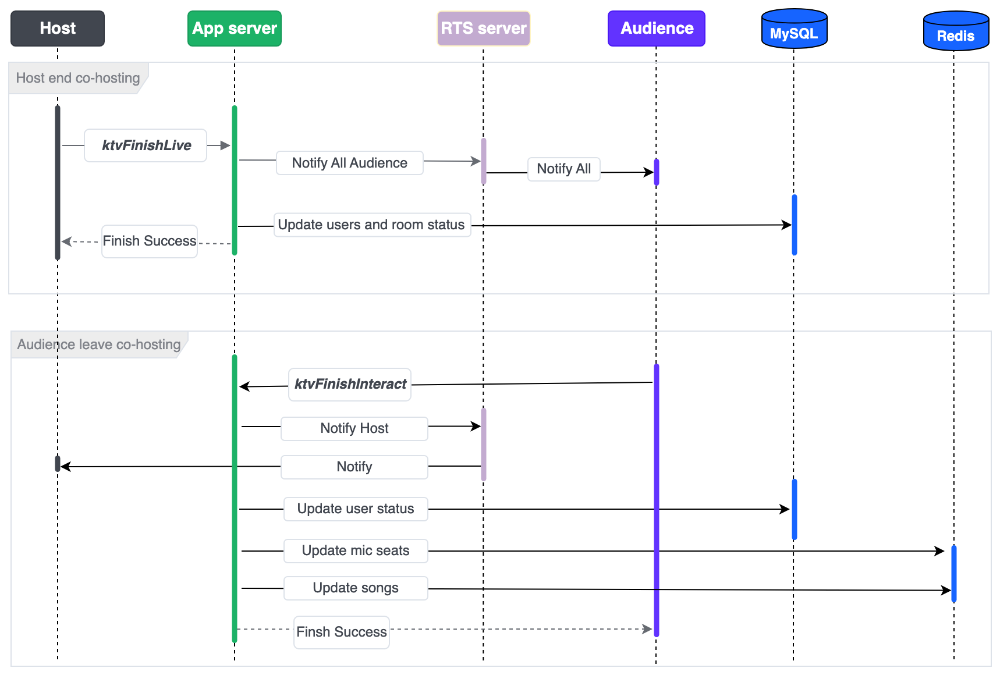

This article introduces VideoOne's practice on implementing the online KTV scenario in your server.
## System requirements

* [Go](https://go.dev/doc/tutorial/getting-started) 1.18 or higher
* [MySQL](https://dev.mysql.com/doc/mysql-getting-started/en/) 5.7 or higher
* [Redis](https://redis.io/docs/latest/operate/oss_and_stack/install/install-redis/) 6.2 or higher

## Prerequisites

* A valid [BytePlus account](http://console.byteplus.com/) with [BytePlus MediaLive](https://console.byteplus.com/live) and [BytePlus RTC](https://console.byteplus.com/rtc/workplaceRTC) activated.
* You have completed [Getting started with BytePlus MediaLive](https://docs.byteplus.com/en/byteplus-media-live/docs/getting-started).
* You have [created an access key](https://docs.byteplus.com/en/docs/byteplus-platform/docs-creating-an-accesskey) for the account.
* Go to GitHub and clone the [VideoOneSolutions](https://github.com/byteplus-sdk/VideoOneSolutions) repository.

## Run the server-side code
This section describes how to run the server-side code on your server.
### Creating tables in MySQL
Execute the following DML SQL to create a MySQL database.
```SQL
CREATE DATABASE IF NOT EXISTS `videoone`;
USE `videoone`;

DROP TABLE IF EXISTS `user_profile`;
CREATE TABLE `user_profile`
(
    `id`         bigint(20) unsigned NOT NULL AUTO_INCREMENT COMMENT 'primary key',
    `user_id`    varchar(32)  NOT NULL DEFAULT '' COMMENT 'user id',
    `user_name`  varchar(64)  NOT NULL DEFAULT '' COMMENT 'user name',
    `app_id`     varchar(64)  NOT NULL COMMENT 'app_id',
    `poster_url` varchar(512) NOT null DEFAULT '' COMMENT 'url',
    `created_at` timestamp    NOT NULL DEFAULT CURRENT_TIMESTAMP COMMENT 'create time',
    `updated_at` timestamp    NOT NULL DEFAULT CURRENT_TIMESTAMP ON UPDATE CURRENT_TIMESTAMP COMMENT 'update time',
    PRIMARY KEY (`id`),
    UNIQUE KEY `idx_user_id` (`user_id`)
) ENGINE = InnoDB DEFAULT CHARSET = utf8mb4 COMMENT ='user profile information';

CREATE TABLE `song`
(
    `id`            bigint(20) unsigned NOT NULL AUTO_INCREMENT COMMENT 'id',
    `name`          varchar(512) NOT NULL DEFAULT '' COMMENT 'song name',
    `artist`        varchar(100) NOT NULL DEFAULT '' COMMENT 'artist',
    `duration`      int(11) NOT NULL DEFAULT '0' COMMENT 'duration, unit: ms',
    `cover_url`     varchar(512) NOT NULL DEFAULT '' COMMENT 'song cover download url ',
    `song_lrc_url`  varchar(512) NOT NULL DEFAULT '' COMMENT 'song lrc file download url ',
    `song_file_url` varchar(512) NOT NULL DEFAULT '' COMMENT 'song file download url ',
    `create_time`   timestamp NULL DEFAULT CURRENT_TIMESTAMP COMMENT 'create time',
    `update_time`   timestamp NULL DEFAULT CURRENT_TIMESTAMP ON UPDATE CURRENT_TIMESTAMP COMMENT 'update time',
    PRIMARY KEY (`id`)
) ENGINE=InnoDB DEFAULT CHARSET=utf8mb4 COMMENT='song info';

CREATE TABLE `ktv_room`
(
    `id`                             bigint(20) unsigned NOT NULL AUTO_INCREMENT COMMENT 'id',
    `app_id`                         varchar(100) DEFAULT '' COMMENT 'live app id',
    `room_id`                        varchar(100) DEFAULT '' COMMENT 'room id',
    `room_name`                      varchar(200) DEFAULT '' COMMENT 'name of live room',
    `host_user_id`                   varchar(100) DEFAULT '' COMMENT 'host id',
    `host_user_name`                 varchar(200) DEFAULT '' COMMENT 'host name',
    `status`                         int(11) DEFAULT 0 COMMENT 'live room status',
    `enable_audience_interact_apply` int(11) DEFAULT 0 COMMENT 'Enable audience interaction requests',
    `create_time`                    timestamp    DEFAULT CURRENT_TIMESTAMP COMMENT 'create_ ime',
    `update_time`                    timestamp    DEFAULT CURRENT_TIMESTAMP ON UPDATE CURRENT_TIMESTAMP COMMENT 'update time',
    `start_time`                     bigint(20) DEFAULT NULL COMMENT 'start unix time',
    `finish_time`                    bigint(20) DEFAULT NULL COMMENT 'finish unix time',
    `ext`                            varchar(200) DEFAULT NULL COMMENT 'extra info',
    PRIMARY KEY (`id`),
    UNIQUE KEY `uniq_room_id` (`room_id`)
) ENGINE=InnoDB  DEFAULT CHARSET=utf8 COMMENT='info of KTV live room';

CREATE TABLE `ktv_user`
(
    `id`              bigint(20) unsigned NOT NULL AUTO_INCREMENT COMMENT 'id',
    `app_id`          varchar(100) DEFAULT '' COMMENT 'live app id',
    `room_id`         varchar(100) DEFAULT '' COMMENT 'room id',
    `user_id`         varchar(255) DEFAULT '' COMMENT 'user id',
    `user_name`       varchar(255) DEFAULT '' COMMENT 'user name',
    `user_role`       int(11) DEFAULT 0 COMMENT 'user role 1: host 2:audience',
    `net_status`      int(11) DEFAULT 0 COMMENT 'user net status',
    `interact_status` int(11) DEFAULT 0 COMMENT 'user interact status',
    `seat_id`         int(11) DEFAULT '0' COMMENT 'seat id',
    `mic`             tinyint(4) DEFAULT '0' COMMENT 'mic status',
    `create_time`     timestamp    DEFAULT CURRENT_TIMESTAMP COMMENT 'create time',
    `update_time`     timestamp    DEFAULT CURRENT_TIMESTAMP ON UPDATE CURRENT_TIMESTAMP COMMENT 'update time',
    `join_time`       bigint(20) DEFAULT NULL COMMENT 'join time',
    `leave_time`      bigint(20) DEFAULT NULL COMMENT 'leave time',
    `device_id`       varchar(128) DEFAULT '' COMMENT 'device id',
    PRIMARY KEY (`id`),
    UNIQUE KEY `uniq_room_id_user_id` (`room_id`,`user_id`)
) ENGINE=InnoDB  DEFAULT CHARSET=utf8 COMMENT='info of KTV live user';
```

### Filling in the server configuration
Within the project folder, navigate to the `/Server/conf` directory, open the `config.yaml` file, and configure the following settings.

| **Parameter** | **Data type** | **Description** | **Example** |
| --- | --- | --- | --- |
| mysql_dsn | String | The DSN of your MySQL server, where: <br>  <br> * `user_name` is the username of your MySQL account. <br> * `password` is the password of your MySQL account. <br> * `mysql_address` is the IP address of your MySQL server. <br> * `port` is the port number used by MySQL. | user1:0EFF9BF*******2240CA35@tcp(127.0.0.1:3306)/videoone?parseTime=true&loc=Local |
| redis_init | Boolean | Whether to connect to Redis. | Must be **`true`** |
| redis_addr | String | The IP address and port number of your Redis server. |  |
| redis_password | String | The password for your Redis service. | 0EFF9BF*******2A35 |
| port | String | The port number used by this app service. In most cases, you can set it to `8080`. | 8080 |
| access_key | String | The **Access Key ID (AK)** of your BytePlus account. | AKAPZ7******FK4k9 |
| secret_access_key | String | The **Secret Access Key (SK)** of your BytePlus account. | 8dk39vK********k7D== |
| rtc_app_id | String | The **AppId** of your BytePlus RTC app. | 1256********37a86 |
| rtc_app_key | String | The **AppKey** of your BytePlus RTC app. | 1bfaa8e********fjc07d |
| ktv_timer_enable | Boolean | Specifies whether to automatically end a KTV room session after the duration set in `ktv_experience_time`. <br>  <br> * true: Enable automatic ending <br> * false: Disable automatic ending | true |
| ktv_experience_time | Integer | The session duration in minutes. The session ends automatically when this time is reached. This setting requires `ktv_timer_enable` to be `true`. | 20 |
### Preparing music files
Follow the steps below to prepare some music files in your database:
```SQL
INSERT INTO 
  song(`name`,`artist`,`duration`,`cover_url`,`song_lrc_url`,`song_file_url`) 
VALUES 
  ( '{song_name}', '{artist}', '{duration}', '{cover_url}', '{song_lrc_url}', '{song_file_url}'); 
```

| **Parameter** | **Data type** | **Description** | **Example** |
| --- | --- | --- | --- |
| name | String | Song name. | Love Story |
| artist | String | Singer Name. | Taylor Swift |
| duration | Integer | Song duration in milliseconds. | 236000 |
| cover_url | String | The download URL for the song cover. | https://xxxxx |
| song_lrc_url | String | The download URL for the lyrics file. | https://xxxxx |
| song_file_url | String | The download URL for the song file. | https://xxxxx |
### Deploying the project 
Under the root directory, run the following command to compile and deploy the project:
```Shell
sh startserver.sh
```

### Checking results and logs
Call the `ping` interface using the following command:
```Shell
curl --location 'http://{your_server_address}:{port_number}/videoone_opensource/ping'
```

The following response indicates that the service is up and running:
```Plain Text
{"message":"pong"} 
```

To access the service logs, navigate to the `/Server/output/log/app` directory and find the logs in `app.log`. Here is an example of a log entry:
```Plain Text
time="2021-12-31T15:35:14+08:00" level=info msg="get login userID: 123" Location="user.go:49" LogID=75119c42-3a98-4533-a3f7-d2b8468c03f6
```

## Implementation
### Create and join a room
**Sequence diagram**



**Sample code**
Refer to [Authentication with Token](https://docs.byteplus.com/en/docs/byteplus-rtc/docs-70121) for detailed instructions on how to generate RTC tokens.
```Go
var (
// Make sure you use the same appID, roomID, and userID when generating the token and creating the RTC call. Otherwise, joining room will fail.
    appID  = "xxxxx" 
    appKey = "xxxxx" 
    roomID = "room" // To generate a token for RTS, pass an empty value for it.
    userID = "uid"
)
t := AccessToken.New(appID, appKey, roomID, userID)
// Specify the expiration time for the token. The token expires in 2 hours. After expiration, the user can no longer use it to join the room.
t.ExpireTime(time.Now().Add(time.Hour * 2))
// Add privilege of subscribing.
t.AddPrivilege(AccessToken.PrivSubscribeStream, time.Time{})
// Add privilege of publishing.
t.AddPrivilege(AccessToken.PrivPublishStream, time.Time{})
// Get the token.
token,err := t.Serialize()
```

### Enabling co-hosting
To start a co-hosting session (initiated by either the host or an audience member), follow these steps:

1. Send invitation or application notification via RTS.
2. If the request is approved, update the user's status in the database.

**Sequence diagram**


**Sample code**

1. Send invitation notification to the invited host via RTS.

Refer to [SendUnicast](https://docs.byteplus.com/en/docs/byteplus-rtc/docs-1164061) for detailed instructions on how to send peer-to-peer messages from server to a client.
```Go
// build request parameters for SendUnicast
param := &sendRoomUnicastParam{
    AppID:   appID,
    RoomID:  roomID,
    From:    FromServer,
    To:      userID,
    Binary:  false,
    Message: message,
}
// send HTTP request
p, _ := json.Marshal(param)
resp, code, err := client.Json(sendRoomUnicast, nil, string(p))
// handling the HTTP response
if err != nil || code != 200 {
    if err == nil {
       err = errors.New("net error")
    }
    logs.CtxError(ctx, "sendRoomUnicast failed,appID:%s,roomID:%s,userID:%s,error:%s", appID, roomID, userID, err)
    return errors.New(err.Error())
}

r := &base.CommonResponse{}
if err = json.Unmarshal(resp, r); err != nil {
    logs.CtxInfo(ctx, "json unmarshal common response failed,resp:%s,error:%s", string(resp), err)
    return err
}
if r.Result == nil {
    return errors.New(r.ResponseMetadata.Error.Message)
}
return nil
```

### Requesting and Switching songs
**Sequence diagram**



**Sample code**

1. To request a new song, add it to the end of the song list.

```Go
// use redis List structure to store song list
func (repo *RedisSongRepo) Push(ctx context.Context, roomID string, song *ktv_entity.KtvSong) error {
    data, _ := json.Marshal(song)
    err := redis_cli.Client.RPush(getSongListKey(roomID), data).Err()
    if err != nil {
       return err
    }
    // set expire time
    redis_cli.Client.Expire(getSongListKey(roomID), expireTime)
    return nil
}
```


2. To switch to the next song, remove the current song from the top of the list.

```Go
// remove the first song
_, err := ss.songFactory.Pop(ctx, roomID)
if err != nil {
    return err
}
song, err := ss.songFactory.Top(ctx, roomID)
if err != nil {
    return err
}
if song != nil {
    // update song status in redis
    song.Start()
    err = ss.songFactory.UpdateTop(ctx, roomID, song)
    if err != nil {
       return err
    }
}
```

### Ending co-hosting
The host can end the entire co-hosting, and the audience can leave co-hosting. To end co-hosting, do the following:

1. Send invitation notification to host via RTS.
2. Update user status in the database.

**Sequence diagram**



**Sample code**

1. Update user status in the database.

```Go
// defining user status constants
const UserInteractStatusNormal = 1

//  get user from mysql
user, err := is.userFactory.GetActiveUserByRoomIDUserID(ctx, appID, roomID, userID)
if err != nil {
    return err
}
if user == nil {
    return custom_error.ErrUserNotExist
}

// update user status and save it
user.SetInteract(UserInteractStatusNormal, 0)
user.UnmuteMic()
err = is.userFactory.Save(ctx, user)
```


2. End the current song.

```Go
songService := GetSongService()
// get the current song
curSong, err := songService.GetCurSong(ctx, roomID)
if err != nil {
    return err
}
// switch song if current singer will leave
if curSong != nil && curSong.GetOwnerUserID() == user.GetUserID() {
    err = songService.CutOffSong(ctx, appID, roomID)
    if err != nil {
       return err
    }
}
```


### 
