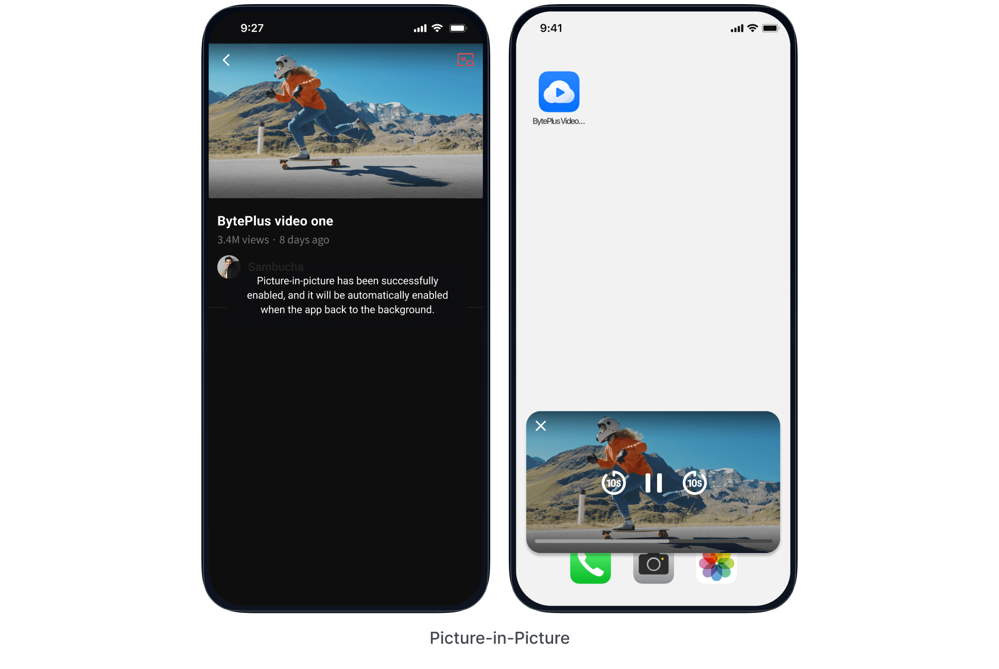
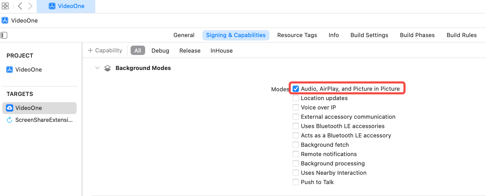

To allow your users to multitask by watching videos in a floating window while using other apps, you can implement the Picture-in-Picture (PiP) feature. This guide provides detailed, step-by-step instructions and code examples for adding PiP support to your video player on both Android and iOS platforms. 
You can download the demo via [Trying the demo](https://docs.byteplus.com/en/docs/byteplus-vos/docs-byteplus-videoone-demo-app_1) and go to `Function` > `Video player` and play any video. After tapping Play Page, tap the Picture-in-Picture icon to turn on the feature. When the video is playing, tap the Home button to return to the home screen. The following Picture-in-Picture effect will appear:



# Picture-in-Picture app support
## Android
### System requirements

* A physical mobile device running Android 8.0 (API level 26) or later.

### Implementation

1. **Declare Picture-in-Picture support**

In `AndroidManifest.xml`, declare the video activity's `android:supportsPictureInPicture` as `true`.
```XML
<activity android:name=".SampleVideoActivity"
    android:supportsPictureInPicture="true"
    android:configChanges=
        "screenSize|smallestScreenSize|screenLayout|orientation"
    ...
```


2. **Add play controls**

The playback controls in the Picture-in-Picture window can be customized as described below. Refer to [MiniPlayerLayer.java](https://github.com/byteplus-sdk/VideoOneSolutions/blob/main/Client/Android/solutions/vod/vod-scenekit/src/main/java/com/byteplus/vod/scenekit/ui/video/layer/MiniPlayerLayer.java) for details:
```Java
void updatePictureInPictureActions(
        @DrawableRes int iconId, String title, int controlType, int requestCode
) {
    final ArrayList<RemoteAction> actions = new ArrayList<>();

    final PendingIntent intent =
            PendingIntent.getBroadcast(
                    getContext(),
                    requestCode,
                    new Intent(ACTION_PLAYER_CONTROL).putExtra(EXTRA_CONTROL_TYPE, controlType),
                    0);
    final Icon icon = Icon.createWithResource(getContext(), iconId);
    actions.add(new RemoteAction(icon, title, title, intent));
    
    // ... Add other actions.
   // Call the getMaxNumPictureInPictureActions() method to get the maximum number of actions.

    mPictureInPictureParamsBuilder.setActions(actions);

    setPictureInPictureParams(mPictureInPictureParamsBuilder.build());
}
```


3. **Switch video activity to Picture-in-Picture**

Call [Activity.enterPictureInPictureMode()](https://developer.android.com/reference/android/app/Activity#enterPictureInPictureMode()) to switch to Picture-in-Picture mode. Refer to [BaseActivity.java](https://github.com/byteplus-sdk/VideoOneSolutions/blob/main/Client/Android/solutions/vod/vod-scenekit/src/main/java/com/byteplus/vod/scenekit/ui/base/BaseActivity.java) for details:
```Java
@Override
public void onUserLeaveHint () {
    Rational aspectRatio = new Rational(mVideoView.getWidth(), mVideoView.getHeight());
    mPictureInPictureParamsBuilder.setAspectRatio(aspectRatio).build();
    enterPictureInPictureMode(mPictureInPictureParamsBuilder.build());
}
```


4. **Monitoring** **Picture-in-Picture mode change events**

When the activity enters or exits **Picture-in-Picture** mode, the android system calls [Activity.onPictureInPictureModeChanged(boolean, android.content.res.Configuration)](https://developer.android.com/reference/android/app/Activity#onPictureInPictureModeChanged(boolean,%20android.content.res.Configuration)) or [Fragment.onPictureInPictureModeChanged(boolean, android.content.res.Configuration)](https://developer.android.com/reference/android/app/Fragment#onPictureInPictureModeChanged(boolean,%20android.content.res.Configuration)). Refer to [MiniPlayerLayer.java](https://github.com/byteplus-sdk/VideoOneSolutions/blob/main/Client/Android/solutions/vod/vod-scenekit/src/main/java/com/byteplus/vod/scenekit/ui/video/layer/MiniPlayerLayer.java) for details:
```Java
@Override
public void onPictureInPictureModeChanged(
        boolean isInPictureInPictureMode, Configuration configuration) {
    super.onPictureInPictureModeChanged(isInPictureInPictureMode, configuration);
    if (isInPictureInPictureMode) {
        // Starts receiving events from action items in Picture-in-Picture mode.
        mReceiver =
                new BroadcastReceiver() {
                    @Override
                    public void onReceive(Context context, Intent intent) {
                        if (intent == null
                                || !ACTION_MEDIA_CONTROL.equals(intent.getAction())) {
                            return;
                        }

                        // This is where we are called back from Picture-in-Picture action items.
                        final int controlType = intent.getIntExtra(EXTRA_CONTROL_TYPE, 0);
                        switch (controlType) {
                            case CONTROL_TYPE_PLAY:
                                mVideoView.play();
                                break;
                            case CONTROL_TYPE_PAUSE:
                                mVideoView.pause();
                                break;
                        }
                    }
                };
        registerReceiver(mReceiver, new IntentFilter(ACTION_MEDIA_CONTROL));
    } else {
        // We are out of PiP mode. We can stop receiving events from it.
        unregisterReceiver(mReceiver);
        mReceiver = null;
    }
}
```

For a fix related to an [issue](https://issuetracker.google.com/issues/207397151?pli=1) where startActivity does not work in Android 12, see the [linked code](https://github.com/limdale/PipTest/commit/ed49df5f8730946da472d85da76468687606692c) for details.

## iOS
### System requirements

* A physical mobile device running iOS 14 or later.

### Implementation

1. Enable the Picture-in-Picture background mode.

In your Xcode project, navigate to the `Signing & Capabilities` tab, add the `Background Modes` capability, and enable `Audio, AirPlay, and Picture in Picture` as shown below:



2. Configure and create an AVPlayer, and then initialize the AVPictureInPictureController. Refer to [PIPManager.m](https://github.com/byteplus-sdk/VideoOneSolutions/blob/main/Client/iOS/Component/ToolKit/VodPlayer/VEPlayerUIModule/Classes/PIPManager/PIPManager.m) for details:

```Objective-C
// Setting AVAudioSession
@try {
    NSError *error = nil;
    [[AVAudioSession sharedInstance] setCategory:AVAudioSessionCategoryPlayback error:nil];
    [[AVAudioSession sharedInstance] setActive:YES error:&error];
  } @catch (NSException *exception) {
   // Handle errors that occur when setting the AVAudioSession.
  }
  
 // Create AVPlayer
AVAsset *asset = [[AVURLAsset alloc] initWithURL:[NSURL URLWithString:self.currentAVPlayerURL] options:@{AVURLAssetPreferPreciseDurationAndTimingKey: @YES}];
AVPlayerItem *playItem = [AVPlayerItem playerItemWithAsset:asset];
self.avPlayer = [AVPlayer playerWithPlayerItem:playItem];

// Initialize AVPictureInPictureController
AVPlayerLayer *layer = [AVPlayerLayer playerLayerWithPlayer:self.avPlayer];
UIView *playContainerView = [self.dataSource containerView];
layer.frame = playContainerView.bounds;
self.pipController = [[AVPictureInPictureController alloc] initWithPlayerLayer:layer];
self.pipController.delegate = self;
```


3. Start Picture-in-Picture

```Objective-C
[self.pipController startPictureInPicture];
```


4. Monitor AVPictureInPictureController callback events. Refer to [PIPManager.m](https://github.com/byteplus-sdk/VideoOneSolutions/blob/main/Client/iOS/Component/ToolKit/VodPlayer/VEPlayerUIModule/Classes/PIPManager/PIPManager.m) for details:

```Objective-C
/*!
        @method                pictureInPictureControllerWillStartPictureInPicture:
        @param                pictureInPictureController
                                The Picture in Picture controller.
        @abstract        The delegate can implement this method to be notified when Picture-in-Picture is about to start.
 */
- (void)pictureInPictureControllerWillStartPictureInPicture:(AVPictureInPictureController *)pictureInPictureController;

/*!
        @method                pictureInPictureControllerDidStartPictureInPicture:
        @param                pictureInPictureController
                                The Picture in Picture controller.
        @abstract        The delegate can implement this method to be notified when Picture-in-Picture has started.
 */
- (void)pictureInPictureControllerDidStartPictureInPicture:(AVPictureInPictureController *)pictureInPictureController;

/*!
        @method                pictureInPictureController:failedToStartPictureInPictureWithError:
        @param                pictureInPictureController
                                The Picture in Picture controller.
        @param                error
                                An error describing why it failed.
        @abstract        Delegate can implement this method to be notified when Picture in Picture failed to start.
 */
- (void)pictureInPictureController:(AVPictureInPictureController *)pictureInPictureController failedToStartPictureInPictureWithError:(NSError *)error;

/*!
        @method                pictureInPictureControllerWillStopPictureInPicture:
        @param                pictureInPictureController
                                The Picture in Picture controller.
        @abstract        The delegate can implement this method to be notified when Picture-in-Picture is about to stop.
 */
- (void)pictureInPictureControllerWillStopPictureInPicture:(AVPictureInPictureController *)pictureInPictureController;

/*!
        @method                pictureInPictureControllerDidStopPictureInPicture:
        @param                pictureInPictureController
                                The Picture in Picture controller.
        @abstract        The delegate can implement this method to be notified when Picture-in-Picture has stopped.
 */
- (void)pictureInPictureControllerDidStopPictureInPicture:(AVPictureInPictureController *)pictureInPictureController;

/*!
        @method                pictureInPictureController:restoreUserInterfaceForPictureInPictureStopWithCompletionHandler:
        @param                pictureInPictureController
                                The Picture in Picture controller.
        @param                completionHandler
                                The completion handler the delegate needs to call after restore.
        @abstract        Delegate can implement this method to restore the user interface before Picture in Picture stops.
 */
- (void)pictureInPictureController:(AVPictureInPictureController *)pictureInPictureController restoreUserInterfaceForPictureInPictureStopWithCompletionHandler:(void (^)(BOOL restored))completionHandler;
```

