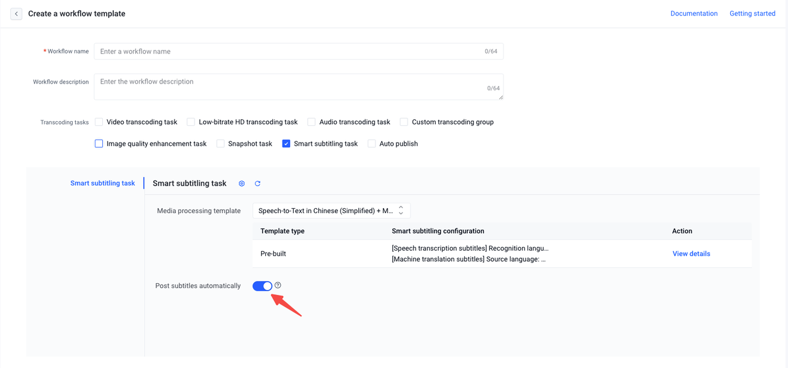
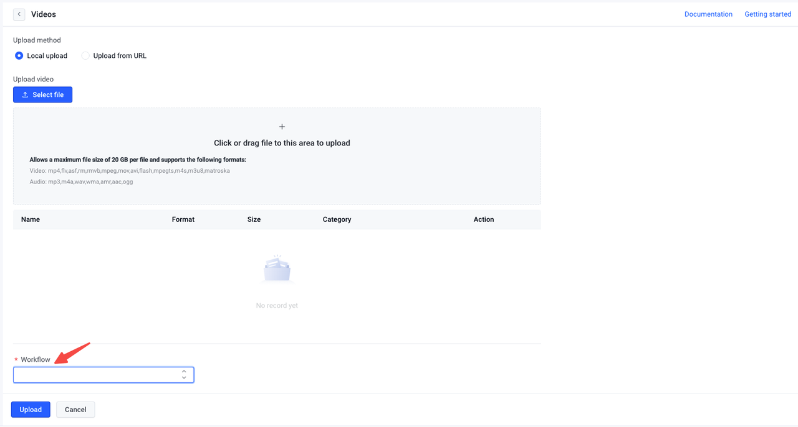
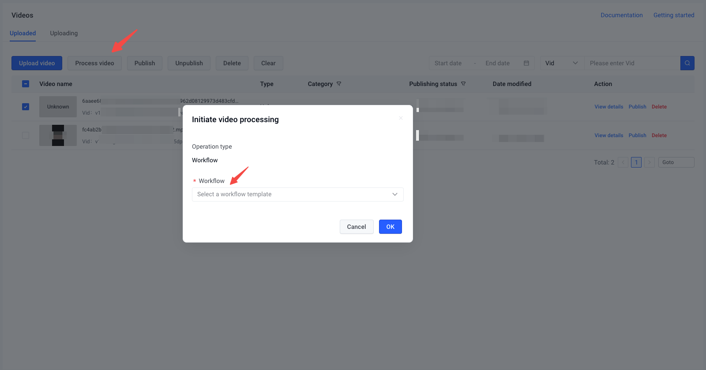
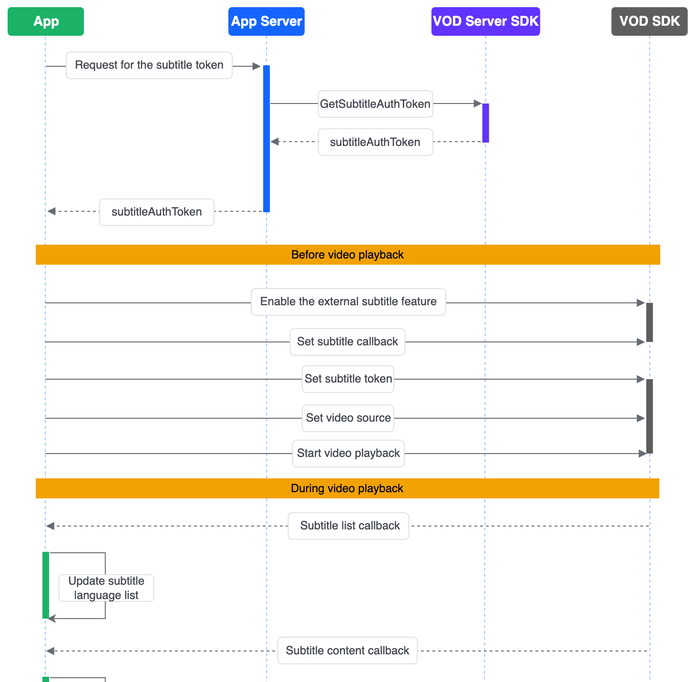

VideoOne leverages the smart subtitling capability of BytePlus VOD to provide users with best practices for matching and displaying the appropriate multilingual subtitles for videos played within the application. This powerful feature not only benefits users facing hearing difficulties or encountering noisy backgrounds, but also allows users to access subtitles in their preferred language, thereby enhancing the viewing experience for a diverse audience.
This feature requires a two-step implementation: first, configure the VOD console to generate subtitles for your videos, and then use the VOD client API to display them. This article will provide comprehensive instructions for both of these steps, ensuring a seamless integration of the subtitle functionality into your application.
# Demonstration

# Prerequisite
You have already enabled the BytePlus VOD service and successfully implemented the basic video playback capability by integrating the BytePlus VOD Player SDK. Refer to the video playback-related sections in the following documentation for detailed instructions:

* Android: [Implementing video playback & edit for Android](https://docs.byteplus.com/en/byteplus-vos/docs/implementing-video-playback-edit-for-android?version=v1.0#a568cca2)
* iOS: [Implementing video playback & edit for iOS](https://docs.byteplus.com/en/byteplus-vos/docs/implementing-video-playback-edit-for-ios?version=v1.0)

# Generating subtitles
BytePlus VOD includes an Automatic Speech Recognition (ASR) feature that recognizes audio content in media files and automatically converts it to text. Additionally, the VOD also includes machine translation capability, which allows for the translation of the generated source language subtitles into other languages.
Before processing media for subtitle generation, you must configure a media processing template and a workflow template in the VOD console.
## Step 1: Create a smart subtitling template
Refer to the [instructions](https://docs.byteplus.com/en/byteplus-vod/docs/smart-subtitle-template#6dd6f799) for creating a smart subtitling template. Make sure to enable the "Subtitles for machine translation" option if you need subtitles in multiple languages. BytePlus VOD currently offers speech recognition and translation capabilities for four languages: Chinese, English, Japanese, and Korean.
## Step 2: Create a workflow template
Refer to the [instructions](https://docs.byteplus.com/en/byteplus-vod/docs/workflow#a9136274) for creating a workflow template. Include the "Smart subtitling task" in your workflow template and select the newly created smart subtitling template. Make sure to enable the "Publish subtitles automatically" option.

## Step 3: Generate subtitles
Initiate a video processing task using the newly created workflow template. You can do this during video upload or for existing videos. You can upload individual or small batches of videos through the VOD console. For large-scale video uploads, we recommend using the OpenAPI.
### Generate subtitles during video upload

* **Using VOD console**
   Refer to the [Media upload](https://docs.byteplus.com/en/byteplus-vod/docs/media-upload) document, specifically the "Uploading an audio or video file" section, for uploading videos on the console. Choose the workflow you have created in the previous step to enable automatic subtitle generation.
   
* **Using OpenAPI**
   * [ApplyUploadInfo](https://docs.byteplus.com/en/byteplus-vod/reference/applyuploadinfo), [CommitUploadInfo](https://docs.byteplus.com/en/byteplus-vod/reference/commituploadinfo): Use these APIs to upload a large number of media files from your application server to the VOD service. Make sure to pass in the workflow ID through the `TemplateId` parameter to enable automatic subtitle generation during media upload.
   * [UploadMediaByUrl](https://docs.byteplus.com/en/byteplus-vod/reference/uploadmediabyurl): Use this API to transfer media resources from a third-party storage to the VOD service. Make sure to pass in the workflow ID through the `TemplateId` parameter to enable automatic subtitle generation during media upload.

### Generate subtitles for uploaded videos

* **Using VOD console**
   Refer to the [Initiating a video processing task](https://docs.byteplus.com/en/byteplus-vod/docs/media-processing#02a08188) section in the "Media processing overview" document for how to initiate a processing task for uploaded videos on the console.
   
* **Using OpenAPI**
   Call [StartWorkflow](https://docs.byteplus.com/en/byteplus-vod/reference/startworkflow?version=v1.0) to initiate a video processing task using a specified workflow.

# Displaying subtitles
The subtitles generated in the previous step will be stored as external subtitles, separately from the video files, on the VOD server. To display the subtitles during video playback, you also need to call the client API to import and display them.
## Sequence diagram


## Implementation
### Server-side
Call the `GetSubtitleAuthToken` API of the VOD server SDK to obtain the subtitle authentication token.
### Client-side
#### iOS

1. Call the client APIs to initialize the external subtitles functionality:
   ```Objective-C
   // Enable the external subtitles feature.
   [self.videoEngine setOptionForKey:VEKKeyPlayerSubEnabled_BOOL value:@(YES)];
   // Enable dynamic toggling of subtitle display during video playback.
   [self.videoEngine setOptionForKey:VEKeyPlayerEnableSubThread_BOOL value:@(YES)];
   // Set a subtitle delegate object that conforms to the TTVideoEngineSubtitleDelegate protocol to handle subtitle-related callbacks.
   [self.videoEngine setSubtitleDelegate:object];
   // Set the subtitle token.
   [self.videoEngine setSubtitleAuthToken:subtitleAuthToken];
   // Set the video source.
   [self.videoEngine setVideoEngineVideoSource:vidSource];
   // Start playing the video.
   [self.videoEngine play];
   ```

2. Implement the `videoEngine:onSubtitleInfoRequested:error:` callback on the subtitle delegate object. When subtitles are requested, the player invokes this method and returns the subtitle list. At this point, you can render the list of supported subtitles for the current video.
   Each object in the subtitle list represents a subtitle in a specific language and includes properties such as:
   * `subtitleId`: Used for subtitle switching.
   * `languageId`: The language of the subtitle object based on the [subtitle language mapping table](https://docs.byteplus.com/en/byteplus-vod/reference/getsubtitleinfolist?version=v1.0#5f739d4b).
   * `source`:
      * `ASR`: The subtitle is generated through Automatic Speech Recognition (ASR), indicating that it represents the source language of the video.
      * `MT`: The subtitle is generated through machine translation, indicating that it is not the source language of the video.
   ```Objective-C
   // When subtitles are requested, the player invokes this method and returns an info object that contains the supported subtitle language types for the video. You can use this information to initialize the subtitle list to be displayed by the player.
   - (void)videoEngine:(TTVideoEngine *)videoEngine 
       onSubtitleInfoRequested:(id _Nullable)info 
       error:(NSError *_Nullable)error {
       // Get the subtitle list from the info.
       NSDictionary *result = info[@"Result"];
       NSArray *fileSubtitleInfoList = result[@"FileSubtitleInfoList"];
       NSArray *subtitleinfos = fileSubtitleInfoList[0][@"SubtitleInfoList"];
       // Render the subtitle language list on the UI.
   }
   ```

3. Implement the videoEngine:onSubLoadFinished:info: callback on the subtitle delegate object. This callback is triggered when the subtitles finish loading. By default, the subtitle language is selected randomly. If you want to display the source language subtitles as the default option, it is recommended to call the subtitle switching API at this point. Refer to Step 5 for more details on how to switch to the source language subtitles.
   ```Objective-C
   - (void)videoEngine:(TTVideoEngine *)videoEngine 
       onSubLoadFinished:(BOOL)success 
       info:(TTVideoEngineLoadInfo *_Nullable)info {
       if (success) {
           // If you want to display the source language subtitles as the default option, it is recommended to call the subtitle switching API at this point.
       }
   }
   ```

4. Implement the videoEngine:onSubtitleInfoCallBack:pts: callback on the subtitle delegate. Upon receiving this callback, you are responsible for rendering the subtitles. Please note that this callback may not be triggered on the main thread, but it is recommended to render the subtitles on the main thread.
   ```Objective-C
   // Callback returning the subtitle content at the current playback position of the video.
   - (void)videoEngine:(TTVideoEngine *)videoEngine onSubtitleInfoCallBack:(NSString *)content pts:(NSUInteger)pts {
       dispatch_async(dispatch_get_main_queue(), ^{
            // Render the subtitle content on the UI.
       })
   }
   ```

5. Call the `setOptionForKey:value:` method, passing `VEKeyPlayerSwitchSubtitleId_NSInteger` as the key and the `subtitleId` of the target language subtitle as the value to switch the subtitles.
6. Implement the `videoEngine:onSubSwitchCompleted:currentSubtitleId:` callback on the subtitle delegate object. This callback is triggered after the subtitle switching is completed. At this point, we recommend updating the UI to reflect the newly selected subtitles.
   ```Objective-C
   // Callback triggered after the subtitle switching is completed.
   - (void)videoEngine:(TTVideoEngine *)videoEngine onSubSwitchCompleted:(BOOL)success currentSubtitleId:(NSInteger)currentSubtitleId {
           // Switch the displayed subtitle on the UI.
       });
   }
   ```

7. During playback, you can call the `setOptionForKey:value:` method, pass `VEKKeyPlayerSubEnabled_BOOL` as the key and `NO` as the value to disable the subtitle display. This will stop the subtitle information callback. At this point, we recommend hiding the subtitles in the UI.
   ```Objective-C
   [self.videoEngine setOptionForKey:VEKKeyPlayerSubEnabled_BOOL value:@(NO)];
   // Hide the subtitles on the UI
   ```


Refer to the [SmartSubtitleViewController.m](https://github.com/byteplus-sdk/VideoOneSolutions/blob/main/Client/iOS/Component/VodSingleFunction/Classes/SmartSubtitles/SmartSubtitleViewController.m) file in the demo project to integrate this feature into your app. You can take advantage of existing implementations, gain insights into best practices, and customize the code to suit your application's needs effectively.

#### Android

1. Initialize the external subtitles functionality:
   ```Java
   // Enable the external subtitles feature.
   mVideoEngine.setIntOption(PLAYER_OPTION_ENABLE_OPEN_SUB, 1);
   // Enable dynamic toggling of subtitle display during video playback.
   mVideoEngine.setIntOption(PLAYER_OPTION_ENABLE_OPEN_SUB_THREAD, 1);
   // Set subtitle information callback
   mVideoEngine.setSubInfoCallBack(new SubInfoSimpleCallBack() {
       @Override
       public void onSubPathInfo(String subPathInfoJson, Error error) {
       
       }
       
       @Override
       public void onSubInfoCallback(int code, String infoJson) {
       
       }
           
       @Override
       public void onSubSwitchCompleted(int success, int subId) {
          
       }
   }
   String vid = "your video id";
   String playAuthToken = "your video id's playAuthToken";
   String subAuthToken = "your video id's subAuthToken";
   // Set the subtitle token.
   mVideoEngine.setSubAuthToken(subAuthToken);
   // Set the video source using the video ID (VID).
   VidPlayAuthTokenSource vidSource = new VidPlayAuthTokenSource.Builder()
           .setVid(vid)
           .setPlayAuthToken(playAuthToken)
           .build();    
   mVideoEngine.setStrategySource(vidSource);
   ```

   The subtitle information callbacks include:
   * [onSubPathInfo](https://docs.byteplus.com/en/byteplus-vod/docs/android-player-sdk-callbacks#SubInfoListener-onsubpathinfo)
      When subtitles are requested, the player will invoke this method and return the subtitle list information. At this point, you can render the list of supported subtitles for the current video. Each object in the subtitle list represents a subtitle in a specific language and includes properties such as:
      * `subtitleId`: Used for subtitle switching.
      * `languageId`: The language of the subtitle object based on the [subtitle language mapping table](https://docs.byteplus.com/en/byteplus-vod/reference/getsubtitleinfolist?version=v1.0#5f739d4b).
      * `source`:
         * `ASR`: The subtitle is generated through Automatic Speech Recognition (ASR), indicating that it represents the source language of the video.
         * `MT`: The subtitle is generated through machine translation, indicating that it is not the source language of the video.
      ```Java
      // Triggered when subtitles are requested.
      public void onSubPathInfo(String subPathInfoJson, Error error) {
          // The returned subPathInfoJson object contains a list of supported subtitle language types for the video. Use this information to initialize the list of subtitles displayed in the UI.
      }
      ```

   * [onSubInfoCallback](https://docs.byteplus.com/en/byteplus-vod/docs/android-player-sdk-callbacks#SubInfoSimpleCallBack-onsubinfocallback)
      This callback returns the subtitle content at the current playback position. You can render the subtitles on the UI at this point.
      ```Java
      public void onSubInfoCallback(int code, String infoJson) {
          // Callback for subtitle content.
          JSONObject jsonObject = new JSONObject(infoJson);
          String subtitle = jsonObject.optString("info");
          textView.setText(subtitle); // Set the content to the TextView.
      }
      ```

   * [onSubSwitchCompleted](https://docs.byteplus.com/en/byteplus-vod/docs/android-player-sdk-callbacks?version=v1.0#SubInfoSimpleCallBack-onsubswitchcompleted)
      This callback is triggered when the subtitle language is switched.
      ```Java
      public void onSubSwitchCompleted(int success, int subId) {
      }
      ```

2. Call the `setIntOption` method with `PLAYER_OPTION_SWITCH_SUB_ID` and the target `subtitleId` to switch subtitle languages.
   ```Java
   // You are responsible for managing the mapping between the ID and language on your own.
   mVideoEngine.setIntOption(PLAYER_OPTION_SWITCH_SUB_ID, sub_id);
   ```

3. During playback, you can call the `setIntOption` method, pass `PLAYER_OPTION_ENABLE_OPEN_SUB` as the first parameter and `0` as the second to disable the subtitle display. This will stop the subtitle information callback. It is recommended to hide the subtitles on the UI at this point.
   ```Java
   // Disable subtitle display.
   mVideoEngine.setIntOption(PLAYER_OPTION_ENABLE_OPEN_SUB, 0); 
   // Hide the subtitles on the UI.
   ```


Refer to the [SubtitleFragment.java](https://github.com/byteplus-sdk/VideoOneSolutions/blob/main/Client/Android/solutions/vod/vod-function/src/main/java/com/videoone/vod/function/fragment/SubtitleFragment.java) file in the demo project to integrate this feature into your app. You can take advantage of existing implementations, gain insights into best practices, and customize the code to suit your application's needs effectively.


