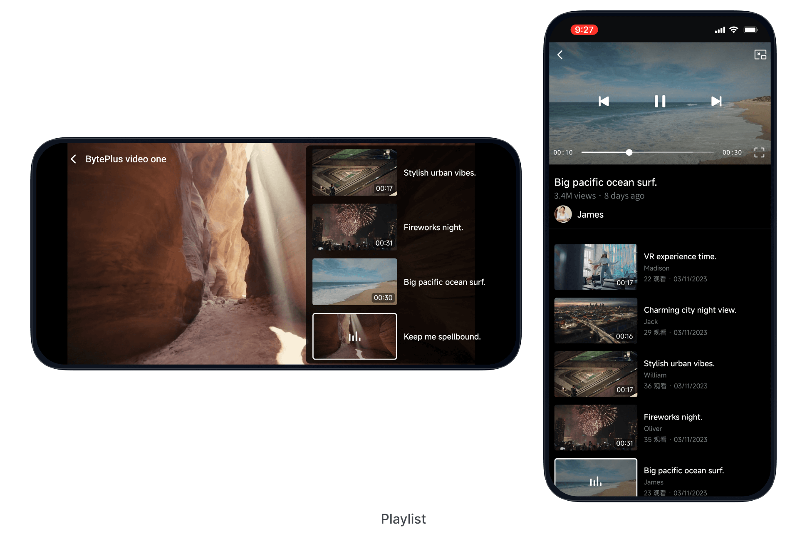

The BytePlus VOD playlist feature allows you to present a series of videos in a predefined order, increasing viewer engagement. This document introduces the feature and provides direct links to open-source code examples on GitHub, helping you quickly implement the playlist functionality in your Android and iOS applications. For a detailed introduction to the playlist feature, see [BytePlus VOD Playlist](https://docs.byteplus.com/en/byteplus-vod/docs/playlist?version=v1.0).
The demo shows the implementation of the playlist feature. You can download the demo via [Trying the demo](https://docs.byteplus.com/en/docs/byteplus-vos/docs-byteplus-videoone-demo-app_1) and go to `Function` > `Video player` > `Playlist` to experience this feature. A preview of the playlist is shown below:

If you are a developer, you can refer to our open-source [VideoOneSolutions](https://github.com/byteplus-sdk/VideoOneSolutions) code on GitHub to implement the playlist feature:

* [Android: PlaylistFragment.java](https://github.com/byteplus-sdk/VideoOneSolutions/blob/main/Client/Android/solutions/vod/vod-function/src/main/java/com/videoone/vod/function/fragment/PlaylistFragment.java)
* [iOS: PlayListViewController.m](https://github.com/byteplus-sdk/VideoOneSolutions/blob/main/Client/iOS/Component/VodSingleFunction/Classes/PlayList/PlayListViewController.m)

